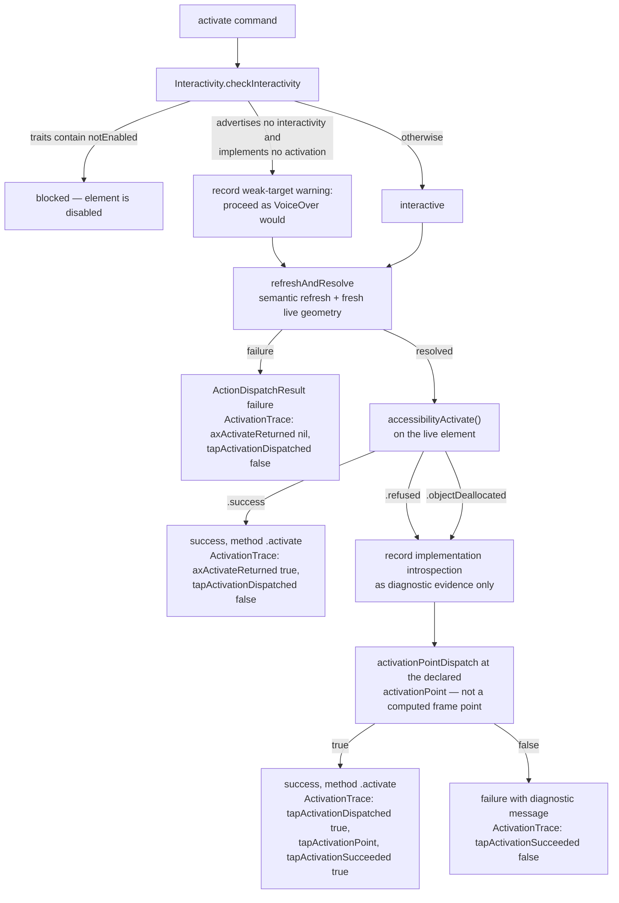

# Activation Policy

The `activate` decision tree uses VoiceOver order. Button Heist refreshes the target and calls the primary accessibility action. If that action returns `false`, Button Heist sends one tap at the declared activation point.

**Illustrates:** [ACCESSIBILITY-CONTRACT.md](../ACCESSIBILITY-CONTRACT.md), [API.md](../API.md)
**Source of truth:** `ButtonHeist/Sources/TheInsideJob/TheBrains/ActivationPolicy.swift`, `ButtonHeist/Sources/TheInsideJob/TheBrains/AccessibilityActionDispatcher.swift`, `ButtonHeist/Sources/TheInsideJob/TheVault/Interactivity.swift`, `ButtonHeist/Sources/TheScore/AccessibilityPolicy.swift`

```mermaid
flowchart TD
    START["activate command"] --> CHECK["Interactivity.checkInteractivity"]
    CHECK -- "traits contain notEnabled" --> BLOCKED["blocked — element is disabled"]
    CHECK -- "advertises no interactivity and<br/>implements no activation" --> WARN["record weak-target warning:<br/>proceed as VoiceOver would"]
    CHECK -- "otherwise" --> PROCEED["interactive"]
    WARN --> REFRESH
    PROCEED --> REFRESH["refreshAndResolve<br/>semantic refresh + fresh live geometry"]
    REFRESH -- "failure" --> FAIL1["ActionDispatchResult failure<br/>ActivationTrace: axActivateReturned nil,<br/>tapActivationDispatched false"]
    REFRESH -- "resolved" --> AXACT["accessibilityActivate()<br/>on the live element"]
    AXACT -- ".success" --> OK1["success, method .activate<br/>ActivationTrace: axActivateReturned true,<br/>tapActivationDispatched false"]
    AXACT -- ".refused" --> DIAG["record implementation introspection<br/>as diagnostic evidence only"]
    AXACT -- ".objectDeallocated" --> DIAG
    DIAG --> TAP["activationPointDispatch at the declared<br/>activationPoint — not a computed frame point"]
    TAP -- "true" --> OK2["success, method .activate<br/>ActivationTrace: tapActivationDispatched true,<br/>tapActivationPoint, tapActivationSucceeded true"]
    TAP -- "false" --> FAIL2["failure with diagnostic message<br/>ActivationTrace: tapActivationSucceeded false"]
```

Notes:

- `accessibilityActivate()` is the operation that VoiceOver uses. Button Heist calls it first on the target with fresh live geometry.
- UIKit defines `false` as “not activated.” Button Heist trusts that result and sends one fallback tap.
- Interface changes do not override the Boolean result. They may come from unrelated work and do not prove that this target activated.
- The activation-point tap uses the same `activate` command. Button Heist delivers this command through touch injection.
- Every enabled target enters this policy. `notEnabled` is the only difference from VoiceOver.
- Button Heist does not dispatch to a target with this accessibility state. VoiceOver permits the double-tap and lets the app ignore it.
- Override and block introspection supplies diagnostic evidence only. It is not an accessibility semantic or dispatch gate.
- After a decline, this evidence describes the target implementation. It does not permit the fallback dispatch.
- A weak target warning uses `activation_weak_affordance_evidence`. A later expectation failure keeps this warning in the action result.
- `ActivationTrace` records the path. Its fields describe the AX return, implementation evidence, tap dispatch, tap point, and tap result.
