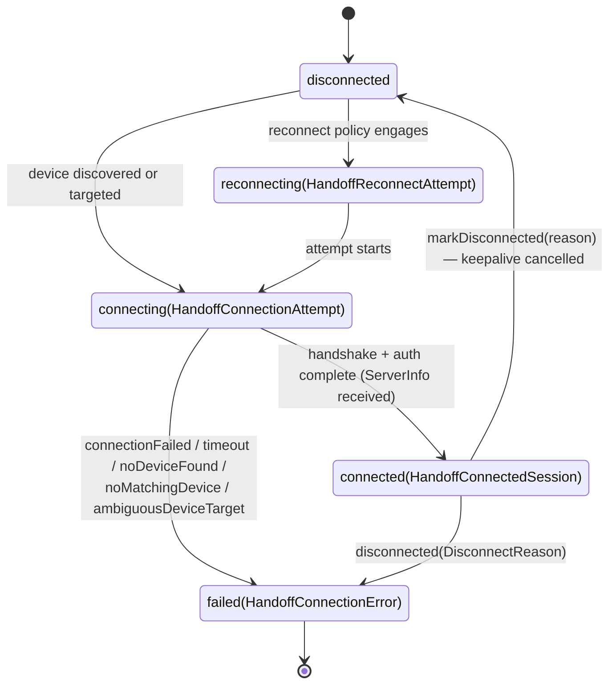
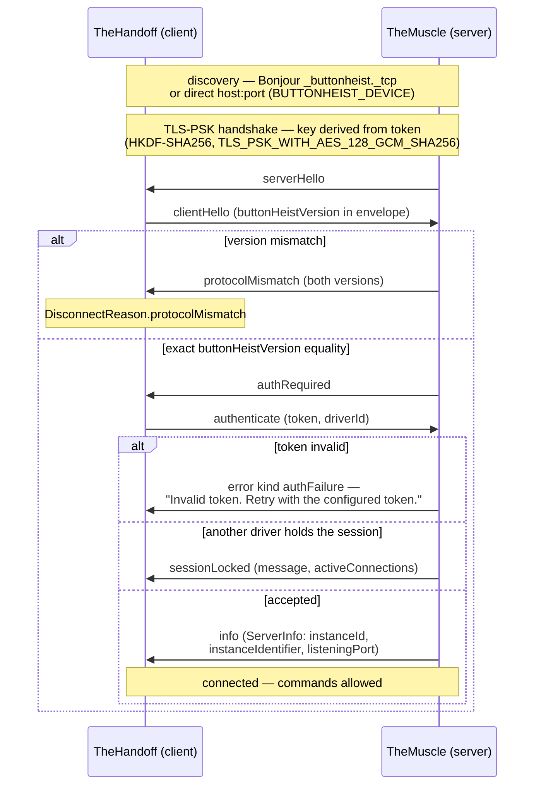

# Connection Lifecycle

The client connection as a state machine (`HandoffConnectionPhase`) plus the message-level handshake that runs inside the `connecting` phase: TLS-PSK, hello exchange, exact version equality, token auth, session claim. This diagram answers "what state is my connection in, and which step rejected me?"

**Illustrates:** [AUTH.md](../AUTH.md), [WIRE-PROTOCOL.md](../WIRE-PROTOCOL.md)
**Source of truth:** `ButtonHeist/Sources/TheButtonHeist/TheHandoff/HandoffConnectionState.swift`, `ButtonHeist/Sources/TheButtonHeist/TheHandoff/HandoffConnectionLifecycle.swift`, `ButtonHeist/Sources/TheButtonHeist/TheHandoff/NetworkBoundary/DeviceConnectionFailures.swift`, `ButtonHeist/Sources/TheInsideJob/Server/MuscleHandshakePhase.swift`, `ButtonHeist/Sources/TheScore/Core/TLSPreSharedKeyMaterial.swift`, `ButtonHeist/Sources/TheScore/Wire/Messages.swift`

## Connection phases

`DisconnectReason` carries the documented failure edges: `networkError`, `bufferOverflow`, `eventBacklogOverflow`, `serverClosed`, `authFailed`, `sessionLocked`, `protocolMismatch`, `localDisconnect`, `missingToken`.

## Handshake inside `connecting`

Notes:

- The version gate compares `envelope.buttonHeistVersion == buttonHeistVersion` — exact string equality, checked in `MuscleHandshakePhase` before token auth. There is no separate wire-protocol version.
- TLS security and message-level auth both derive from the same token: the TLS layer uses a pre-shared key derived from it, then the `authenticate` message proves it again in JSON.
- The auth-failure message does not disclose the server's token or identity; the server's `instanceIdentifier` travels in the Bonjour TXT record and in `ServerInfo` after successful auth (see [multi-agent-isolation.md](multi-agent-isolation.md)).
