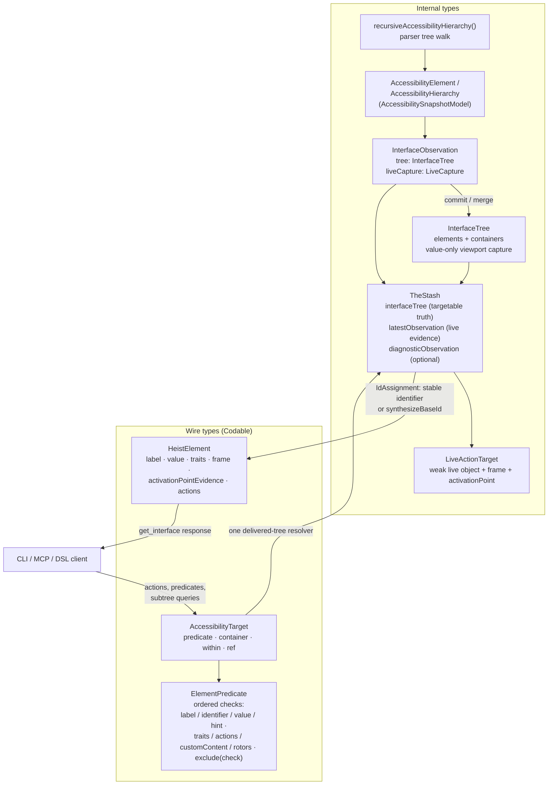

# Currency Types

The type families that carry UI state through the system, and the hard border between internal types and wire types. This diagram answers "which type do I pass here, and which types are allowed to cross the network?"

**Illustrates:** [ARCHITECTURE.md](../ARCHITECTURE.md), [API.md](../API.md)
**Source of truth:** `submodules/AccessibilitySnapshotBH/AccessibilitySnapshotModel/Sources/AccessibilitySnapshotModel/`, `ButtonHeist/Sources/TheInsideJob/TheStash/InterfaceObservation.swift`, `ButtonHeist/Sources/TheInsideJob/TheStash/TheStash.swift`, `ButtonHeist/Sources/TheInsideJob/TheStash/IdAssignment.swift`, `ButtonHeist/Sources/TheScore/Wire/ElementModels.swift`, `ButtonHeist/Sources/ThePlans/Model/AccessibilityTarget.swift`

Notes:

- `AccessibilityElement` and `AccessibilityHierarchy` are the parser's output and the internal working currency. They never cross the wire; the wire representation of an element is `HeistElement` (TheScore, Codable).
- `InterfaceTree` is the durable, targetable representation. It contains value types only; `merging(_:)` is pure last-read-wins and retains the newest viewport capture.
- `InterfaceObservation` pairs an interface tree with one viewport's `LiveCapture`. Live references are replaced on every parse and never unioned across exploration pages.
- `TheStash` owns one `interfaceTree`, one `latestObservation`, and optional failed-settle diagnostic evidence. There is no parallel world store or live lookup.
- Targets flow the other way: `AccessibilityTarget` (ThePlans, Codable) refers
  to an element, container, scoped descendant, or target reference. Actions,
  predicates, and subtree queries pass the same value. Container identifiers
  match every delivered parser container type that carries them.
- heistIds are assigned by `TheStash.IdAssignment`: a stable developer `identifier` wins when present; otherwise `synthesizeBaseId` derives an id from the element's label and highest-priority trait (`AccessibilityPolicy.synthesisPriority`), with `_1`, `_2` suffixes for duplicates in traversal order.
