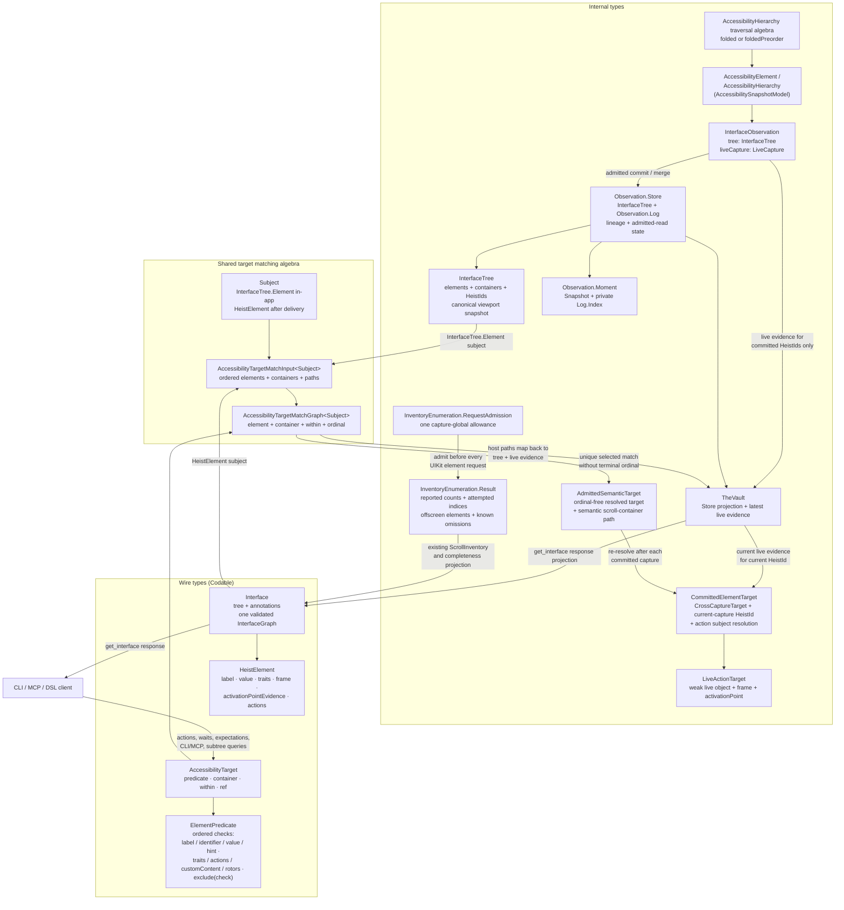

# Currency Types

The type families that carry UI state through the system, and the hard border between internal types and wire types. This diagram answers "which type do I pass here, and which types are allowed to cross the network?"

**Illustrates:** [ARCHITECTURE.md](../ARCHITECTURE.md), [API.md](../API.md)
**Source of truth:** `submodules/AccessibilitySnapshotBH/AccessibilitySnapshotModel/Sources/AccessibilitySnapshotModel/`, `ButtonHeist/Sources/TheScore/Core/AccessibilityHierarchy+Traversal.swift`, `ButtonHeist/Sources/TheScore/Core/ElementPredicate+HeistElement.swift`, `ButtonHeist/Sources/TheInsideJob/TheVault/InterfaceObservation.swift`, `ButtonHeist/Sources/TheInsideJob/TheVault/InterfaceTree.swift`, `ButtonHeist/Sources/TheInsideJob/TheVault/SemanticObservationStore.swift`, `ButtonHeist/Sources/TheInsideJob/TheVault/TheVault.swift`, `ButtonHeist/Sources/TheInsideJob/TheVault/TheVault+Capture.swift`, `ButtonHeist/Sources/TheInsideJob/TheVault/TheVault+TargetResolution.swift`, `ButtonHeist/Sources/TheInsideJob/TheVault/IdAssignment.swift`, `ButtonHeist/Sources/TheInsideJob/TheBrains/ElementInflation.swift`, `ButtonHeist/Sources/TheInsideJob/TheBrains/ElementInflation+State.swift`, `ButtonHeist/Sources/TheButtonHeist/TheFence/InterfaceProjection.swift`, `ButtonHeist/Sources/TheScore/Wire/InterfaceModels.swift`, `ButtonHeist/Sources/ThePlans/Model/AccessibilityTarget.swift`

Notes:

- `AccessibilityElement` and `AccessibilityHierarchy` are the parser's output and the internal working currency. They never cross the wire; the wire representation of an element is `HeistElement` (TheScore, Codable).
- The settled `InterfaceTree` is the sole current semantic truth. It contains value types only; `merging(_:)` is pure last-read-wins and retains the newest viewport capture.
- `InterfaceObservation` pairs an interface tree with one viewport's disposable
  `LiveCapture`. `LiveCapture.Snapshot` stores the viewport's canonical element
  and container entries once; its path-indexed convenience views are derived.
  Live references are replaced on every parse and never unioned across
  exploration pages.
- `Observation.Store` owns one `InterfaceTree`, retained `Observation.Log`,
  lineage, and admitted-read state. `Observation.Moment` combines one immutable
  snapshot with its private Log index for direct `events(since:)` reads.
  `TheVault` keeps only the latest live
  UIKit observation beside that Store. There is no parallel screen/query store
  or semantic back map.
- Each delivered `Interface` validates and stores one package `InterfaceGraph`
  for structural hierarchy operations and formatting. The delivered value
  supplies `HeistElement` subjects while the host supplies
  `InterfaceTree.Element` subjects directly. One generic
  `AccessibilityTargetMatchGraph` evaluates element, container, descendant, and
  ordinal semantics for either subject. Internal resolution never converts
  through the wire element model; host results already carry their tree value
  when `TheVault` joins them to current live evidence.
- Element inflation admits an `AdmittedSemanticTarget` for cross-capture work
  only when the resolved target without its terminal ordinal uniquely selects
  the originally chosen element in the complete committed tree. That semantic
  target is re-resolved after each committed capture. Missing or ambiguous
  resolution fails instead of retaining an old id or selecting a sibling.
- `CommittedElementTarget` carries one `CrossCaptureTarget`, the matching
  element's current capture-local `HeistId`, and its action-subject resolution.
  The admitted semantic target is the durable identity; the current id is only
  the live UIKit join key for geometry and dispatch.
- Targets flow the other way: `AccessibilityTarget` (ThePlans, Codable) refers
  to an element, container, scoped descendant, or target reference. Actions,
  waits, expectations, CLI/MCP, and subtree queries pass the same value.
  Container identifiers match every delivered parser container type that
  carries them.
- Capture-local `HeistId` values are assigned by `TheVault.IdAssignment`: a stable developer `identifier` wins when present; otherwise `synthesizeBaseId` derives an id from the element's label and highest-priority trait (`AccessibilityPolicy.synthesisPriority`), with `_1`, `_2` suffixes for duplicates in traversal order. They correlate nodes with live evidence only inside the capture that assigned them. Ordinals, duplicate suffixes, inventory indices, and stale ids never establish cross-capture identity, and ids do not cross the public transport as selectors.
- Offscreen inventory capture has one capture-global
  `InventoryEnumeration.RequestAdmission` and one `InventoryEnumeration.Result`.
  Admission precedes every `accessibilityElement(at:)` request; the result owns
  count snapshots, attempted indices, captured elements, and known omissions.
  Those facts project through existing `ScrollInventory` and completeness
  fields rather than creating another evidence or wire model.
- First-responder identity uses the same currency: the capture stores one
  `HeistId`, trace context may project it to an `AccessibilityTarget`, and a
  first-responder action verifies that the current and inflated ids still equal
  the captured id.
