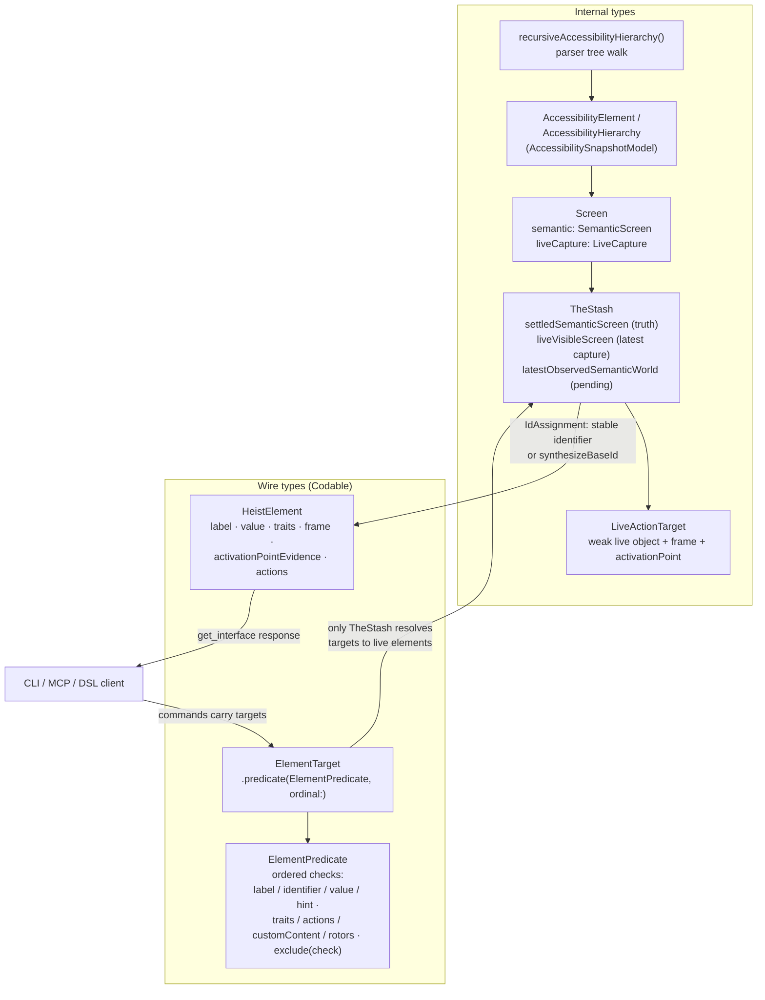

# Currency Types

The type families that carry UI state through the system, and the hard border between internal types and wire types. This diagram answers "which type do I pass here, and which types are allowed to cross the network?"

**Illustrates:** [ARCHITECTURE.md](../ARCHITECTURE.md), [API.md](../API.md)
**Source of truth:** `submodules/AccessibilitySnapshotBH/AccessibilitySnapshotModel/Sources/AccessibilitySnapshotModel/`, `ButtonHeist/Sources/TheInsideJob/TheStash/Screen.swift`, `ButtonHeist/Sources/TheInsideJob/TheStash/TheStash.swift`, `ButtonHeist/Sources/TheInsideJob/TheStash/IdAssignment.swift`, `ButtonHeist/Sources/TheScore/ElementModels.swift`, `ButtonHeist/Sources/ThePlans/ElementTarget.swift`

Notes:

- `AccessibilityElement` and `AccessibilityHierarchy` are the parser's output and the internal working currency. They never cross the wire; the wire representation of an element is `HeistElement` (TheScore, Codable).
- `Screen` is an immutable snapshot value pairing the durable semantic projection (`SemanticScreen`) with one live capture (`LiveCapture`, weak references — invalidated on every new parse). `TheStash` keeps the settled screen as truth, the latest live capture for action machinery, and pending observations separately.
- `Screen.merging` is pure last-read-wins: on a heistId conflict the other screen's entry replaces this one's; the merged live capture is the latest one, not a union.
- Targets flow the other way: `ElementTarget` / `ElementPredicate` (ThePlans, Codable) are how callers refer to elements abstractly. Every layer above TheStash passes them opaquely; only TheStash resolves them to live elements.
- heistIds are assigned by `TheStash.IdAssignment`: a stable developer `identifier` wins when present; otherwise `synthesizeBaseId` derives an id from the element's label and highest-priority trait (`AccessibilityPolicy.synthesisPriority`), with `_1`, `_2` suffixes for duplicates in traversal order.
