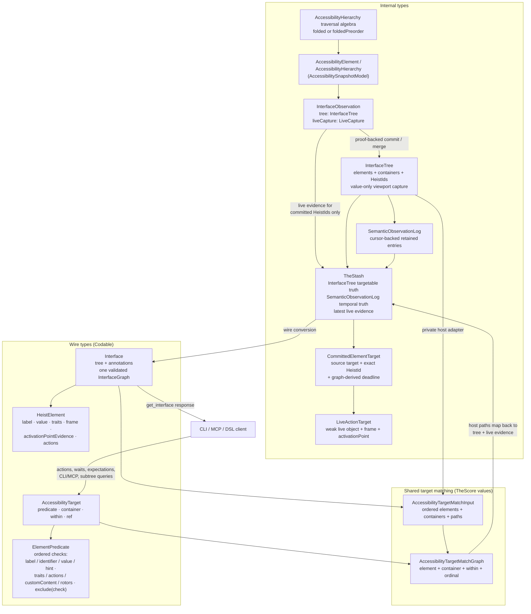

# Currency Types

The type families that carry UI state through the system, and the hard border between internal types and wire types. This diagram answers "which type do I pass here, and which types are allowed to cross the network?"

**Illustrates:** [ARCHITECTURE.md](../ARCHITECTURE.md), [API.md](../API.md)
**Source of truth:** `submodules/AccessibilitySnapshotBH/AccessibilitySnapshotModel/Sources/AccessibilitySnapshotModel/`, `ButtonHeist/Sources/TheScore/Core/AccessibilityHierarchy+Traversal.swift`, `ButtonHeist/Sources/TheScore/Core/ElementPredicate+HeistElement.swift`, `ButtonHeist/Sources/TheInsideJob/TheStash/InterfaceObservation.swift`, `ButtonHeist/Sources/TheInsideJob/TheStash/InterfaceTree.swift`, `ButtonHeist/Sources/TheInsideJob/TheStash/SemanticObservationLog.swift`, `ButtonHeist/Sources/TheInsideJob/TheStash/TheStash.swift`, `ButtonHeist/Sources/TheInsideJob/TheStash/TheStash+TargetResolution.swift`, `ButtonHeist/Sources/TheInsideJob/TheStash/IdAssignment.swift`, `ButtonHeist/Sources/TheScore/Wire/InterfaceModels.swift`, `ButtonHeist/Sources/ThePlans/Model/AccessibilityTarget.swift`

Notes:

- `AccessibilityElement` and `AccessibilityHierarchy` are the parser's output and the internal working currency. They never cross the wire; the wire representation of an element is `HeistElement` (TheScore, Codable).
- The settled `InterfaceTree` is the sole current semantic truth. It contains value types only; `merging(_:)` is pure last-read-wins and retains the newest viewport capture.
- `InterfaceObservation` pairs an interface tree with one viewport's disposable `LiveCapture`. Live references are replaced on every parse and never unioned across exploration pages.
- `TheStash` owns one `InterfaceTree`, one retained `SemanticObservationLog`,
  one latest live observation, and optional failed-settle diagnostic evidence.
  There is no parallel screen/query store or semantic back map.
- Each delivered `Interface` validates and stores one package `InterfaceGraph`
  for structural hierarchy operations and formatting. Both that delivered value
  and the host's private `InterfaceTree` adapter produce
  `AccessibilityTargetMatchInput`; one `AccessibilityTargetMatchGraph` evaluates
  element, container, descendant, and ordinal semantics. Host results map back
  to `TheStash.interfaceTree` and current live evidence before wire projection
  re-roots a selected subtree.
- Element inflation resolves an `AccessibilityTarget` once, then carries a
  `CommittedElementTarget` with the exact capture-local `HeistId` and one
  graph-derived deadline. Refresh and dispatch use that id; they do not choose a
  new element by rerunning the public selector.
- Targets flow the other way: `AccessibilityTarget` (ThePlans, Codable) refers
  to an element, container, scoped descendant, or target reference. Actions,
  waits, expectations, CLI/MCP, and subtree queries pass the same value.
  Container identifiers match every delivered parser container type that
  carries them.
- Capture-local `HeistId` values are assigned by `TheStash.IdAssignment`: a stable developer `identifier` wins when present; otherwise `synthesizeBaseId` derives an id from the element's label and highest-priority trait (`AccessibilityPolicy.synthesisPriority`), with `_1`, `_2` suffixes for duplicates in traversal order. They correlate committed nodes with live evidence inside TheInsideJob and do not cross the public transport as selectors.
- First-responder identity uses the same currency: the capture stores one
  `HeistId`, trace context may project it to an `AccessibilityTarget`, and a
  first-responder action verifies that the current and inflated ids still equal
  the captured id.
