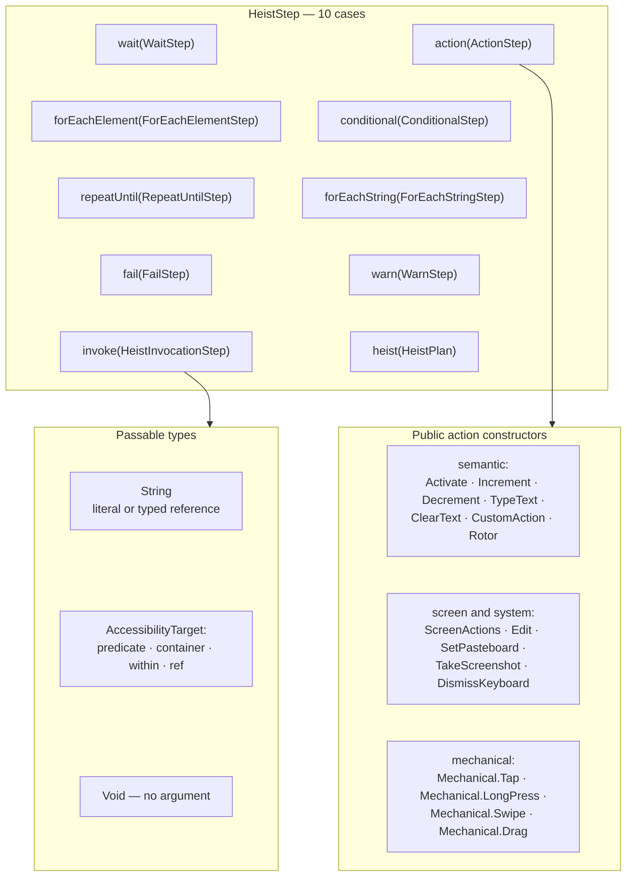
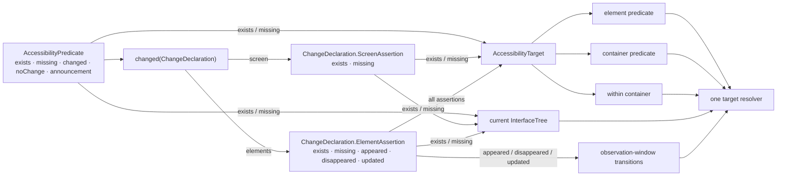

# DSL Grammar

The authoring surface as one picture: step types, action commands, passable
types, one target language, and one concrete predicate tree.

**Illustrates:** [HEIST-LANGUAGE-SPEC.md](../HEIST-LANGUAGE-SPEC.md), [HEIST-FORMAT.md](../HEIST-FORMAT.md), [SWIFT-HEIST-AUTHORING.md](../SWIFT-HEIST-AUTHORING.md)
**Source of truth:** `ButtonHeist/Sources/ThePlans/Model/HeistStep.swift`, `ButtonHeist/Sources/ThePlans/Model/HeistActions.swift`, `ButtonHeist/Sources/ThePlans/Model/HeistActionCommand.swift`, `ButtonHeist/Sources/ThePlans/Model/AccessibilityPredicate.swift`, `ButtonHeist/Sources/ThePlans/Model/AccessibilityTarget.swift`

The predicate and target contexts:

Notes:

- `invoke(HeistInvocationStep)` is `RunHeist` by name plus an argument — the passable types are what that argument can be.
- `AccessibilityTarget` is shared by actions, waits, action expectations, control-flow predicates, CLI/MCP, and `get_interface` subtree selection. It can target an element predicate, a container predicate, a scoped descendant, or a reference.
- Concrete nested assertion types make invalid combinations unconstructible. Current-tree existence checks are shared; lifecycle and update assertions are available only inside element change declarations.
- Expression, core, and resolved representations stay behind the public DSL surface.
- Wire discriminators for the loop steps are snake_case in `plan.json`: `for_each_element`, `for_each_string`, `repeat_until`.
