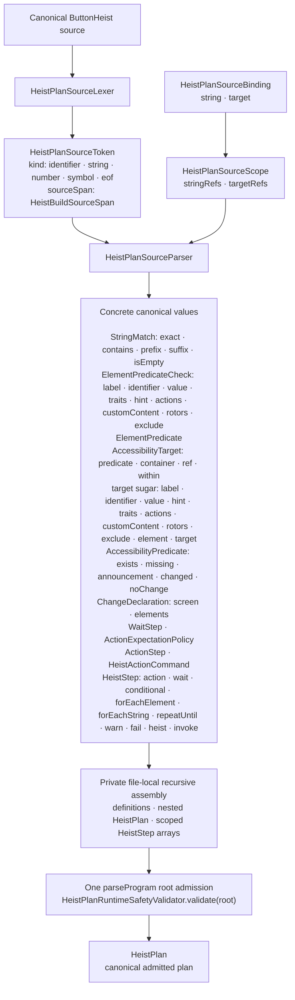

# DSL Grammar

The canonical authoring language and its source-lowering path: lexical
evidence enters one parser, concrete domain values remain in one file-local
recursive assembly, and one root admission returns the `HeistPlan`.

**Illustrates:** [HEIST-LANGUAGE-SPEC.md](../HEIST-LANGUAGE-SPEC.md), [HEIST-FORMAT.md](../HEIST-FORMAT.md), [SWIFT-HEIST-AUTHORING.md](../SWIFT-HEIST-AUTHORING.md)

**Source of truth:** `ButtonHeist/Sources/ThePlans/Parsing/HeistPlanSourceLexer.swift`, `ButtonHeist/Sources/ThePlans/Parsing/HeistPlanSourceParser+Diagnostics.swift`, `ButtonHeist/Sources/ThePlans/Parsing/HeistPlanSourceProgramParser.swift`, `ButtonHeist/Sources/ThePlans/Model/StringExpressions.swift`, `ButtonHeist/Sources/ThePlans/Model/ElementPredicate.swift`, `ButtonHeist/Sources/ThePlans/Model/AccessibilityTarget.swift`, `ButtonHeist/Sources/ThePlans/Model/AccessibilityPredicate.swift`, `ButtonHeist/Sources/ThePlans/Model/HeistTargets.swift`, `ButtonHeist/Sources/ThePlans/Model/HeistActions.swift`, `ButtonHeist/Sources/ThePlans/Model/HeistStep.swift`, `ButtonHeist/Sources/ThePlans/Model/HeistPlan.swift`, `ButtonHeist/Sources/TheInsideJob/TheVault/TheVault+TargetResolution.swift`, `ButtonHeist/Sources/TheScore/Core/AccessibilityPredicate+Evaluation.swift`

The concrete predicate path is shared everywhere:

- `StringMatch` values form `ElementPredicateCheck` values, ordered checks form
  one `ElementPredicate`, and `AccessibilityTarget` carries that predicate.
- Direct target sugar such as `.label(...)`, `.element(.label(...),
  .traits(...))`, and `.target(.label(...), ordinal: 1)` immediately creates the
  same `ElementPredicate` and `AccessibilityTarget` values.
- `AccessibilityTarget` is shared by actions, waits, action expectations,
  control-flow predicates, CLI/MCP commands, and `get_interface` subtree
  selection. It resolves once through `HeistExecutionEnvironment` to
  `ResolvedAccessibilityTarget`, which `TheVault.resolveTarget` evaluates
  against the applicable `InterfaceTree`.
- Standalone `WaitFor` and action `.expect(...)` both carry
  `AccessibilityPredicate`. Expectation chaining has one composition owner and
  finishes as `WaitStep` and `ActionExpectationPolicy`.
- `ChangeDeclaration.ScreenAssertion` permits `exists` and `missing`;
  `ChangeDeclaration.ElementAssertion` additionally permits `appeared`,
  `disappeared`, and `updated`. Current-tree assertions use the resolved target
  directly; transition assertions use observation-window evidence.

The supported public action constructors are:

- Semantic: `Activate`, `Increment`, `Decrement`, `TypeText`, `ClearText`,
  `CustomAction`, and `Rotor`.
- Screen and system: `ScreenActions.Dismiss`, `ScreenActions.MagicTap`, `Edit`,
  `SetPasteboard`, `TakeScreenshot`, and `dismissKeyboard`.
- Spatial: `oneFingerTap`, `longPress`, `swipe`, and `drag`.

The source parser preserves grammar evidence while lowering:

- Each token keeps its `HeistPlanSourceTokenKind` and
  `HeistBuildSourceSpan` (`sourceName`, offset, line, column, and length).
- `HeistPlanSourceScope` binds local string and target names to typed
  `HeistReferenceName` values, snapshots scope for nested closures, and restores
  the enclosing scope afterward.
- Only unchecked recursive plan, step, and definition assembly remains private
  to `HeistPlanSourceProgramParser.swift` until `parseProgram` performs the
  single root runtime-safety admission. Predicate parsing remains in
  `HeistPlanSourcePredicateParser.swift`, target and string parsing in
  `HeistPlanSourceTargetStringParser.swift`, and action expectation parsing in
  `HeistPlanSourceActionParser.swift`.

`invoke(HeistInvocationStep)` is `RunHeist` by name plus a `Void`, `String`, or
`AccessibilityTarget` argument. The loop step wire discriminators remain
`for_each_element`, `for_each_string`, and `repeat_until`.
