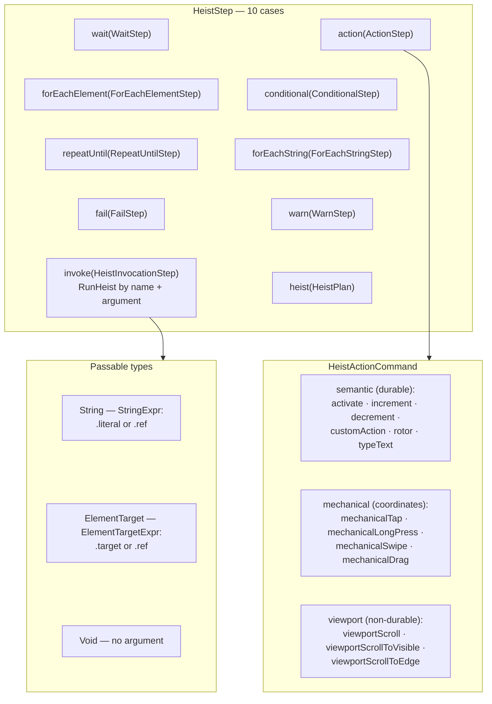
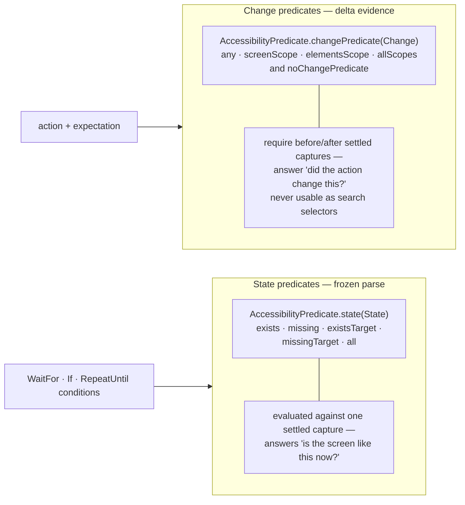

# DSL Grammar

The authoring surface as one picture: step types, action commands, the passable types, target forms, and — the central division — the split between state predicates (evaluated against a frozen parse) and change predicates (requiring delta evidence, never usable as search selectors). This diagram answers "what can a heist say, and what kind of evidence does each construct consume?"

**Illustrates:** [HEIST-LANGUAGE-SPEC.md](../HEIST-LANGUAGE-SPEC.md), [HEIST-FORMAT.md](../HEIST-FORMAT.md), [SWIFT-HEIST-AUTHORING.md](../SWIFT-HEIST-AUTHORING.md)
**Source of truth:** `ButtonHeist/Sources/ThePlans/HeistStep.swift`, `ButtonHeist/Sources/ThePlans/HeistActionCommand.swift`, `ButtonHeist/Sources/ThePlans/HeistArgument.swift`, `ButtonHeist/Sources/ThePlans/AccessibilityPredicate.swift`, `ButtonHeist/Sources/ThePlans/StatePredicateExpressions.swift`, `ButtonHeist/Sources/ThePlans/ElementTarget.swift`

The predicate split:

Notes:

- Targets have exactly one durable form: `ElementTarget.predicate(ElementPredicate, ordinal:)` — a semantic selector with an optional 0-based disambiguating ordinal. There is no coordinate target and no capture-local id target in the durable language (see [element-inflation.md](element-inflation.md)).
- The state/change split is the headline design rule: a state predicate can gate control flow because it reads one frozen parse; a change predicate classifies an action's delta and therefore only exists attached to an action's expectation. Element deltas are expressed with `ElementUpdatePredicate.updated(_, before:, after:)`.
- Wire discriminators for the loop steps are snake_case in `plan.json`: `for_each_element`, `for_each_string`, `repeat_until`.
