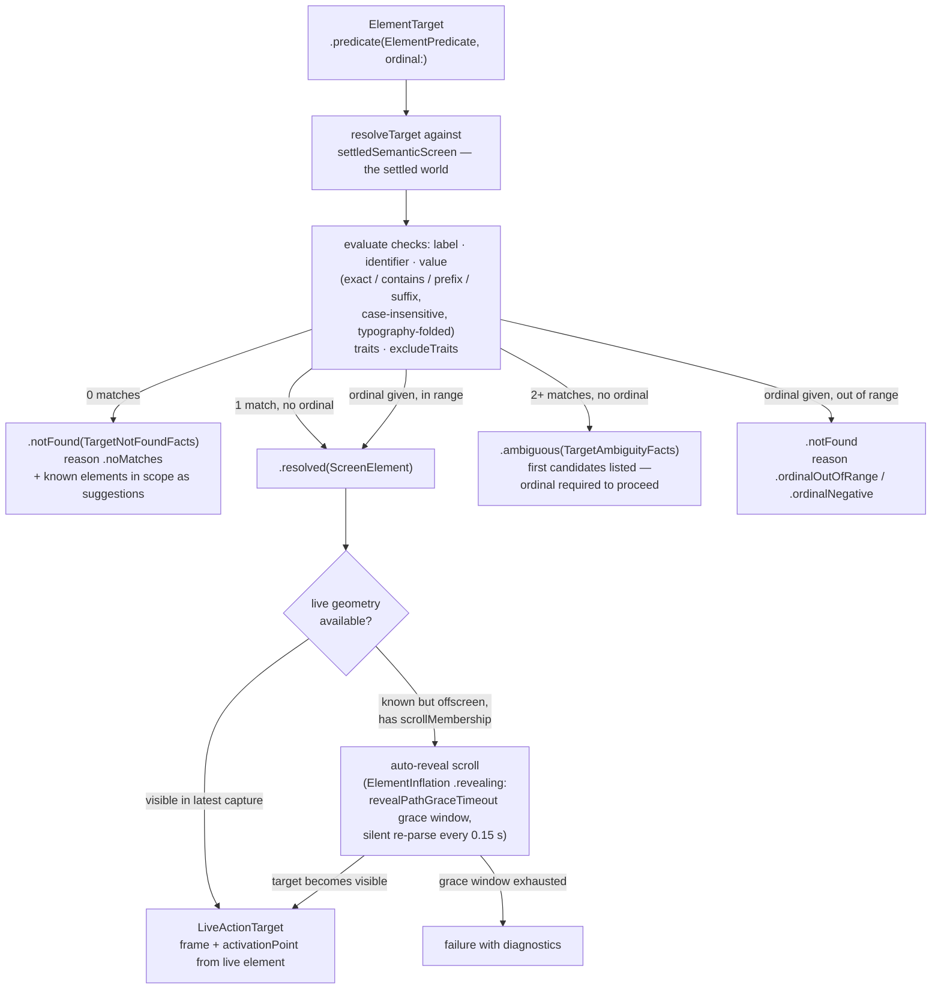

# Element Inflation

How an `ElementTarget` becomes a live, actionable element: predicate resolution against the settled world, ordinal disambiguation, near-miss diagnostics, and the auto-reveal scroll path for known-but-offscreen targets. This diagram answers "why did my selector hit, miss, or scroll?"

**Illustrates:** [ARCHITECTURE.md](../ARCHITECTURE.md), [API.md](../API.md), [HEIST-LANGUAGE-SPEC.md](../HEIST-LANGUAGE-SPEC.md), [SCOPE-AND-LIMITS.md](../SCOPE-AND-LIMITS.md)
**Source of truth:** `ButtonHeist/Sources/ThePlans/ElementTarget.swift`, `ButtonHeist/Sources/ThePlans/ElementPredicate.swift`, `ButtonHeist/Sources/TheInsideJob/TheStash/TheStash+TargetResolution.swift`, `ButtonHeist/Sources/TheInsideJob/TheBrains/ElementInflation.swift`

Notes:

- Resolution reads the **settled world only** (`settledSemanticScreen`). Live capture proves actionability and geometry for a settled element; it is not a second search space.
- Matching is **exact or miss**: string checks are case-insensitive with typography folding (smart quotes, dashes, ellipsis fold to ASCII), traits compare as sets. On a miss the resolver returns structured facts — the known elements in scope — through the diagnostic path; there is no fuzzy fallback.
- The reveal path is bounded: lazily-instantiated content has no elements until UIKit realizes it, so a target that never enters the settled world cannot be revealed — the grace window (`revealPathGraceTimeout`, with `revealPathSilentReparseInterval = 0.15` s re-parses) covers async-loaded targets that are already known, not content that does not exist yet.
- The ordinal is a disambiguator over a semantic base selector, never a selector by itself.
