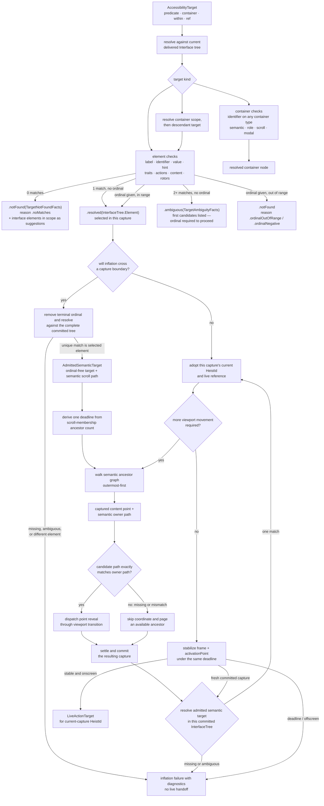

# Element Inflation

How an `AccessibilityTarget` resolves in the delivered tree and, for actions,
becomes a live actionable element. The same resolver also serves predicates and
`get_interface` subtree queries.

**Illustrates:** [ARCHITECTURE.md](../ARCHITECTURE.md), [API.md](../API.md), [HEIST-LANGUAGE-SPEC.md](../HEIST-LANGUAGE-SPEC.md), [SCOPE-AND-LIMITS.md](../SCOPE-AND-LIMITS.md)
**Source of truth:** `ButtonHeist/Sources/ThePlans/Model/AccessibilityTarget.swift`, `ButtonHeist/Sources/ThePlans/Model/ElementPredicate.swift`, `ButtonHeist/Sources/TheInsideJob/TheVault/TheVault+TargetResolution.swift`, `ButtonHeist/Sources/TheInsideJob/TheBrains/ElementInflation.swift`, `ButtonHeist/Sources/TheInsideJob/TheBrains/ElementInflation+SemanticReveal.swift`, `ButtonHeist/Sources/TheInsideJob/TheBrains/ElementInflation+Geometry.swift`

Notes:

- Resolution reads the **interface tree only** (`TheVault.interfaceTree`). Live capture proves current actionability and geometry for an interface element; it is not a second search space.
- Container-only targets are valid for predicates and subtree queries. Element-
  only actions reject a resolved container with a typed target-kind error.
- Matching is **exact or miss**: string checks are case-insensitive with typography folding (smart quotes, dashes, ellipsis fold to ASCII), traits compare as sets. On a miss the resolver returns structured facts — the interface elements in scope — through the diagnostic path; substring matching is not part of resolution.
- A capture-local action can join the selected element's current `HeistId`
  directly to live UIKit evidence. Before any cross-capture reveal, inflation
  admits an `AdmittedSemanticTarget` only when the selected target without its
  terminal ordinal uniquely resolves to that same element in the complete
  committed interface.
- `AdmittedSemanticTarget` is the sole identity retained across committed
  captures. After every viewport transition or other fresh committed capture,
  inflation re-resolves it and adopts only the matching element's current
  `HeistId` and live reference for geometry and dispatch. Missing or ambiguous
  resolution fails; a stale id or newly visible sibling cannot take over.
- The handoff budget is graph-derived: `max(2, unique scroll-membership ancestors + 1)` one-second ticks. Nested reveal follows that graph outermost-first, proves each semantic path against current live containment, and shares the same deadline with geometry stabilization.
- A known semantic target that later gains scroll membership earns at most one
  direct reveal attempt. Its captured content point and producing scroll
  container's semantic path are one evidence value. Exact-owner admission occurs
  immediately before point dispatch; a missing or mismatched owner cannot donate
  its coordinate to an ancestor or sibling and instead selects the established
  ancestor paging route. Point reveal and paging both use the canonical viewport
  transition, settlement, Store commit, and target re-resolution pipelines.
  Content absent from settled semantic truth cannot be revealed, and exploration
  never scans for an old `HeistId` as identity.
- The ordinal is a capture-local disambiguator over a semantic base selector,
  never durable identity. A target that becomes unique only through its terminal
  ordinal cannot be admitted across a capture boundary.
