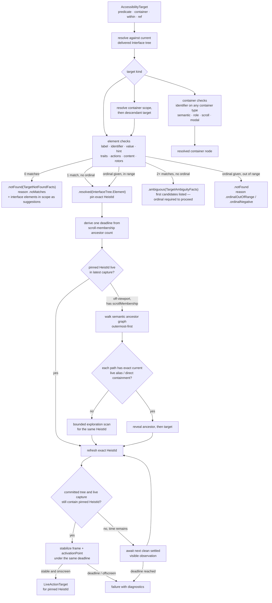

# Element Inflation

How an `AccessibilityTarget` resolves in the delivered tree and, for actions,
becomes a live actionable element. The same resolver also serves predicates and
`get_interface` subtree queries.

**Illustrates:** [ARCHITECTURE.md](../ARCHITECTURE.md), [API.md](../API.md), [HEIST-LANGUAGE-SPEC.md](../HEIST-LANGUAGE-SPEC.md), [SCOPE-AND-LIMITS.md](../SCOPE-AND-LIMITS.md)
**Source of truth:** `ButtonHeist/Sources/ThePlans/Model/AccessibilityTarget.swift`, `ButtonHeist/Sources/ThePlans/Model/ElementPredicate.swift`, `ButtonHeist/Sources/TheInsideJob/TheStash/TheStash+TargetResolution.swift`, `ButtonHeist/Sources/TheInsideJob/TheBrains/ElementInflation.swift`, `ButtonHeist/Sources/TheInsideJob/TheBrains/ElementInflation+SemanticReveal.swift`, `ButtonHeist/Sources/TheInsideJob/TheBrains/ElementInflation+Geometry.swift`

Notes:

- Resolution reads the **interface tree only** (`TheStash.interfaceTree`). Live capture proves current actionability and geometry for an interface element; it is not a second search space.
- Container-only targets are valid for predicates and subtree queries. Element-
  only actions reject a resolved container with a typed target-kind error.
- Matching is **exact or miss**: string checks are case-insensitive with typography folding (smart quotes, dashes, ellipsis fold to ASCII), traits compare as sets. On a miss the resolver returns structured facts — the interface elements in scope — through the diagnostic path; substring matching is not part of resolution.
- The first successful semantic resolution pins one `HeistId`. Every reveal, refresh, geometry sample, multi-stage action handoff, and final dispatch must retain that id; the original selector is not rerun to choose a replacement.
- The handoff budget is graph-derived: `max(2, unique scroll-membership ancestors + 1)` one-second ticks. Nested reveal follows that graph outermost-first, proves each semantic path against current live containment, and shares the same deadline with geometry stabilization.
- A missing direct reveal path may trigger bounded exploration for the same pinned `HeistId`. A known target that later gains scroll membership earns at most one direct reveal attempt; content absent from settled semantic truth cannot be revealed.
- The ordinal is a disambiguator over a semantic base selector, never a selector by itself.
