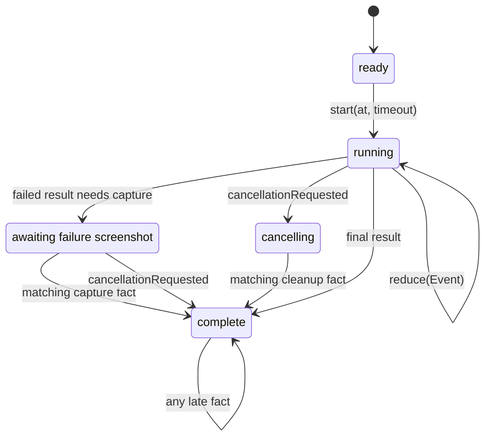
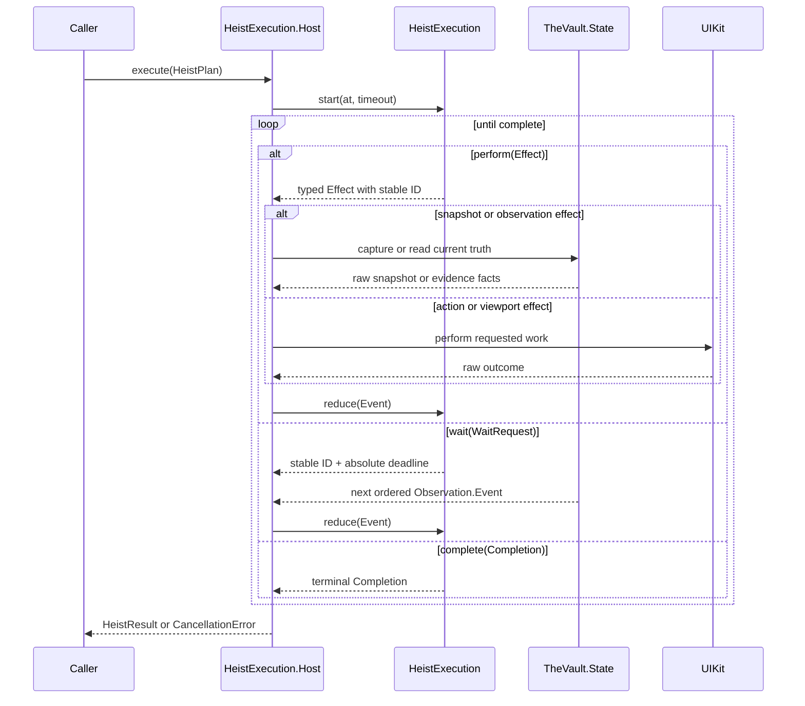
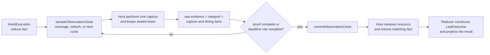

# Heist Execution

One pure `HeistExecution` reducer advances one complete heist. It owns the
execution meaning. It returns only the next `Effect`, a `WaitRequest`, or the
final `Completion`.

**Illustrates:** [ARCHITECTURE.md](../ARCHITECTURE.md), [API.md](../API.md),
[WIRE-PROTOCOL.md](../WIRE-PROTOCOL.md)

**Source of truth:**
`ButtonHeist/Sources/TheInsideJob/TheBrains/HeistExecution.swift`,
`ButtonHeist/Sources/TheInsideJob/TheBrains/HeistExecution+Reducer.swift`,
`ButtonHeist/Sources/TheInsideJob/TheBrains/HeistExecution+ControlFlow.swift`,
`ButtonHeist/Sources/TheInsideJob/TheBrains/HeistExecution+Leaf.swift`,
`ButtonHeist/Sources/TheInsideJob/TheBrains/HeistExecution+Host.swift`

## State Algebra

The private state stores control-flow progress, step results, expectation
progress, stable request IDs, and the original leaf and whole-heist deadlines.
It has no UIKit object, task, socket, closure, subscription, or notification
lease. For the same plan, start time, and ordered facts, it returns the same
decisions.

## Ordered Execution

The host subscribes once for the heist. The Vault records each observation
event before delivery, so live execution and retained evidence share one order.
The host owns the live resources. It does not inspect reducer state.

## Observation Close

The reducer chooses the sample mode. A requested close first admits causal
coverage, then asks for deadline-bounded refreshes until the authored
expectation and structural `noChange` are proved or time expires. A deadline
close takes one next-cycle sample. It takes one more next-cycle sample only when
the first sample proves the authored part but still needs stability. The host
never evaluates an expectation or constructs `LeafOutcome`.

## Deadline Boundary

The reducer stores the original leaf and whole-heist deadlines. It gives each
boundary effect and wait the earlier absolute target. It keeps both originals
so leaf timeout, whole-heist timeout, and equal expiry stay distinct.

The host reads the clock and waits. It returns a stable-ID deadline fact. The
reducer rejects stale facts, closes active observation evidence, and decides the
timeout result. No deadline fact enters `Observation.History`.

## Failure and Cancellation

Failure screenshots are reducer finalization. If the failed result needs one,
the reducer returns `captureFailureScreenshot`, admits the matching capture
fact, and then completes. Cancellation skips a pending failure screenshot and
completes with `.cancelled`. The first admitted terminal event wins, and the
complete state absorbs every later event.

Cancellation has one typed path:

1. The host returns `cancellationRequested`.
2. The reducer returns `cancelObservation` once.
3. The host releases the keyed observation resource and returns the matching
   cleanup fact.
4. The reducer completes with `.cancelled`.
5. The host throws `CancellationError` and releases heist lifetime resources.

Cancellation during failure capture starts at step 4 because no observation
resource remains open.

No result projection performs another capture, discovery, predicate
evaluation, or history reconstruction.
