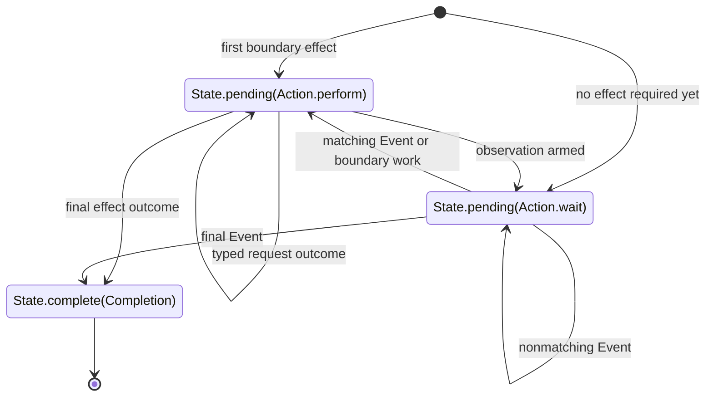
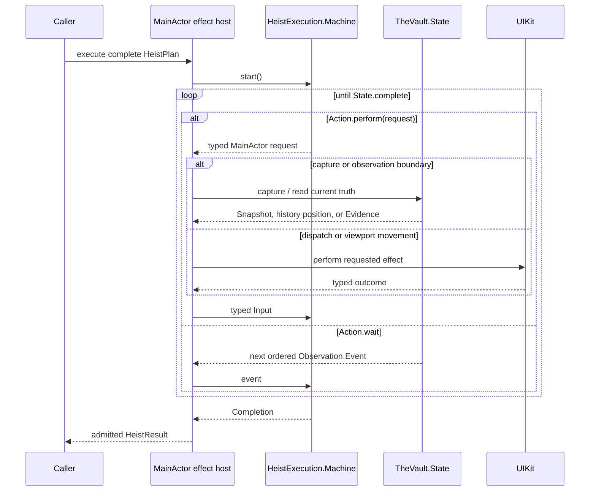

# Heist Execution

One pure machine advances one complete heist. It owns authored control-flow
progress and returns only the next effect request, a request to wait for another
event, or the complete result.

**Illustrates:** [ARCHITECTURE.md](../ARCHITECTURE.md), [API.md](../API.md),
[WIRE-PROTOCOL.md](../WIRE-PROTOCOL.md)

**Source of truth:**
`ButtonHeist/Sources/TheInsideJob/TheBrains/HeistExecution.swift`,
`ButtonHeist/Sources/TheInsideJob/TheBrains/HeistExecution+Reducer.swift`,
`ButtonHeist/Sources/TheInsideJob/TheBrains/HeistExecution+ControlFlow.swift`,
`ButtonHeist/Sources/TheInsideJob/TheBrains/HeistExecution+Leaf.swift`,
`ButtonHeist/Sources/TheInsideJob/TheBrains/HeistExecution+Host.swift`

## State Algebra

The machine has no clock, UIKit object, observation subscription, or async task.
Its private continuation stack says where nested control flow resumes after the
active leaf. For the same plan and ordered inputs, it returns the same states.

## Ordered Execution

The host subscribes once for the heist. The Vault records each event before
delivery, so live consumption and retained replay share one order. A leaf's
observation boundary selects its baseline and history position atomically; no
caller supplies either value.

Subscription installation returns the live subscription and retained replay as
one value. The host constructs its session before consuming replay, so neither
the stream nor the host needs an installation callback phase or event buffer.
Within a running session, observation is exactly idle, establishing its
boundary, or active with the resources owned by that leaf.

## Deadline Boundary

The host owns two absolute policies and one scheduled task: the active leaf's
deadline and the whole heist's deadline. After every crank it schedules the task
for whichever absolute deadline comes first. The machine never receives a clock
event and cannot manufacture timeout state.

When the task expires, the host:

1. latches which deadline expired;
2. cancels the active app interaction or viewport exploration;
3. waits for cancellation cleanup and captures the final visible state;
4. derives evidence from the leaf's protected history boundary; and
5. returns a typed leaf- or heist-timeout outcome to the machine.

A leaf timeout may select an authored wait `else` branch while the heist still
has time. A heist timeout permits no further authored effect. The machine admits
the final cancellation outcome, returns success only if that crank completed
the heist, and otherwise aborts the remaining continuation stack into one
structurally complete timed-out result.

## Failure Evidence

Failure screenshots belong to machine finalization, not deadline handling.
Whenever executed root children contain an `abortedAtPath` and screenshot
evidence is enabled:

1. the machine returns `perform([captureFailureScreenshot])`;
2. the host captures the visible screen;
3. the host returns `failureScreenshotCaptured`; and
4. the same machine returns `complete`.

This path applies equally to explicit failure, leaf or control-flow failure,
runtime and viewport failure, and timeout. Failure to capture the screenshot is
recorded as auxiliary evidence without changing the original aborted path.

## Terminal Cleanup

Completion or cancellation has one host cleanup path:

1. stop accepting event callbacks;
2. stop and join viewport work;
3. cancel the active deadline;
4. consume or release the notification scope;
5. release observation demand and protected history; and
6. resume the caller exactly once.

No result projection performs another capture, discovery, predicate evaluation,
or history reconstruction.
