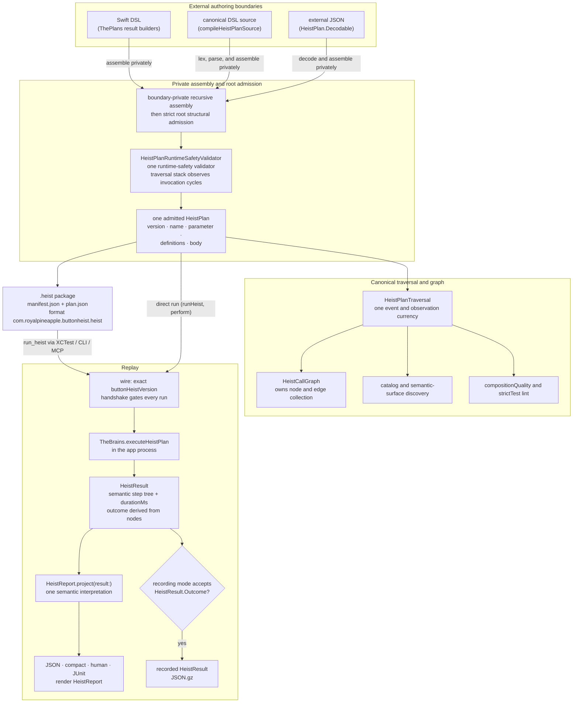

# Heist Lifecycle

Author-to-replay: how external JSON, canonical DSL source, or Swift DSL authoring becomes one admitted plan, a portable `.heist` artifact, and finally a replayed run with a result. This diagram answers "where does my heist live at each stage, and where can it be rejected?"

**Illustrates:** [HEIST-FORMAT.md](../HEIST-FORMAT.md), [HEIST-LANGUAGE-SPEC.md](../HEIST-LANGUAGE-SPEC.md), [SWIFT-HEIST-AUTHORING.md](../SWIFT-HEIST-AUTHORING.md)
**Source of truth:** `ButtonHeist/Sources/ThePlans/Model/HeistContent.swift`, `ButtonHeist/Sources/ThePlans/Model/HeistPlan.swift`, `ButtonHeist/Sources/ThePlans/Model/HeistPlanTraversal.swift`, `ButtonHeist/Sources/ThePlans/Model/HeistCallGraph.swift`, `ButtonHeist/Sources/ThePlans/Compilation/HeistSwiftFileCompilation.swift`, `ButtonHeist/Sources/ThePlans/Parsing/HeistPlanSourceProgramParser.swift`, `ButtonHeist/Sources/ThePlans/Model/HeistArtifact.swift`, `ButtonHeist/Sources/ThePlans/Validation/HeistPlan+RuntimeValidationTraversal.swift`, `ButtonHeist/Sources/ThePlans/Validation/HeistPlan+Validation.swift`, `ButtonHeist/Sources/ThePlans/Discovery/HeistPlan+Discovery.swift`, `ButtonHeist/Sources/TheInsideJob/TheBrains/TheBrains+HeistExecution.swift`, `ButtonHeist/Sources/TheScore/Results/HeistResult.swift`, `ButtonHeist/Sources/TheScore/Reports/HeistResult+Report.swift`, `ButtonHeist/Sources/TheScore/Results/HeistResultRecording.swift`

Notes:

- JSON decoding, source parsing, and Swift DSL construction each keep recursive assembly inside their boundary owner. Only the root leaves that boundary, after strict structural admission and the single `HeistPlanRuntimeSafetyValidator`, as the admitted `HeistPlan`. The runtime never compiles Swift. Live composition enters the same root admission boundary.
- Admission rejects unknown JSON keys with an explicit allowed list per step type. The runtime-safety validator consumes canonical `HeistPlanTraversal` observations, whose invocation stack observes recursive definition cycles ("heist runs must not be recursive"), and applies `HeistPlanRuntimeSafetyLimits` (see [totality.md](totality.md)).
- `HeistCallGraph` owns graph node and edge collection from canonical traversal events. Traversal owns event order, invocation expansion, and invocation-stack cycle observation; there is no graph projection or alternate cycle route.
- Discovery and `.compositionQuality` / `.strictTest` lint consume the admitted plan through the same traversal currency. They are projections and quality checks, not additional admission paths.
- The `.heist` package is two JSON files: `manifest.json` (`format`, `formatVersion`, `planVersion`, `entry`, `producer`, `createdAt`) and `plan.json` (the IR, `HeistPlan.currentVersion = 2`), read and written by `HeistArtifactCodec`.
- Replay always crosses the wire contract: the exact `buttonHeistVersion` handshake gates the session before any plan runs, so a heist can never execute against a mismatched runtime.
- `HeistResult` remains execution truth. `HeistReport.project(result:)`
  interprets it once, and every presentation boundary renders that report.
- Result recording reads `HeistResult.Outcome` directly. The recording mode and
  artifact filename do not introduce a second passed/failed status.
