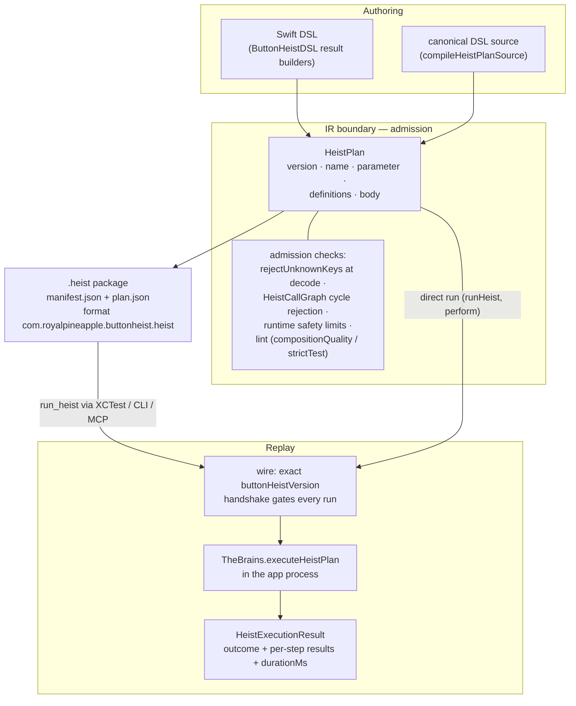

# Heist Lifecycle

Author-to-replay: how a heist written in Swift (or in the canonical DSL source form) becomes a validated plan, a portable `.heist` artifact, and finally a replayed run with a receipt. This diagram answers "where does my heist live at each stage, and where can it be rejected?"

**Illustrates:** [HEIST-FORMAT.md](../HEIST-FORMAT.md), [HEIST-LANGUAGE-SPEC.md](../HEIST-LANGUAGE-SPEC.md), [SWIFT-HEIST-AUTHORING.md](../SWIFT-HEIST-AUTHORING.md)
**Source of truth:** `ButtonHeist/Sources/ThePlans/Model/HeistPlan.swift`, `ButtonHeist/Sources/ThePlans/Compilation/HeistSwiftFileCompiler.swift`, `ButtonHeist/Sources/ThePlans/Parsing/HeistPlanSourceProgramParser.swift`, `ButtonHeist/Sources/ThePlans/Model/HeistArtifact.swift`, `ButtonHeist/Sources/ThePlans/Model/HeistArtifactCodec.swift`, `ButtonHeist/Sources/ThePlans/Validation/HeistPlan+Validation.swift`, `ButtonHeist/Sources/TheInsideJob/TheBrains/TheBrains+HeistExecution.swift`, `ButtonHeist/Sources/TheScore/Receipts/HeistExecutionResult.swift`

Notes:

- Both authoring frontends lower to the same validated `HeistPlan` — the runtime never compiles Swift. Live composition (heists assembled over an interactive session) enters the same IR boundary as hand-authoring.
- Admission is strict at the boundary: decoding rejects unknown keys with an explicit allowed list per step type, `HeistCallGraph` rejects any recursive definition cycle ("heist runs must not be recursive"), and `HeistPlanRuntimeSafetyLimits` caps plan size (see [totality.md](totality.md)).
- The `.heist` package is two JSON files: `manifest.json` (`format`, `formatVersion`, `planVersion`, `entry`, `producer`, `createdAt`) and `plan.json` (the IR, `HeistPlan.currentVersion = 1`), read and written by `HeistArtifactCodec`.
- Replay always crosses the wire contract: the exact `buttonHeistVersion` handshake gates the session before any plan runs, so a heist can never execute against a mismatched runtime.
