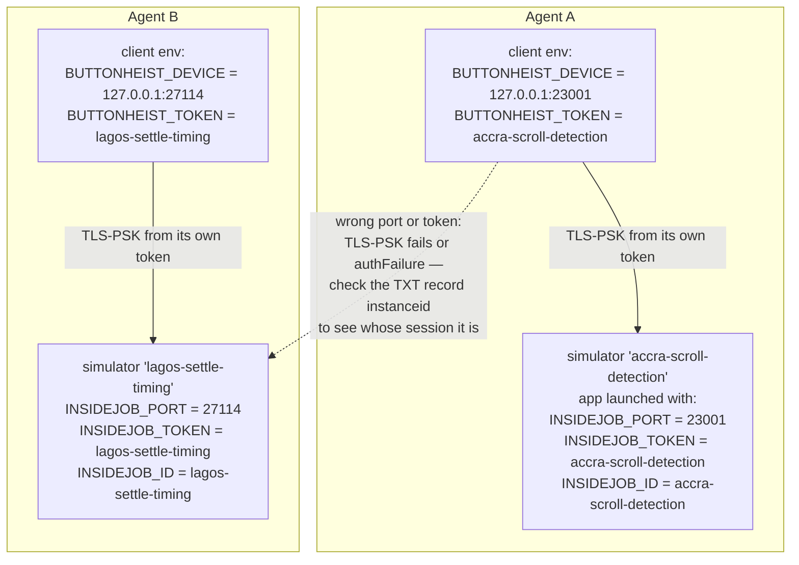
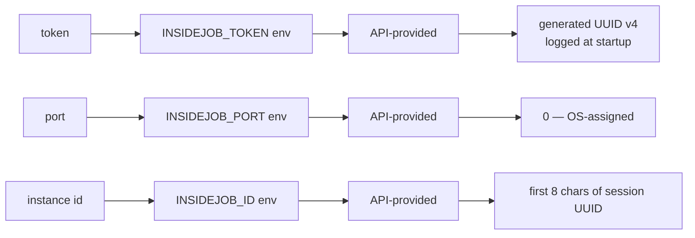

# Multi-Agent Isolation

How many agents drive many apps on one machine without stepping on each other: one simulator, one port, and one human-readable token per agent, with the same slug used as simulator name, auth token, and instance identifier. This diagram answers "whose session did I just hit, and how does an agent find its own?"

**Illustrates:** [AUTH.md](../AUTH.md)
**Source of truth:** `ButtonHeist/Sources/TheInsideJob/InsideJobRuntimeConfiguration.swift`, `ButtonHeist/Sources/TheScore/Messages.swift`, `ButtonHeist/Sources/TheScore/ServerIdentityPayloads.swift`, `ButtonHeist/Sources/TheInsideJob/Server/BonjourAdvertisement.swift`, `ButtonHeist/Sources/TheInsideJob/Server/SessionTokenSource.swift`

Server-side identity resolution (`InsideJobRuntimeConfiguration`):

Notes:

- The convention is `{workspace}-{task-slug}` for all three values: simulator name = token = instance ID. The token is not just auth — it is a label. `xcrun simctl list devices booted` becomes a dashboard of what every agent is doing, and a session's identity is legible everywhere it appears.
- The server advertises its identity in the Bonjour TXT record (`TXTRecordKey`: `instanceid`, `simudid`, `devicename`, `installationid`, `transport = tls-psk`), so an agent can tell sessions apart **before** connecting.
- After successful auth, `ServerInfo` carries `instanceId` (per-launch UUID), `instanceIdentifier` (the human-readable ID), and `listeningPort`.
- A failed auth returns only "Invalid token. Retry with the configured token." — the server never discloses its token. An auth failure against the loopback usually means the wrong simulator's port, not the wrong token: find your own session by its `instanceid` instead of changing tokens.
- Never use UUIDs or opaque strings as tokens for agent work — a human-readable slug is what makes a connection error diagnosable.
