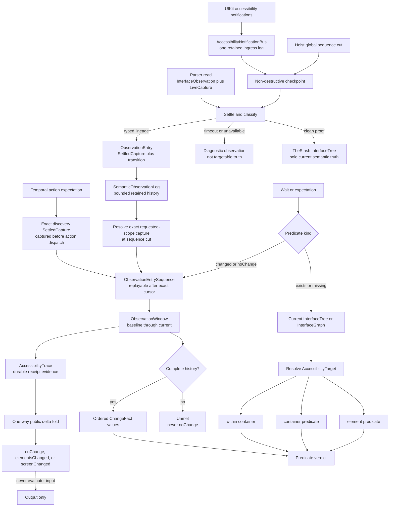
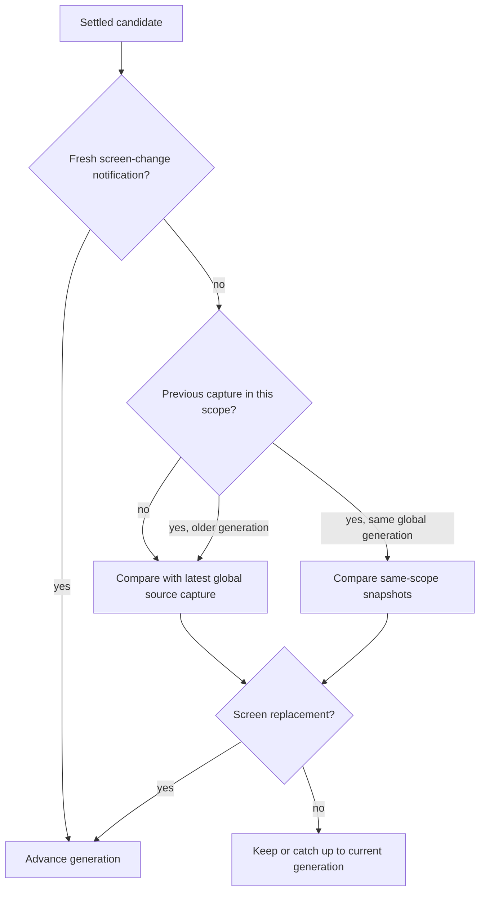
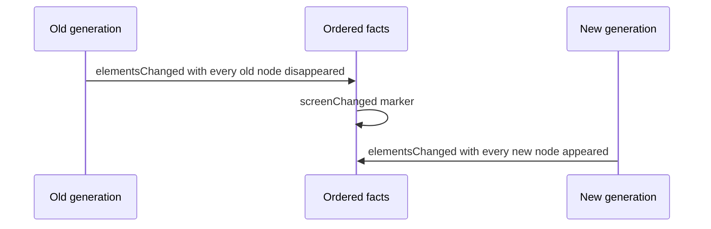

# Observation Pipeline

Button Heist has one current semantic tree and one retained temporal log.
Presence reads the current tree. Change evaluation reads a cursor-backed window
from the retained log. Receipts materialize trace evidence from that same
lineage, and public `delta` remains a final lossy fold.

**Illustrates:** [ARCHITECTURE.md](../ARCHITECTURE.md),
[API.md](../API.md), [WIRE-PROTOCOL.md](../WIRE-PROTOCOL.md)

**Source of truth:**
`ButtonHeist/Sources/TheInsideJob/TheStash/TheStash+InterfaceState.swift`,
`ButtonHeist/Sources/TheInsideJob/TheStash/SemanticObservationValues.swift`,
`ButtonHeist/Sources/TheInsideJob/TheStash/SemanticObservationLog.swift`,
`ButtonHeist/Sources/TheInsideJob/TheStash/ObservationEntrySequence.swift`,
`ButtonHeist/Sources/TheInsideJob/TheStash/SemanticObservationPublication.swift`,
`ButtonHeist/Sources/TheInsideJob/TheStash/SemanticObservationStream.swift`,
`ButtonHeist/Sources/TheInsideJob/TheBrains/InteractionObservation.swift`,
`ButtonHeist/Sources/TheInsideJob/TheBrains/ObservationWindow.swift`,
`ButtonHeist/Sources/TheInsideJob/TheBrains/PredicateWait+ObservationStream.swift`,
`ButtonHeist/Sources/TheInsideJob/TheTripwire/AccessibilityNotificationBus.swift`,
`ButtonHeist/Sources/TheScore/Core/AccessibilityPredicate+Evaluation.swift`,
`ButtonHeist/Sources/TheButtonHeist/TheFence/DeltaProjection.swift`

Publication assigns generations through one scope-aware classifier:

A screen boundary is one typed transition with this fact order:

Consequences:

- `changed(.screen(...))` requires the screen marker, then evaluates its
  `exists` and `missing` assertions against the current tree.
- `changed(.elements(...))` can match same-screen lifecycle changes or the
  disappearance/appearance facts produced by a screen boundary.
- `updated` is constructible only from two captures in the same generation.
  Identically described nodes across a screen boundary disappear and reappear.
- Notification checkpoints retain their source events. Overflow is explicit
  `AccessibilityNotificationGap` evidence rather than silent history loss.
- Presence uses the same `AccessibilityTarget` resolver as actions and
  `get_interface`, including container and descendant-scoped targets.
- Only a complete, fact-free window can satisfy `noChange`.
- Public delta cannot recover the retained transition order it folds and never
  participates in predicate evaluation. If the window contains a screen marker,
  `screenChanged` dominates the final public delta kind.
