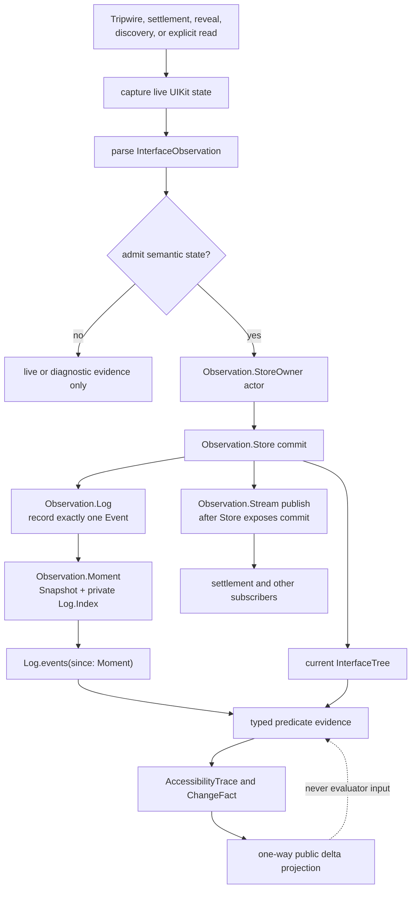
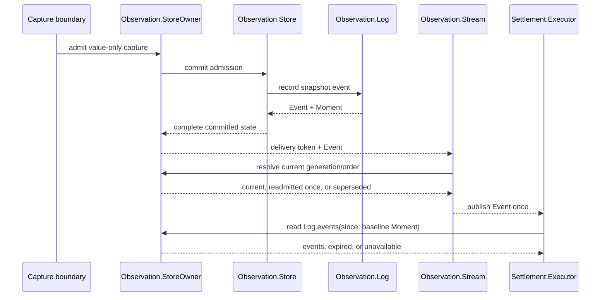

# Observation Pipeline

Button Heist has one semantic observation pipeline. `Observation.Store` owns
current truth and one retained `Observation.Log`; `Observation.Stream` owns
capture scheduling and ordered delivery. A parser sample has no semantic
authority until it has been admitted and committed.

**Illustrates:** [ARCHITECTURE.md](../ARCHITECTURE.md), [API.md](../API.md),
[WIRE-PROTOCOL.md](../WIRE-PROTOCOL.md)

**Source of truth:**
`ButtonHeist/Sources/TheInsideJob/TheVault/SemanticObservationValues.swift`,
`ButtonHeist/Sources/TheInsideJob/TheVault/SemanticObservationHistory.swift`,
`ButtonHeist/Sources/TheInsideJob/TheVault/SemanticObservationStore.swift`,
`ButtonHeist/Sources/TheInsideJob/TheVault/SemanticObservationStoreOwner.swift`,
`ButtonHeist/Sources/TheInsideJob/TheVault/SemanticObservationStream.swift`,
`ButtonHeist/Sources/TheInsideJob/TheBrains/Settlement.swift`,
`ButtonHeist/Sources/TheInsideJob/TheBrains/Settlement+Execution.swift`

## Authority and publication

Commit and publication are ordered, not eventually reconciled. The Store first
derives continuity, records the event in a copied Log, and atomically installs
the resulting current state. Only then may the Stream deliver that event. A
failed admission or commit leaves prior semantic truth intact and publishes
nothing.

UIKit objects stay in disposable capture evidence. `Observation.Snapshot`,
`Moment`, and `Event` retain normalized value state only. Capture-local
`HeistId` values may join a committed semantic target to live evidence for the
next dispatch, but never become identity across captures.

## Collection semantics

`Observation.Log` is a `RandomAccessCollection`. Its index is private to the
observation subsystem; consumers receive a `Moment`, not an integer token they
can manipulate. `events(since:)` returns one of:

- ordered events beginning strictly after the Moment's insertion boundary;
- an expired result with a typed retention gap; or
- an unavailable result when the Moment belongs to another Log.

The Store protects the baseline of each active settlement from pruning. Once
that settlement finishes, normal bounded retention resumes. This is ownership
bookkeeping only: it does not retain UIKit objects and it does not expose a
second public window abstraction.

Delivery tokens prevent a reset or invalidation from publishing an event from
an older Store generation. One actor re-admission is allowed when a commit was
invalidated before delivery; repeated invalidation supersedes the event rather
than looping.

## Predicate evidence

| Predicate semantics | Observation input |
| --- | --- |
| Current state | Exact handoff snapshot returned by settlement |
| Positive transition | Ordered post-baseline snapshot events; first qualifying result latches |
| Announcement | Ordered notification event after the invocation announcement position; first qualifying result latches |
| Complete history (`noChange`) | Complete, non-expired `events(since:)` result at the handoff |

Diagnostic candidates and endpoint deltas never change predicate truth. An
action and a later standalone wait have different Moments and announcement
positions, so evidence cannot leak between operations.
