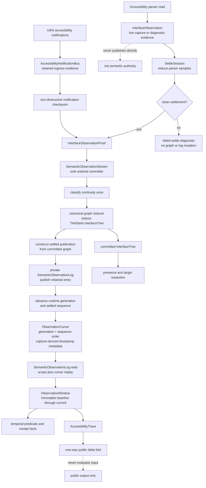
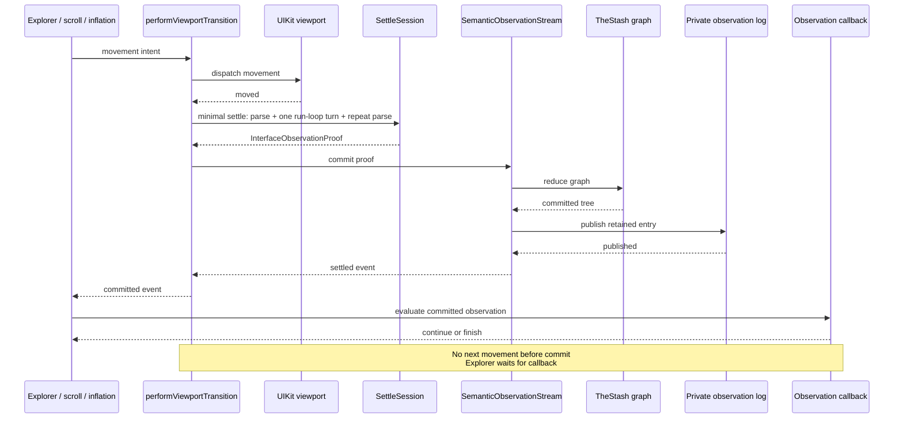
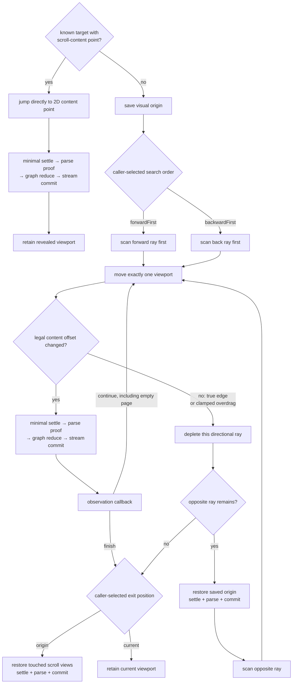
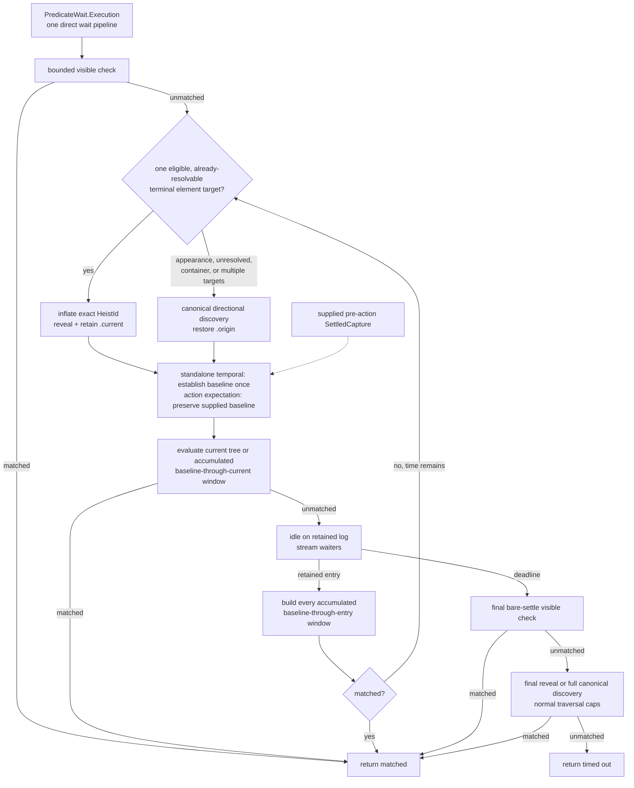
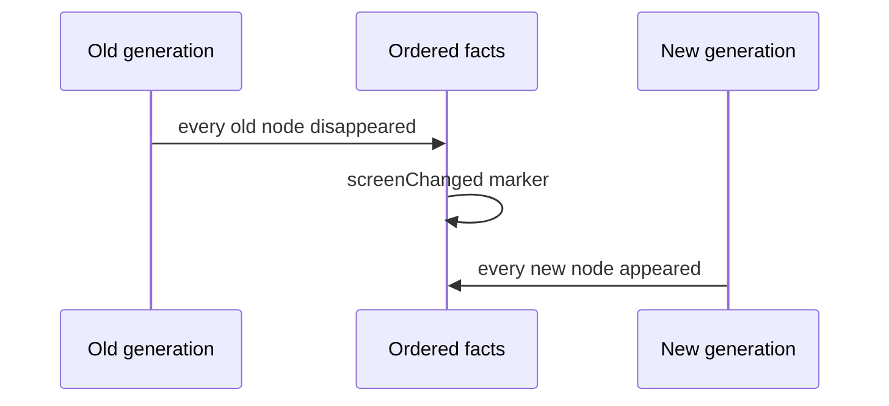

# Observation Pipeline

Button Heist has one committed semantic tree and one private retained temporal
log. Raw parser samples remain live or diagnostic evidence. Only a clean
settlement proof can enter the ordered commit path. Presence reads the committed
tree; temporal predicates and receipts read replayable retained entries.

**Illustrates:** [ARCHITECTURE.md](../ARCHITECTURE.md),
[API.md](../API.md), [WIRE-PROTOCOL.md](../WIRE-PROTOCOL.md)

**Source of truth:**
`ButtonHeist/Sources/TheInsideJob/TheStash/TheStash+InterfaceState.swift`,
`ButtonHeist/Sources/TheInsideJob/TheStash/SemanticObservationValues.swift`,
`ButtonHeist/Sources/TheInsideJob/TheStash/SemanticObservationLog.swift`,
`ButtonHeist/Sources/TheInsideJob/TheStash/SemanticObservationPublication.swift`,
`ButtonHeist/Sources/TheInsideJob/TheStash/SemanticObservationStream.swift`,
`ButtonHeist/Sources/TheInsideJob/TheBrains/SettleSession.swift`,
`ButtonHeist/Sources/TheInsideJob/TheBrains/Navigation+ScrollSettleProof.swift`,
`ButtonHeist/Sources/TheInsideJob/TheBrains/Navigation+Explore.swift`,
`ButtonHeist/Sources/TheInsideJob/TheBrains/Navigation+ExplorationScanning.swift`,
`ButtonHeist/Sources/TheInsideJob/TheBrains/Navigation+SemanticExploration.swift`,
`ButtonHeist/Sources/TheInsideJob/TheBrains/InteractionObservation.swift`,
`ButtonHeist/Sources/TheInsideJob/TheBrains/PredicateWait.swift`,
`ButtonHeist/Sources/TheInsideJob/TheBrains/PredicateWait+Evaluation.swift`,
`ButtonHeist/Sources/TheInsideJob/TheBrains/PredicateWait+ObservationStream.swift`,
`ButtonHeist/Sources/TheInsideJob/TheTripwire/AccessibilityNotificationBus.swift`

## Authority And Publication

The ordering is structural: graph reduction completes before private log
publication. Consumers cannot observe an entry for graph state that has not
already committed, and consuming an entry cannot mutate the graph. Cursor
`observedAt` is derived from the capture's interface timestamp and is metadata;
generation and settled sequence provide correctness ordering.

## Viewport Movement

`Navigation.performViewportTransition` is the only product-owned movement
operation. `ViewportExplorer`, page scroll, inflation placement, and rollback
all submit movement intent to it. No next movement can dispatch until the
previous viewport has committed; exploration additionally waits for its
predicate callback.

Known semantic targets do not page through blank space. If `InterfaceTree`
already carries a target's scroll membership and parser-derived two-dimensional
content point, inflation submits that point directly to the same transition.
Directional page discovery is the fallback for unknown targets or missing
reveal evidence.

The two rays are independent because the explorer commits the saved origin
between them. Empty pages do not imply an edge. A direction depletes only when
the next page cannot change the clamped legal content offset; UIKit bounce and
stretch are outside that legal interval. The exit position is known before
traversal and is applied whenever traversal ends: command and wait discovery
restore `.origin`, while inflation retains `.current`. Restoration is itself a movement, so `.origin`
cannot return before its settle, proof, graph reduction, and publication finish.
When the callback already returned `finish`, final restoration does not invoke
that goal callback again. There is no alternate traversal or commit path.

## Wait Lifecycle

The wait does not poll while idle. Retained entries are the wake-up mechanism;
an unmatched entry re-runs the same reveal or discovery route. A standalone
temporal baseline is established only after initial positioning; every later
evaluation uses the full accumulated window from that immutable baseline.
Action expectations keep the supplied pre-action baseline. The terminal visible
check gets the viewport transition's 250 ms settle budget. Terminal search is
not cancelled by the elapsed wait deadline; normal traversal caps bound it.
Every stage returns immediately when the predicate is fulfilled, and no
compatibility wait orchestration exists. `PredicateWait.Execution` directly
coordinates the visible, reveal/discovery, retained-log waiter, and terminal
verification stages. `PredicateObservationStreamState` only reduces one settled
observation against the immutable baseline and owns no lifecycle or history.

## Screen Boundaries

A screen boundary is one typed transition with this fact order:

Consequences:

- `changed(.screen(...))` requires the screen marker, then evaluates its
  `exists` and `missing` assertions against the current tree.
- `changed(.elements(...))` can match same-screen lifecycle changes or the
  disappearance and appearance facts produced by a screen boundary.
- `updated` is constructible only from two captures in the same generation.
- Notification checkpoints retain their source events. Overflow is explicit
  `AccessibilityNotificationGap` evidence rather than silent history loss.
- Presence uses the same `AccessibilityTarget` resolver as actions and
  `get_interface`, including container and descendant-scoped targets.
- Only a complete, fact-free window can satisfy `noChange`.
- Public delta is output only. When a window contains a screen marker,
  `screenChanged` dominates the final public delta kind.
