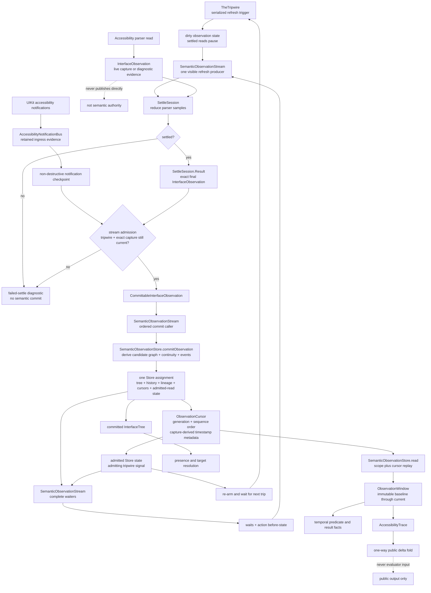
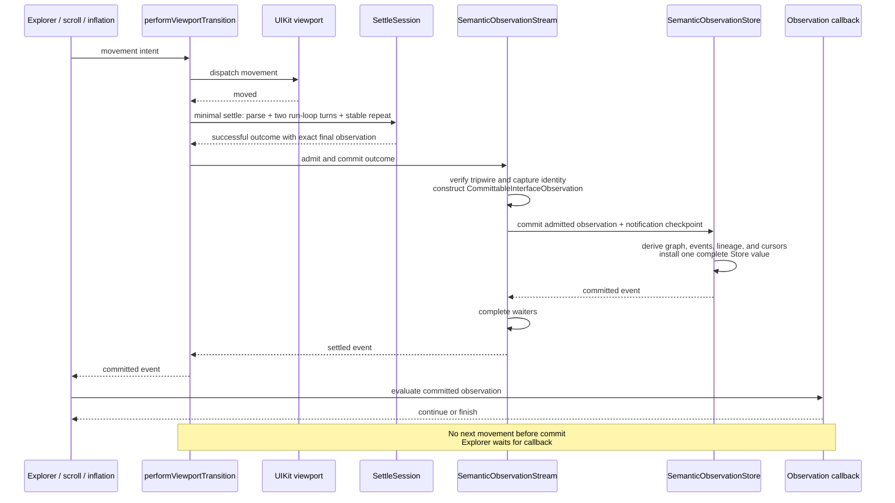
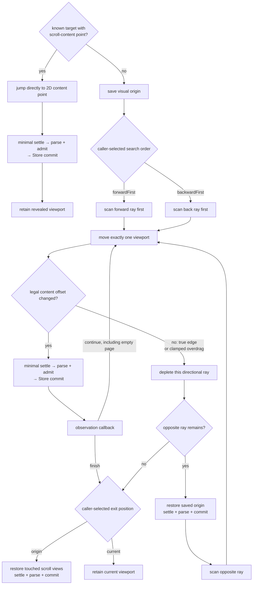
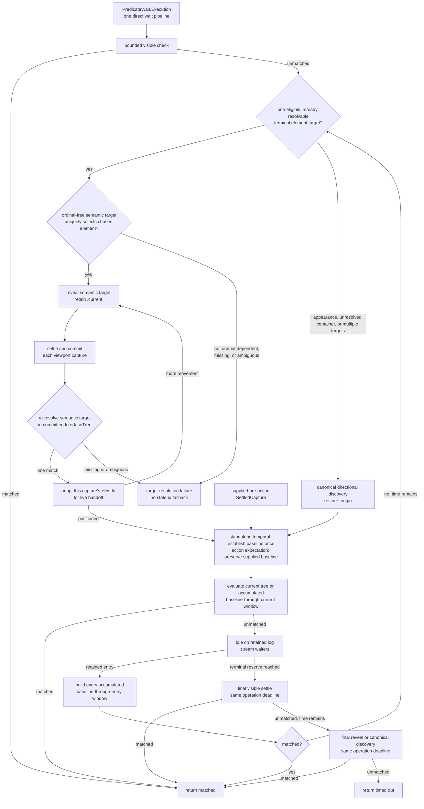
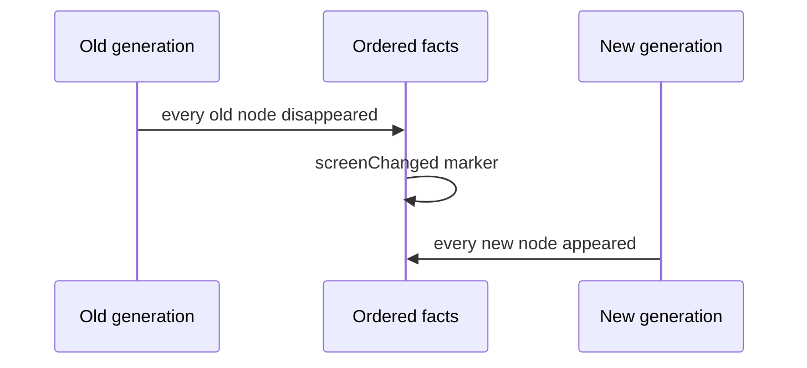

# Observation Pipeline

Button Heist has one `SemanticObservationStore`. It owns the current semantic
graph, retained ordered history, sequence and screen lineage, notification
cursor, and admitted-read state. `SemanticObservationStream` owns settlement
scheduling and delivery, but no second semantic state. Raw parser samples
remain live or diagnostic evidence. Only an admitted settled observation can enter the
Store. Presence reads its current tree; temporal predicates and results read
its replayable retained entries. The tripwire drives one serialized producer
from invalidated state to an admitted commit. Consumers join that refresh or
reuse its admitted result.

**Illustrates:** [ARCHITECTURE.md](../ARCHITECTURE.md),
[API.md](../API.md), [WIRE-PROTOCOL.md](../WIRE-PROTOCOL.md)

**Source of truth:**
`ButtonHeist/Sources/TheInsideJob/TheVault/TheVault+InterfaceState.swift`,
`ButtonHeist/Sources/TheInsideJob/TheVault/SemanticObservationValues.swift`,
`ButtonHeist/Sources/TheInsideJob/TheVault/SemanticObservationHistory.swift`,
`ButtonHeist/Sources/TheInsideJob/TheVault/SemanticObservationStore.swift`,
`ButtonHeist/Sources/TheInsideJob/TheVault/SemanticObservationStream.swift`,
`ButtonHeist/Sources/TheInsideJob/TheVault/SemanticObservationStream+Settlement.swift`,
`ButtonHeist/Sources/TheInsideJob/TheBrains/SettleSession.swift`,
`ButtonHeist/Sources/TheInsideJob/TheBrains/Navigation+ViewportTransition.swift`,
`ButtonHeist/Sources/TheInsideJob/TheBrains/Navigation+Explore.swift`,
`ButtonHeist/Sources/TheInsideJob/TheBrains/Navigation+ExplorationScanning.swift`,
`ButtonHeist/Sources/TheInsideJob/TheBrains/Navigation+SemanticExploration.swift`,
`ButtonHeist/Sources/TheInsideJob/TheBrains/InteractionCoordinator.swift`,
`ButtonHeist/Sources/TheInsideJob/TheBrains/PredicateWait.swift`,
`ButtonHeist/Sources/TheInsideJob/TheBrains/PredicateWait+Evaluation.swift`,
`ButtonHeist/Sources/TheInsideJob/TheBrains/PredicateWait+ObservationStream.swift`,
`ButtonHeist/Sources/TheInsideJob/TheTripwire/AccessibilityNotificationBus.swift`

## Authority And Commit

The ordering is structural. The stream first admits the exact parser capture
which settled. `SemanticObservationStore.commitObservation` then derives the
candidate graph, classifies continuity, constructs every fulfilled-scope event,
validates retained lineage in a copied Store, and installs that Store with one
assignment. Only then does the stream update disposable live evidence and wake
waiters. A failed derivation leaves the complete prior Store intact. Consumers
therefore cannot observe history, lineage, or cursor state for a graph that did
not commit. Cursor `observedAt` is derived from the capture's interface
timestamp and is metadata; generation and settled sequence provide correctness
ordering.

Visible settlement is serialized. A trip invalidates admitted-read state before a
read can be admitted. The first consumer starts the refresh and concurrent
consumers join it; once the Store commit completes, all consumers receive the
same ordered event. Quiet action chains
reuse that event. After-action settlement always starts a fresh capture through
the same producer and publishes through the same commit path.

## Viewport Movement

`Navigation.performViewportTransition` is the only product-owned movement
operation. `ViewportExplorer`, page scroll, inflation placement, and rollback
all submit movement intent to it. No next movement can dispatch until the
previous viewport has committed; exploration additionally waits for its
predicate callback.

Known semantic targets do not page through blank space. If `InterfaceTree`
already carries a target's scroll membership and parser-derived two-dimensional
content point, inflation submits that point directly to the same transition.
Directional page discovery is the fallback for unknown targets or missing
reveal evidence.

After a physical page move, the first settled capture whose semantic viewport
differs from the pre-movement viewport commits immediately. An identical settled
capture remains provisional within the shared one-second semantic observation
budget so delayed SwiftUI accessibility updates can arrive. If the viewport is
legitimately blank or semantically identical, its latest settled capture commits
when there is no budget for another two-frame settle.

The two rays are independent because the explorer commits the saved origin
between them. Empty pages do not imply an edge. A direction depletes only when
the next page cannot change the clamped legal content offset; UIKit bounce and
stretch are outside that legal interval. The exit position is known before
traversal and is applied whenever traversal ends: command and wait discovery
restore `.origin`, while inflation retains `.current`. Restoration is itself a movement, so `.origin`
cannot return before its settle, observation admission, and Store commit finish.
When the callback already returned `finish`, final restoration does not invoke
that goal callback again. There is no alternate traversal or commit path.

## Wait Lifecycle

The wait does not poll while idle. Retained entries are the wake-up mechanism;
an unmatched entry re-runs the same reveal or discovery route. A standalone
temporal baseline is established only after initial positioning; every later
evaluation uses the full accumulated window from that immutable baseline.
Action expectations keep the supplied pre-action baseline. The terminal visible
check, reveal, discovery, and waiter phases inherit one authored operation
deadline. Already-settled truth remains immediately evaluable; new settlement
or discovery starts only when the remaining budget contains the settle reducer's
declared quiet-window floor. After each reveal or discovery, the wait records its route cost and
reserves the longest observed duration so terminal verification starts before
that deadline. Terminal work receives no fresh 250 ms budget and no discovery
continues after the operation deadline. Every stage returns immediately when
the predicate is fulfilled, and no compatibility wait orchestration exists.
An eligible exact-target reveal admits semantic identity before its first
capture boundary, re-resolves that identity after every reveal commit, and uses
only the resulting capture's current `HeistId` for live handoff. A missing or
ambiguous match ends that inflation attempt safely instead of retaining an old
id or substituting a sibling.
`PredicateWait.Execution` directly coordinates the visible, reveal/discovery,
retained-log waiter, and terminal verification stages.
`PredicateObservationStreamState` only reduces one settled observation against
the immutable baseline and owns no lifecycle or history.

## Screen Boundaries

A screen boundary is one typed transition with this fact order:

Consequences:

- `changed(.screen(...))` requires the screen marker, then evaluates its
  `exists` and `missing` assertions against the current tree.
- `changed(.elements(...))` can match same-screen lifecycle changes or the
  disappearance and appearance facts produced by a screen boundary.
- `updated` is constructible only from two captures in the same generation.
- Notification checkpoints retain their source events. Overflow is explicit
  `AccessibilityNotificationGap` evidence rather than silent history loss.
- Presence uses the same `AccessibilityTarget` resolver as actions and
  `get_interface`, including container and descendant-scoped targets.
- Only a complete, fact-free window can satisfy `noChange`.
- Public delta is output only. When a window contains a screen marker,
  `screenChanged` dominates the final public delta kind.
