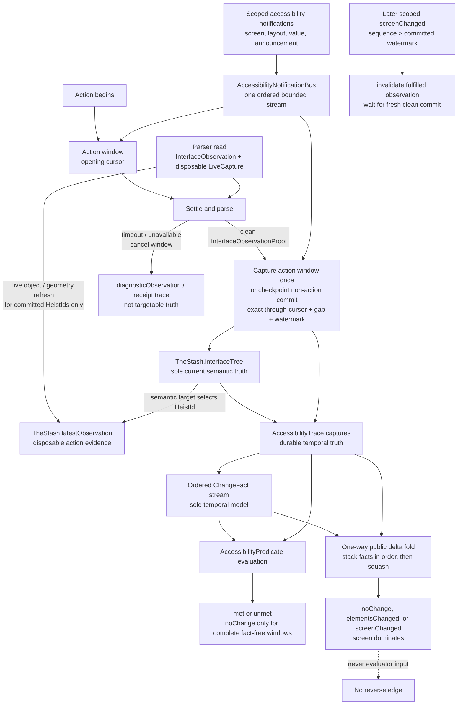
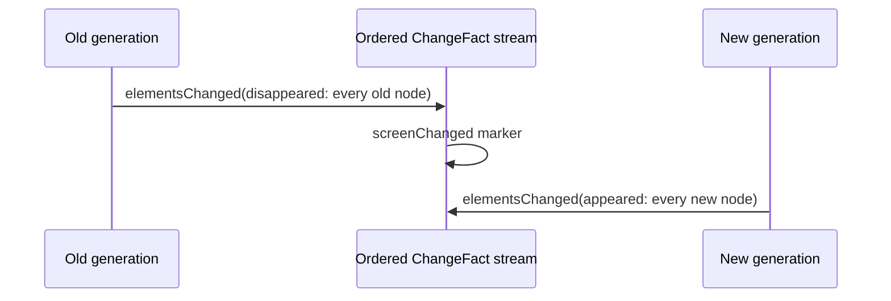

# Observation Pipeline

Button Heist retains one settled `InterfaceTree` as current semantic truth and
settled accessibility captures as temporal truth. It derives one ordered
`ChangeFact` stream for every temporal consumer. Predicates, receipts,
diagnostics, and public formatting all start from that stream. The public
`delta` is a final, lossy fold for display and transport; it is never evaluator
input.

**Illustrates:** [ARCHITECTURE.md](../ARCHITECTURE.md),
[API.md](../API.md), [WIRE-PROTOCOL.md](../WIRE-PROTOCOL.md)

**Source of truth:**
`ButtonHeist/Sources/TheInsideJob/TheStash/TheStash+InterfaceState.swift`,
`ButtonHeist/Sources/TheInsideJob/TheStash/SemanticObservationStream.swift`,
`ButtonHeist/Sources/TheInsideJob/TheTripwire/AccessibilityNotificationBus.swift`,
`ButtonHeist/Sources/TheScore/Evidence/AccessibilityTrace.swift`,
`ButtonHeist/Sources/TheScore/Evidence/AccessibilityTrace+ChangeFacts.swift`,
`ButtonHeist/Sources/TheScore/Evidence/AccessibilityTraceDiff.swift`,
`ButtonHeist/Sources/TheScore/Core/AccessibilityPredicate+Evaluation.swift`,
`ButtonHeist/Sources/TheButtonHeist/TheFence/DeltaProjection.swift`

A screen boundary is normalized into the same fact language:

Consequences:

- `changed(.screen(...))` requires the screen marker, then evaluates its
  `exists` and `missing` assertions against the current delivered tree.
- `changed(.elements(...))` can match lifecycle facts produced by same-screen
  edits or by a screen boundary.
- Identically described nodes on opposite sides of a screen boundary still
  disappear and appear. They are not updates.
- `updated` facts can only be constructed while observing two captures in the
  same screen generation.
- Any scoped screen, layout, value, or announcement notification is edge
  evidence. It prevents a fact-free `noChange` verdict even when endpoint
  captures have equal hashes.
- Raw parser reads refresh disposable live action evidence for committed
  `HeistId` values but do not update the settled interface or make new parsed
  nodes targetable. Failed settles remain diagnostic evidence only.
- Scoped screen notification is authoritative replacement evidence. Element
  and announcement notifications stay in-generation; only empty or unknown
  notification evidence permits snapshot inference. Every inferred replacement
  stores its typed reason in `transition.fallbackReason`. Notification delivery
  is best effort; absence is not a classification.
- A clean action batch contains only retained events after its opening cursor
  and no later than its exact through-cursor. Overflow is explicit
  `AccessibilityNotificationGap` evidence. A later scoped `screenChanged`
  advances beyond the committed scoped-screen watermark and invalidates the
  fulfilled observation; ambient unscoped notifications do not. A failed settle
  cancels the window without attaching its events to settled trace evidence.
- The public fold composes facts like stacked layers, resolves transient
  appear/disappear pairs, and lets any screen marker dominate the final kind.
  That convenience projection cannot recover the ordered history it squashed.
