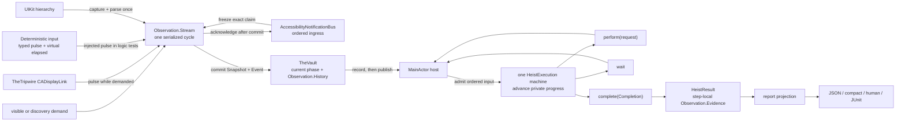

# Observation Pipeline

The Vault owns current accessibility truth and one ordered
`Observation.History`. One `HeistExecution` machine consumes admitted inputs in
authored order and retains all progress for the complete heist.

**Illustrates:** [ARCHITECTURE.md](../ARCHITECTURE.md)

```mermaid
flowchart LR
    Demand["visible or discovery demand"] --> Stream["Observation.Stream<br/>one serialized cycle"]
    Link["TheTripwire CADisplayLink"] -->|"pulse while demanded"| Stream
    Script["Deterministic input<br/>typed pulse + virtual elapsed"] -->|"injected pulse in logic tests"| Stream
    Notice["AccessibilityNotificationBus<br/>ordered ingress"] -->|"freeze exact claim"| Stream
    UIKit["UIKit hierarchy"] -->|"capture + parse once"| Stream
    Stream -->|"commit Snapshot + Event"| Vault["TheVault<br/>current phase + Observation.History"]
    Vault -->|"record, then publish"| Host["MainActor host"]
    Host -->|"admit ordered input"| Machine["one HeistExecution machine<br/>advance private progress"]
    Machine --> Perform["perform(request)"]
    Machine --> Wait["wait"]
    Machine --> Complete["complete(Completion)"]
    Perform --> Host
    Wait --> Host
    Complete --> Result["HeistResult<br/>step-local Observation.Evidence"]
    Result --> Report["report projection"]
    Report --> Render["JSON / compact / human / JUnit"]
    Stream -->|"acknowledge after commit"| Notice
```

One typed pulse starts at most one claim, capture, parse, commit, publication,
and evaluation cycle. Production obtains it from the display-link adapter;
deterministic execution authors it directly and never starts a display link.
Pulses arriving during an active synchronous cycle are dropped; a later pulse
starts the next demanded cycle. Zero live demand pauses the display link, so the
runtime is otherwise inert. The Vault constructs
each event and records it before delivery. A snapshot is current truth, an event
is one ordered fact, history is the Vault-owned retained event array, and
evidence is immutable result data. UIKit objects remain at the boundary.

The host interprets pending actions. For `.perform`, it performs the one typed
MainActor request and admits its result. For `.wait`, it waits for the next
ordered `Observation.Event`. The machine is deterministic and
replayable from its initial heist and ordered admitted inputs.

The host owns the active leaf and whole-heist absolute deadlines, scheduling
one task for the earlier value. Neither deadline enters the machine or
observation history. Exploration may consult the host's deadline but never arms
another timer. Expiry cancels the active interaction, lets dispatched viewport
restoration and its observation cycle finish, admits terminal evidence, and
gives the machine one final crank; only an incomplete heist then becomes a
timeout.
