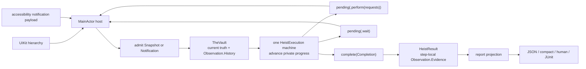

# Observation Pipeline

The Vault owns current accessibility truth and one ordered
`Observation.History`. One `HeistExecution` machine consumes admitted inputs in
authored order and retains all progress for the complete heist.

**Illustrates:** [ARCHITECTURE.md](../ARCHITECTURE.md)

```mermaid
flowchart LR
    UIKit["UIKit hierarchy"] --> Host["MainActor host"]
    Notice["accessibility notification payload"] --> Host
    Host --> Admit["admit Snapshot or Notification"]
    Admit --> Vault["TheVault<br/>current truth + Observation.History"]
    Vault --> Machine["one HeistExecution machine<br/>advance private progress"]
    Machine --> Perform["pending(.perform(requests))"]
    Machine --> Wait["pending(.wait)"]
    Machine --> Complete["complete(Completion)"]
    Perform --> Host
    Wait --> Host
    Complete --> Result["HeistResult<br/>step-local Observation.Evidence"]
    Result --> Report["report projection"]
    Report --> Render["JSON / compact / human / JUnit"]
```

The Vault constructs each event and records it before delivery. A snapshot is
current truth, an event is one ordered fact, history is the Vault-owned retained
event array, and evidence is immutable result data. UIKit objects remain at the
boundary.

The host interprets pending actions. For `.perform`, it performs the typed
MainActor requests and admits their results. For `.wait`, it waits for the next
ordered `Observation.Event`. The machine is deterministic and
replayable from its initial heist and ordered admitted inputs.

The host owns the active leaf and whole-heist absolute deadlines, scheduling
one task for the earlier value. Neither deadline enters the machine or
observation history. Expiry cancels the active interaction, admits terminal
evidence, and gives the machine one final crank; only an incomplete heist then
becomes a timeout.
