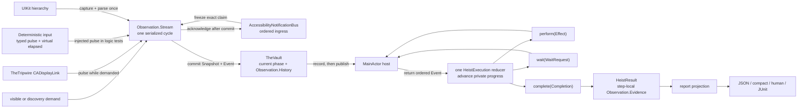

# Observation Pipeline

The Vault owns current accessibility truth and one ordered
`Observation.History`. One `HeistExecution` reducer consumes admitted facts in
authored order and retains all progress for the complete heist.

**Illustrates:** [ARCHITECTURE.md](../ARCHITECTURE.md)

```mermaid
flowchart LR
    Demand["visible or discovery demand"] --> Stream["Observation.Stream<br/>one serialized cycle"]
    Link["TheTripwire CADisplayLink"] -->|"pulse while demanded"| Stream
    Script["Deterministic input<br/>typed pulse + virtual elapsed"] -->|"injected pulse in logic tests"| Stream
    Notice["AccessibilityNotificationBus<br/>ordered ingress"] -->|"freeze exact claim"| Stream
    UIKit["UIKit hierarchy"] -->|"capture + parse once"| Stream
    Stream -->|"commit Snapshot + Event"| Vault["TheVault<br/>current phase + Observation.History"]
    Vault -->|"record, then publish"| Host["MainActor host"]
    Host -->|"return ordered Event"| Execution["one HeistExecution reducer<br/>advance private progress"]
    Execution --> Perform["perform(Effect)"]
    Execution --> Wait["wait(WaitRequest)"]
    Execution --> Complete["complete(Completion)"]
    Perform --> Host
    Wait --> Host
    Complete --> Result["HeistResult<br/>step-local Observation.Evidence"]
    Result --> Report["report projection"]
    Report --> Render["JSON / compact / human / JUnit"]
    Stream -->|"acknowledge after commit"| Notice
```

One typed pulse starts at most one claim, capture, parse, commit, publication,
and evaluation cycle. Production obtains it from the display-link adapter;
deterministic execution authors it directly and never starts a display link.
Pulses arriving during an active synchronous cycle are dropped; a later pulse
starts the next demanded cycle. Zero live demand pauses the display link, so the
runtime is otherwise inert. The Vault constructs
each event and records it before delivery. A snapshot is current truth, an event
is one ordered fact, history is the Vault-owned retained event array, and
evidence is immutable result data. UIKit objects remain at the boundary.

For `.perform`, the host performs the one typed effect and returns its raw
event. For `.wait`, it waits for the next ordered `Observation.Event` or the
reducer-provided absolute deadline. The reducer is deterministic and replayable
from its initial heist, start time, and ordered events.

The reducer owns the active leaf and whole-heist absolute deadlines and projects
the earlier boundary target. Deadlines do not enter observation history. The
host reads the clock, waits, and returns stable-ID facts. The reducer classifies
expiry, requests terminal evidence, and decides whether the result is a leaf or
whole-heist timeout.
