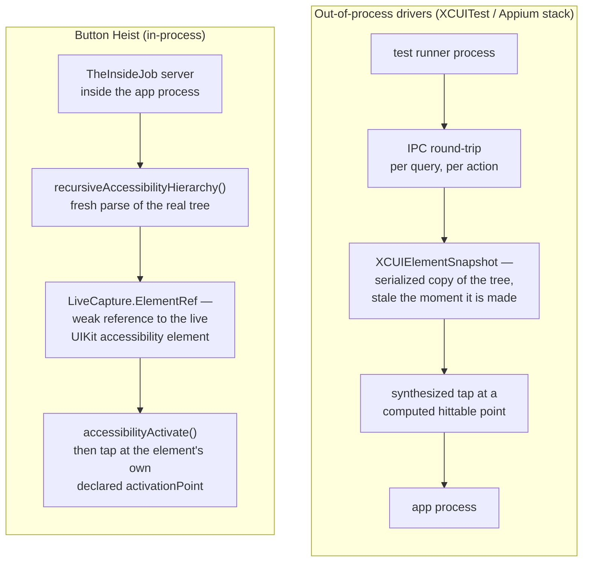

# Process Boundaries

Button Heist in-process versus the out-of-process drivers. Out-of-process automation must serialize a snapshot of the accessibility tree across an IPC boundary and synthesize input at computed coordinates; Button Heist holds the live element in the same process and asks it to activate the way assistive technology does. This diagram answers "why does running inside the app matter?"

**Illustrates:** [WHY-IN-PROCESS.md](../WHY-IN-PROCESS.md), [ARCHITECTURE.md](../ARCHITECTURE.md)
**Source of truth:** `ButtonHeist/Sources/TheInsideJob/TheStash/LiveCapture.swift`, `ButtonHeist/Sources/TheInsideJob/TheBrains/AccessibilityActionDispatcher.swift`, `ButtonHeist/Sources/TheInsideJob/TheBrains/ActivationPolicy.swift`, `submodules/AccessibilitySnapshotBH/Sources/AccessibilitySnapshot/Parser/Swift/Classes/AccessibilityHierarchyParser.swift`

Notes:

- The copy is made at the IPC boundary: out-of-process tools can only ever see a serialized snapshot, because iOS has no public cross-process live-tree API. Button Heist never crosses that boundary — the wire carries commands and receipts, not the tree walk.
- The live element is held in `LiveCapture.ElementRef` as a weak reference, captured per parse and invalidated on the next parse — live access without keeping UIKit objects alive past their lifetime.
- Activation goes through the element's own contract: `accessibilityActivate()` first (what VoiceOver invokes), and on decline a tap at the element's **declared** activation point — not a hittable point computed from the frame (see [activation-policy.md](activation-policy.md)).
- The parser is the AccessibilitySnapshot fork under `submodules/AccessibilitySnapshotBH` — the same tree walk assistive technology semantics are derived from, run in-process on demand.
