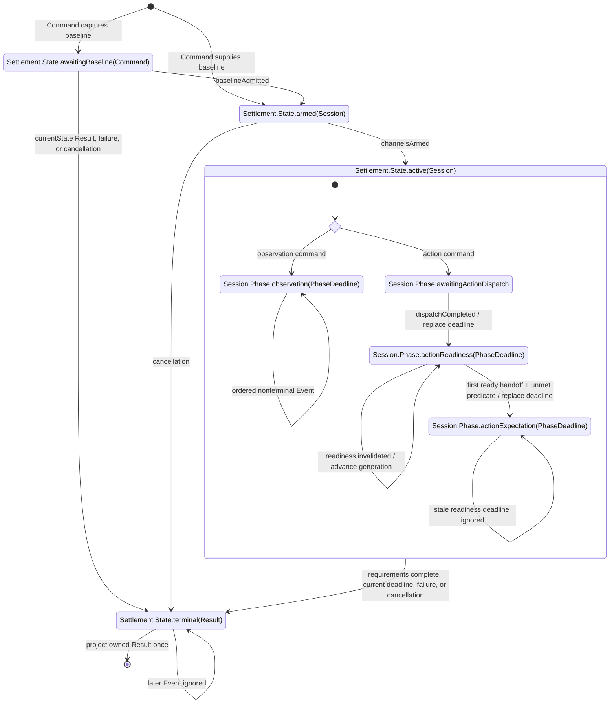
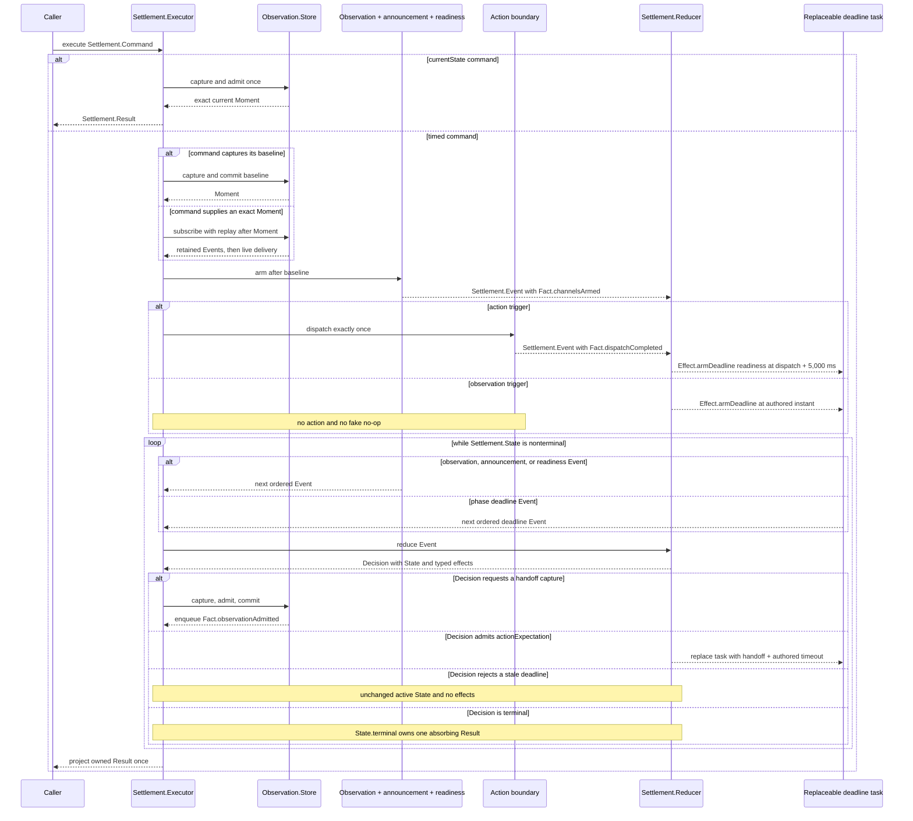

# Settlement Loop

Actions, waits, and heist control flow use one reducer-driven settlement engine.
The command algebra admits exactly three operations: capture current state,
observe until a predicate is satisfied, or dispatch one action with an optional
expectation. Timed commands require readiness and an admitted observation
handoff; current-state inspection returns its one admitted capture directly.

**Illustrates:** [ARCHITECTURE.md](../ARCHITECTURE.md), [API.md](../API.md),
[WIRE-PROTOCOL.md](../WIRE-PROTOCOL.md)

**Source of truth:**
`ButtonHeist/Sources/TheInsideJob/TheBrains/Settlement.swift`,
`ButtonHeist/Sources/TheInsideJob/TheBrains/Settlement+Reducer.swift`,
`ButtonHeist/Sources/TheInsideJob/TheBrains/Settlement+Execution.swift`,
`ButtonHeist/Sources/TheInsideJob/TheBrains/Settlement+ResultProjection.swift`,
`ButtonHeist/Sources/TheInsideJob/TheTripwire/UIKitIdleTracker.swift`

## Three commands, one owner

| Command | Predicate | Meaning | Dispatches |
| --- | --- | --- | --- |
| `currentState` | absent | capture one exact settled snapshot | never |
| `observation` | present | `waitFor` | never |
| `action` | optional | perform one action, optionally evaluating its expectation | once |

## Arm before dispatch

## Completion evidence

A successful timed result is constructible only when all applicable evidence
agrees:

1. The trigger completed successfully. Observation triggers satisfy this
   structurally; action triggers require one successful dispatch.
2. The optional predicate is satisfied. Current-state evidence must hold in the
   returned handoff. Positive transitions and announcements may remain latched.
3. UIKit readiness is established for the current readiness generation.
4. The returned observation was admitted at or after that readiness boundary.

A successful `currentState` result instead requires exactly one admitted
capture, represented as both its boundary and handoff. It arms no channels and
cannot dispatch or evaluate a predicate.

Readiness that arrives after the latest observation requests exactly one
handoff capture. If a qualifying observation was already admitted after the
readiness boundary, it is reused. There is no fixed 30 ms stability delay and
no blanket final predicate revalidation.

The lifecycle-wide `UIKitIdleTracker` combines the aggregate animation counter
with a main-run-loop `beforeWaiting` edge. The private start/stop hooks are
installed for the active Inside Job runtime, not around each action. Nested
heists share the outer observation demand. The existing semantic quiet-window
path remains the fallback for unavailable private tracking and cosmetic
infinite animations.

## Terminal cleanup

Terminal projection happens after structured cleanup:

1. stop accepting new sink callbacks;
2. request graceful stop for viewport-mutating observation work;
3. cancel and join owned dispatch, capture, evaluation, readiness, and deadline
   tasks;
4. consume or release child notification scopes;
5. release the outer action notification window and observation demand; and
6. emit one diagnosis derived from the canonical result.

This ordering prevents a child scope from outliving its owner, restores the
viewport before an observation-only wait returns, and guarantees no capture or
predicate work occurs after the absorbing terminal result.
