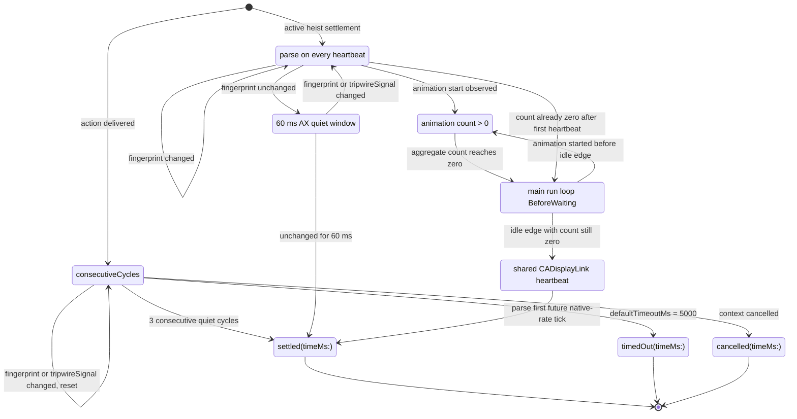
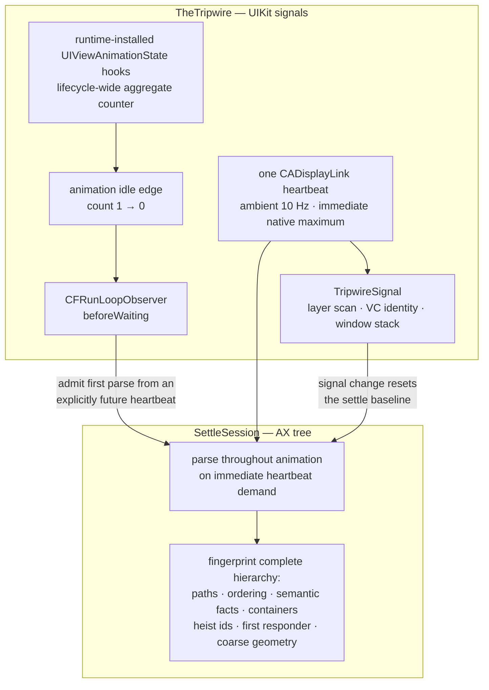

# Settle Loop

The tripwire and the settle loop as cooperating mechanisms: TheTripwire watches UIKit timing signals on one display-link pulse, while SettleSession parses concurrently and accepts the first valid UIKit-idle or semantic-stability proof. This diagram makes "settled evidence" concrete — it answers "what exactly does Button Heist mean when it says the screen settled?"

**Illustrates:** [ARCHITECTURE.md](../ARCHITECTURE.md), [ACCESSIBILITY-CONTRACT.md](../ACCESSIBILITY-CONTRACT.md), [SCOPE-AND-LIMITS.md](../SCOPE-AND-LIMITS.md)
**Source of truth:** `ButtonHeist/Sources/TheInsideJob/TheBrains/SettleSession.swift`, `ButtonHeist/Sources/TheInsideJob/TheBrains/SettleTimeline.swift`, `ButtonHeist/Sources/TheInsideJob/TheTripwire/UIKitIdleTracker.swift`, `ButtonHeist/Sources/TheInsideJob/TheTripwire/TheTripwire.swift`, `ButtonHeist/Sources/TheInsideJob/TheTripwire/TheTripwire+Pulse.swift`, `ButtonHeist/Sources/TheScore/ButtonHeistRuntimeKnobs.swift`

The active proof race shares the same `timedOut` and `cancelled` edges as
`consecutiveCycles`; they are drawn once to keep the picture readable. If the
private idle tracker is unavailable or a cosmetic animation repeats forever,
the 60 ms AX quiet-window proof can still settle. Both proofs use the single CADisplayLink heartbeat;
immediate demand boosts it from the ambient rate to the active screen maximum
until the next tick. An idle wait that consumes the authored deadline stays timed out.

The two clocks:

Notes:

- The fingerprint (`SettleTimeline.fingerprint(of:)`) hashes hierarchy paths and ordering, every stable element semantic fact, containers, heist-id assignments, first-responder identity, and coarse geometry. Volatile `value`, shape, and activation-point facts are **skipped for elements carrying `updatesFrequently`**, so clocks and progress bars cannot hold the screen "unsettled" forever.
- A clean result carries the exact final `InterfaceObservation`; the semantic stream admits that observation only while its tripwire signal and capture identity are still current. It never reacquires or reconstructs the parser sample after settlement.
- `SettleOutcome.timedOut` is explicitly unsettled: `didSettleCleanly` is `false` and the result reports `settled: false`. It is never passed off as stable.
- `cancelled` is the third outcome — the session was torn down mid-action, distinct from `timedOut` so the caller can short-circuit instead of continuing on a dead session.
- Constants live in `SettleSession`: `defaultCyclesRequired = 3`, `defaultCycleIntervalMs = 100`, `defaultTimeoutMs = 5_000`.
