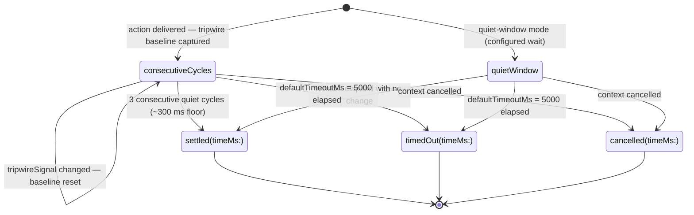
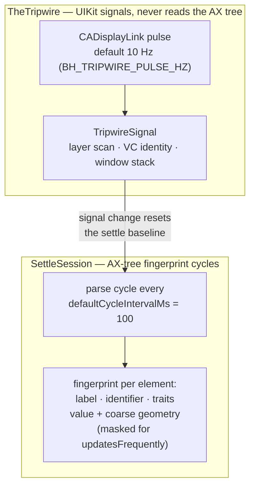

# Settle Loop

The tripwire and the settle loop as cooperating mechanisms: TheTripwire watches UIKit timing signals on a display-link pulse, while SettleSession proves the accessibility tree stable by fingerprinting consecutive parses. This diagram makes "settled evidence" concrete — it answers "what exactly does Button Heist mean when it says the screen settled?"

**Illustrates:** [ARCHITECTURE.md](../ARCHITECTURE.md), [ACCESSIBILITY-CONTRACT.md](../ACCESSIBILITY-CONTRACT.md), [SCOPE-AND-LIMITS.md](../SCOPE-AND-LIMITS.md)
**Source of truth:** `ButtonHeist/Sources/TheInsideJob/TheBrains/SettleSession.swift`, `ButtonHeist/Sources/TheInsideJob/TheBrains/SettleTimeline.swift`, `ButtonHeist/Sources/TheInsideJob/TheTripwire/TheTripwire.swift`, `ButtonHeist/Sources/TheInsideJob/TheTripwire/TheTripwire+Pulse.swift`, `ButtonHeist/Sources/TheScore/ButtonHeistRuntimeKnobs.swift`

The two clocks:

Notes:

- The fingerprint (`SettleTimeline.fingerprint(of:)`) hashes each element's `label`, `identifier`, and `traits`; `value` and coarse geometry are **skipped for elements carrying `updatesFrequently`**, so clocks and progress bars cannot hold the screen "unsettled" forever.
- `SettleOutcome.timedOut` is explicitly unsettled: `didSettleCleanly` is `false` and the receipt reports `settled: false`. It is never passed off as stable.
- `cancelled` is the third outcome — the session was torn down mid-action, distinct from `timedOut` so the caller can short-circuit instead of continuing on a dead session.
- Constants live in `SettleSession`: `defaultCyclesRequired = 3`, `defaultCycleIntervalMs = 100`, `defaultTimeoutMs = 5_000`.
