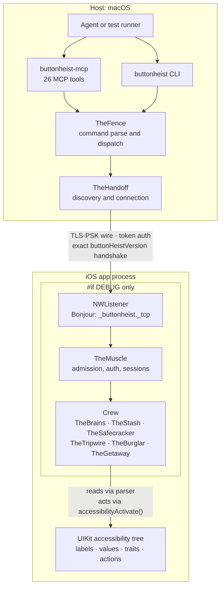

# System Topology

The whole machine in one frame: an agent on the host drives the app through the wire, and everything that runs inside the app process is compiled out of release builds. This diagram answers "what talks to what, and where does each piece live?"

**Illustrates:** [ARCHITECTURE.md](../ARCHITECTURE.md)
**Source of truth:** `ButtonHeist/Sources/TheScore/Messages.swift`, `ButtonHeist/Sources/TheScore/TLSPreSharedKeyMaterial.swift`, `ButtonHeist/Sources/TheInsideJob/TheInsideJob.swift`, `ButtonHeist/Sources/TheInsideJob/Server/SocketListenerStartup.swift`, `ButtonHeist/Sources/TheInsideJob/Server/BonjourAdvertisement.swift`, `ButtonHeistCLI/Package.swift`, `ButtonHeistMCP/Package.swift`

Notes:

- The wire is TLS with a pre-shared key derived from the session token (`ButtonHeistTLSPreSharedKey.makeNetworkParameters(token:)`, HKDF-SHA256, cipher `TLS_PSK_WITH_AES_128_GCM_SHA256`). Token auth then happens again at the message layer (`authenticate`).
- The version handshake compares the client's and server's `buttonHeistVersion` for exact equality and rejects on any mismatch (`MuscleHandshakePhase`).
- Everything inside the `#if DEBUG` border — the listener, TheMuscle, and the crew — does not exist in release builds. The accessibility tree is the surface the server reads and acts on; there is no other channel into the app.
