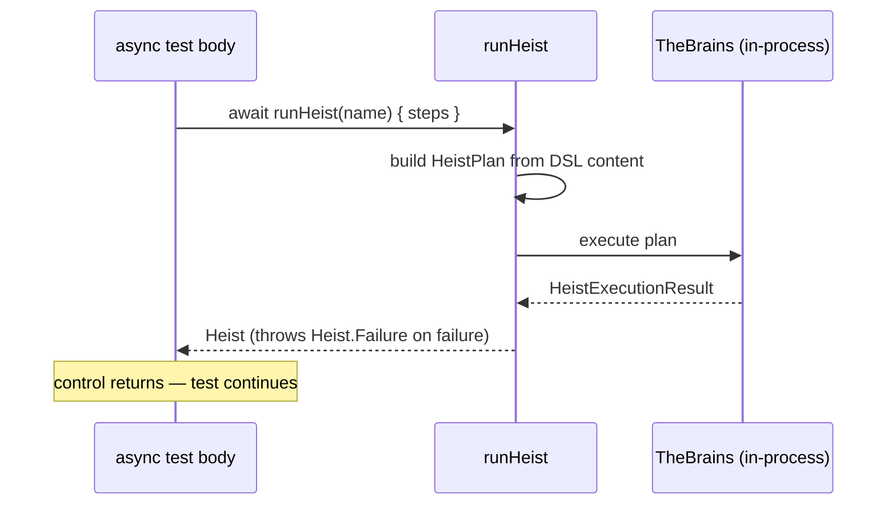
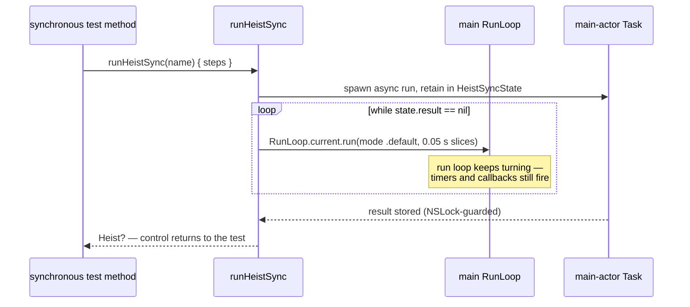
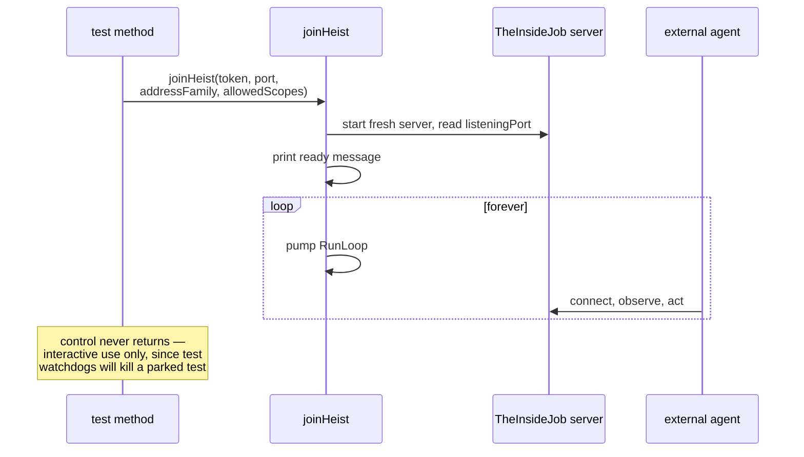
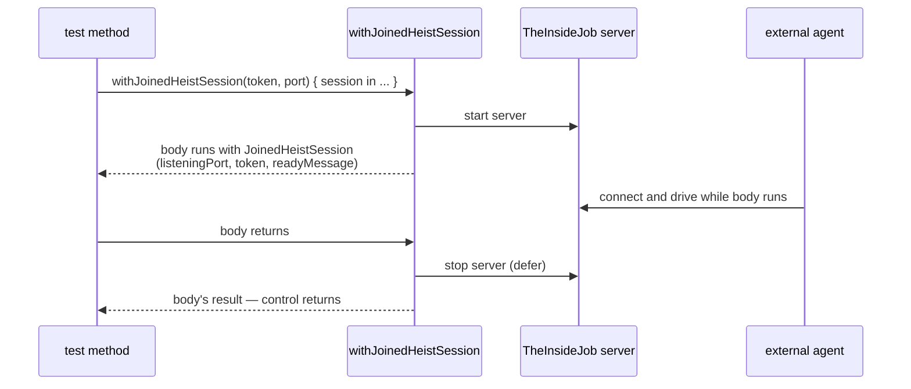

# Test Entry Points

The four ways a test process hands control to Button Heist, and what the run loop is doing in each. "Held" is not "frozen": in every entry point the test thread keeps pumping the run loop, so timers, callbacks, and the in-app server all keep firing while the test waits. All four are `#if DEBUG` only.

**Illustrates:** [SWIFT-HEIST-AUTHORING.md](../SWIFT-HEIST-AUTHORING.md), [HEIST-FORMAT.md](../HEIST-FORMAT.md)
**Source of truth:** `ButtonHeist/Sources/ButtonHeistTesting/ButtonHeistTesting.swift`

## `runHeist` — async test, in-process run

## `runHeistSync` — synchronous XCTest, run loop pumped

## `joinHeist` — park the test, hand the app to an agent

## `withJoinedHeistSession` — scoped join

Notes:

- `runHeist` and `runHeistSync` run the plan in-process; `joinHeist` and `withJoinedHeistSession` start a `TheInsideJob` server inside the test host so an **external** agent can connect (observation and control come from outside, over the same wire as any other client).
- `runHeistSync` exists so the test method itself can stay synchronous: it polls `HeistSyncState` in 0.05 s run-loop slices until the main-actor task publishes a result.
- Bare `joinHeist` never returns — it is for interactive sessions only. Under CI, test watchdogs will kill a parked test; use `withJoinedHeistSession` when the join must end.
- Receipts can be recorded per run via `HeistTestReceiptRecording` (`.environment`, `.failures`, `.always`).
