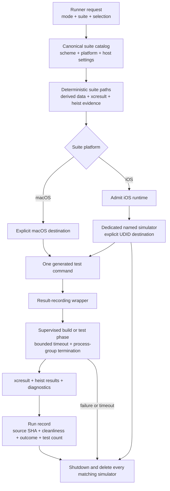
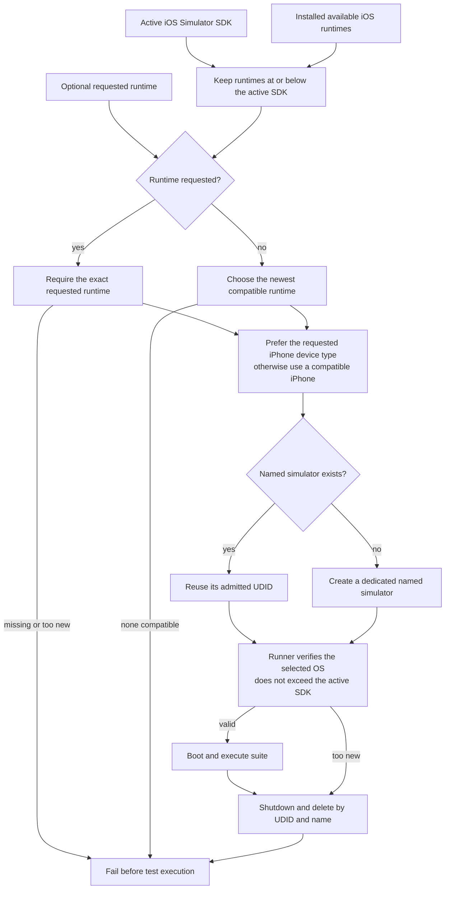
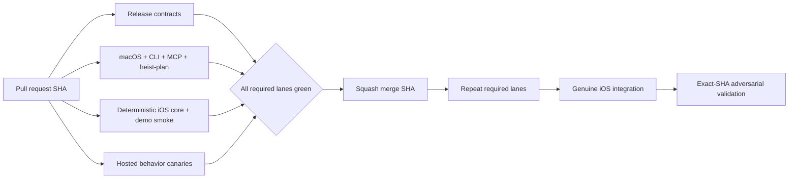

# Test Runner

The canonical runner owns suite names, schemes, destinations, selection,
derived data, result bundles, evidence collection, and simulator cleanup.
Callers choose a suite and mode; they do not assemble an `xcodebuild` command
or manage simulator lifecycle themselves.

**Illustrates:** [ARCHITECTURE.md](../ARCHITECTURE.md)

**Source of truth:** `scripts/test-runner.py`,
`scripts/select-ios-ci-simulator.py`, `.github/workflows/ci.yml`

## One execution path

`run` uses selective testing unless the caller requests `--selection full`.
CI's build-once lanes use `build-for-testing` followed by
`test-without-building` against the same deterministic derived-data path.
Every completed test phase must produce a nonzero test count from its result
bundle; a successful process with no executed tests is inconclusive, not green.

## Runtime admission

The runtime ceiling comes from the active SDK, not the newest runtime installed
on the machine. An explicit runtime remains configurable but cannot exceed that
ceiling. Simulator names are task-readable ownership labels; cleanup checks the
selected UDID and removes every remaining simulator with the same name so a
failed run cannot leak an ambiguous future destination.

## CI ordering

Pull-request evidence is necessary but not sufficient. The `main` push reruns
the regular matrix, then gates genuine integration and exact-SHA adversarial
validation on that immutable merge commit.
