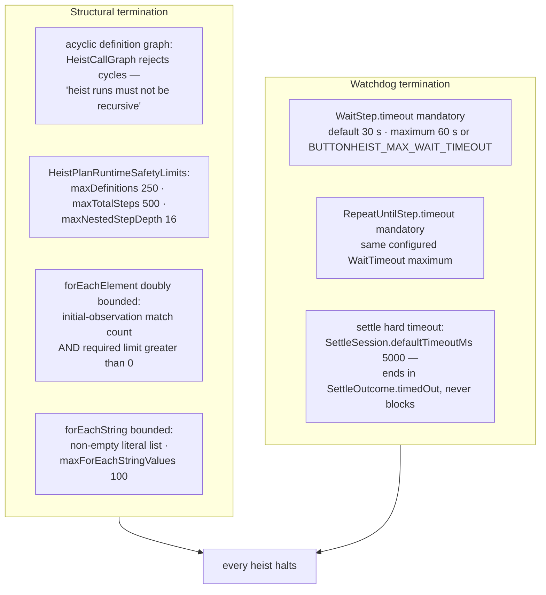

# Totality

Why every heist halts. Termination rests on two independent halves: structural guarantees enforced at admission (the plan cannot express an unbounded computation) and watchdog guarantees enforced at runtime (everything that waits has a mandatory timeout). This diagram answers "what stops a heist from running forever?"

**Illustrates:** [SWIFT-HEIST-AUTHORING.md](../SWIFT-HEIST-AUTHORING.md), [HEIST-LANGUAGE-SPEC.md](../HEIST-LANGUAGE-SPEC.md)
**Source of truth:** `ButtonHeist/Sources/ThePlans/HeistCallGraph.swift`, `ButtonHeist/Sources/ThePlans/HeistPlan+RuntimeValidationTraversal.swift`, `ButtonHeist/Sources/ThePlans/HeistPlan+RuntimeValidationLimits.swift`, `ButtonHeist/Sources/ThePlans/LoopSteps.swift`, `ButtonHeist/Sources/ThePlans/WaitStep.swift`, `ButtonHeist/Sources/TheInsideJob/TheBrains/SettleSession.swift`

Notes:

- Structural bounds are admission-enforced (a violating plan never loads);
  watchdog bounds are runtime-enforced (a loaded plan cannot wait forever).
- The two halves are independent: even if every watchdog fired at its maximum, the structural bounds cap the total number of steps a run can attempt; even if a plan is structurally small, no single step can wait unboundedly.
- The precise invariant underneath: **runtime state can be tested, never named.** A heist cannot bind a discovered element or screen into a variable and branch on it later — passables are `String` / `AccessibilityTarget` / `Void` expressions resolved at use time, and loop domains are fixed by the initial observation or a literal list, so no runtime value can extend a computation the plan didn't already bound.
