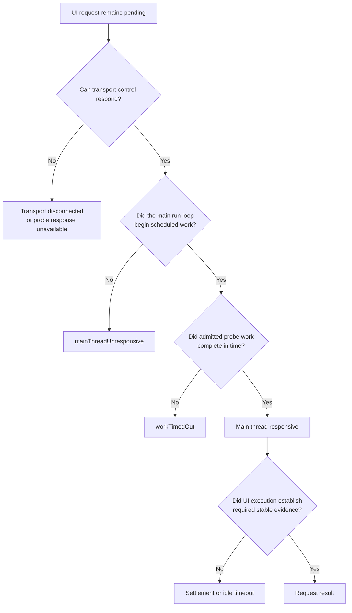

# Transport Control Plane

One off-main owner consumes transport events, admits per-client requests, and
keeps liveness diagnosis independent from the MainActor it measures. This
diagram answers "which work can still progress when the app main thread is
wedged?"

**Illustrates:** [ARCHITECTURE.md](../ARCHITECTURE.md), [WIRE-PROTOCOL.md](../WIRE-PROTOCOL.md)
**Source of truth:** `ButtonHeist/Sources/TheInsideJob/Server/ServerTransport.swift`, `ButtonHeist/Sources/TheInsideJob/Server/NetworkBoundary/SocketClientRegistry.swift`, `ButtonHeist/Sources/TheInsideJob/TheGetaway/TransportControlPlane.swift`, `ButtonHeist/Sources/TheInsideJob/TheGetaway/TheGetaway+Transport.swift`, `ButtonHeist/Sources/TheInsideJob/Runtime/MainThreadProbe.swift`, `ButtonHeist/Sources/TheButtonHeist/TheFence/TheFence+TransportWaits.swift`

## Ownership and execution

```mermaid
flowchart LR
    FENCE["TheFence<br/>pending UI request watchdog"]
    SOCKET["ServerTransport<br/>transportEvents"]

    subgraph offmain["Off MainActor"]
        CONTROL["TransportControlPlane<br/>sole event consumer"]
        ADMISSION["Per-client ordered<br/>admission"]
        SIDEBAND["Transport-control sideband<br/>ping · mainThreadProbe"]
        PROBE["MainThreadProbe<br/>single terminal gate"]
    end

    subgraph main["MainActor"]
        STREAM["One bounded stream<br/>app work + coalesced control wake"]
        BRAINS["TheBrains<br/>single interaction executor"]
        SETTLE["Settlement.Executor<br/>idle and semantic evidence"]
    end

    FENCE -- "mainThreadProbe while UI request is pending" --> SOCKET
    SOCKET --> CONTROL
    CONTROL --> ADMISSION
    ADMISSION --> SIDEBAND
    ADMISSION --> STREAM
    SIDEBAND -- "pong" --> FENCE
    SIDEBAND --> PROBE
    PROBE -- "responsive · mainThreadUnresponsive · workTimedOut" --> FENCE
    PROBE -. "CFRunLoopPerformBlock + wake" .-> main
    STREAM --> BRAINS
    BRAINS --> SETTLE
```

`ping` and `mainThreadProbe` never enter the MainActor stream or TheBrains.
Admitted app work crosses one bounded, capacity-admitted stream. The control
plane retains client-lease invalidations and transport backlog facts off-main
and coalesces them behind one pending control wake-up, so connection churn
cannot grow the stream or lose cancellation facts. UI work still has one
interaction executor. The same lease gates admission and execution.
Response handlers reserve delivery against their originating socket
incarnation. Replacement wiring drains prior interaction work before its
generation is admitted.

## Failure taxonomy

These outcomes locate different boundaries:

- Transport failure says the sideband itself cannot exchange messages.
- `mainThreadUnresponsive` says transport is alive but scheduled main-run-loop
  work did not begin.
- `workTimedOut` says the main run loop began the probe but its admitted work
  did not finish.
- Settlement timeout says UI execution ran but stable semantic evidence did
  not satisfy the operation.
