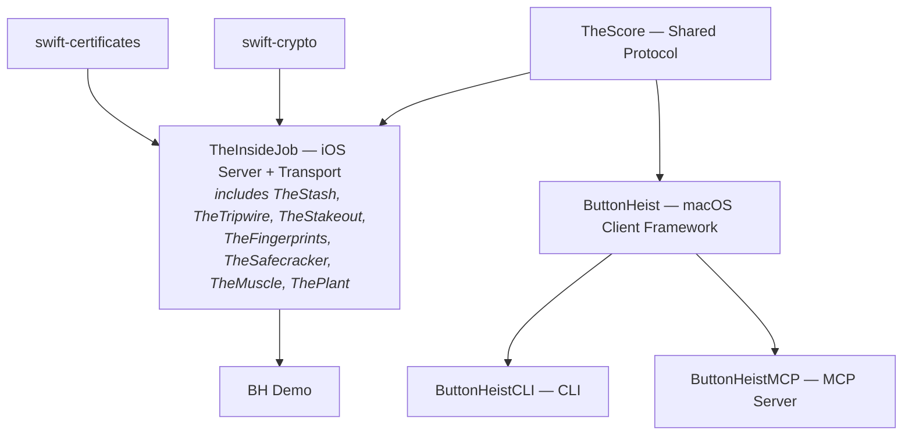
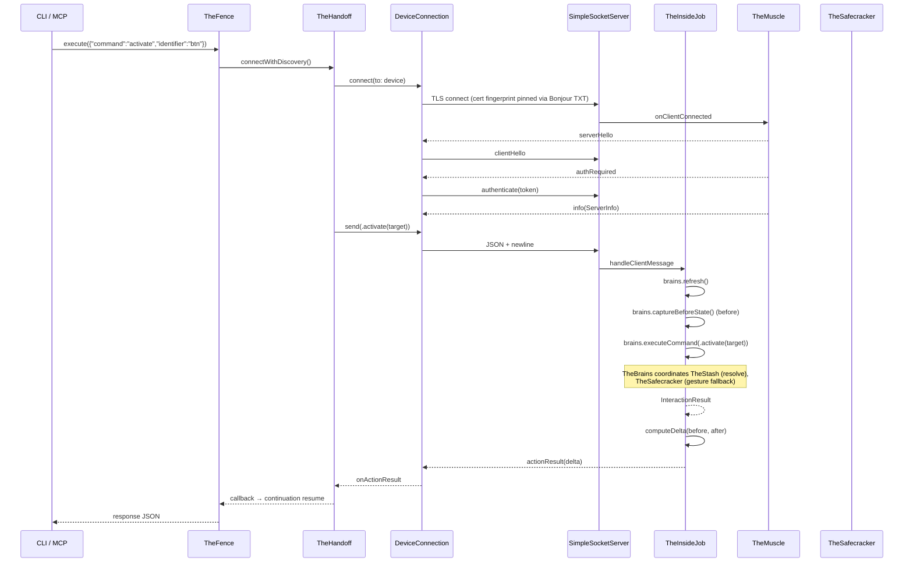

# Button Heist Crew Dossiers - Overview

## The Heist Metaphor

Button Heist is a remote iOS UI automation system structured as a heist crew. An iOS framework (TheInsideJob) embeds inside a target app as a TLS-encrypted server, while macOS tooling discovers, connects (with certificate fingerprint pinning via Bonjour), and sends commands to interact with the app's UI programmatically.

## Crew Roster

### Shared Foundation
| Crew Member | Alias | Primary Role |
|-------------|-------|-------------|
| [TheScore](01-THESCORE.md) | The Score | Shared wire protocol types (cross-platform) |

### Inside Team (iOS - runs in-process)
| Crew Member | Alias | Primary Role |
|-------------|-------|-------------|
| [TheFingerprints](03-THEFINGERPRINTS.md) | The Evidence | Visual touch indicators, overlay included in recordings |
| [TheSafecracker](04-THESAFECRACKER.md) | The Specialist | Touch injection, text input, gesture synthesis |
| [TheStakeout](05-THESTAKEOUT.md) | The Lookout | Screen recording, video encoding |
| [TheMuscle](06-THEMUSCLE.md) | The Bouncer | Authentication, session locking, on-device approval |
| [TheInsideJob](07-THEINSIDEJOB.md) | The Inside Operative | iOS server coordinator, message dispatch, UI polling, TLS transport |
| [ThePlant](08-THEPLANT.md) | The Advance Man | Zero-config auto-start via ObjC +load |
| [TheStash](13-THESTASH.md) | The Score Handler | Element registry, target resolution, wire conversion, screen capture |
| [TheBurglar](13a-THEBURGLAR.md) | The Acquisition Specialist | Hierarchy parsing, parse/apply pipeline, topology detection |
| [TheBrains](13b-THEBRAINS.md) | The Mastermind | Action execution, scroll orchestration, delta cycle, exploration |
| [TheTripwire](14-THETRIPWIRE.md) | The Early Warning System | Animation detection, VC identity, presentation layer fingerprinting |

### Cross-Cutting
| Dossier | Covers |
|---------|--------|
| [Unified Targeting](15-UNIFIED-TARGETING.md) | Element resolution pipeline: TheFence → ElementTarget → TheStash.resolveTarget → action execution |

### Outside Team (macOS - CLI/MCP/Client)
| Crew Member | Alias | Primary Role |
|-------------|-------|-------------|
| [TheHandoff](02-THEHANDOFF.md) | The Logistics | Device discovery, TLS connection, keepalive, auto-reconnect, session state |
| [TheFence](10-THEFENCE.md) | The Boss | Centralized command dispatch, request-response correlation, async waits |
| [TheBookKeeper](16-THEBOOKKEEPER.md) | The Accountant | Session logs, artifact storage, compression, path safety |
| [ButtonHeistCLI](11-CLI.md) | The CLI | Command-line interface |
| [ButtonHeistMCP](12-MCP.md) | The MCP Server | AI agent tool interface |

## Module Dependency Graph

> **Note:** TheStash, TheBurglar, TheBrains, TheTripwire, TheSafecracker, TheMuscle, TheStakeout, TheFingerprints, and ThePlant are all source groups compiled into the `TheInsideJob` framework target — they are not separate modules. They have separate dossiers because they are architecturally distinct subsystems with clear responsibilities.

## End-to-End Data Flow

## Cross-Cutting Review Concerns

These issues span multiple crew members and warrant holistic review:

1. ~~**Documentation drift**~~ - Fixed: configure() port param removed, isRunning visibility corrected, INSIDEJOB_BIND_ALL removed, token persistence clarified, InteractionEvent updated to use interfaceDelta
2. ~~**Duplicate error types**~~ - Fixed: `CLIError` removed, `FenceError` is the single error type
3. **Inconsistent timeouts** - 15s for actions, 30s for type_text/screenshots, 10s for interface requests
4. ~~**`vendorid` TXT key**~~ - Fixed: removed from DiscoveredDevice and DeviceDiscovery
5. ~~**Token logged in plaintext**~~ - By design: session token is logged with `privacy: .public` — it's a coordination primitive for agent isolation, not a security credential
6. **No TheInsideJob unit tests** - TheMuscleTests added; TheStash and TheInsideJob server-side logic still untested
7. **USBDeviceDiscovery blocks actor thread** - Subprocess calls in @ButtonHeistActor context
8. ~~**Interaction log payload unbounded**~~ - Fixed: capped at 500 events, uses InterfaceDelta instead of full snapshots
