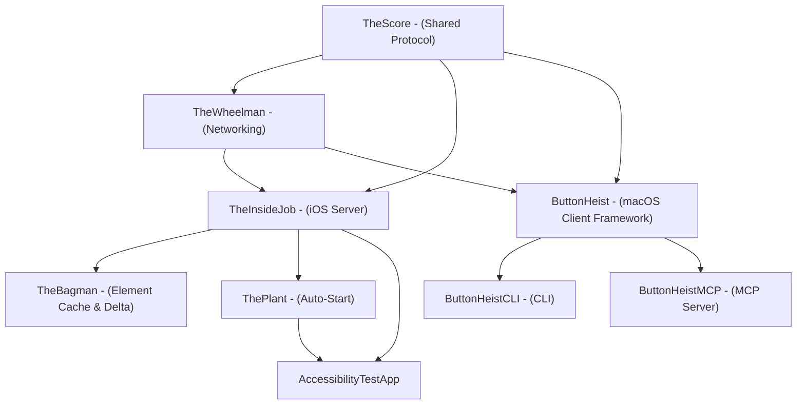
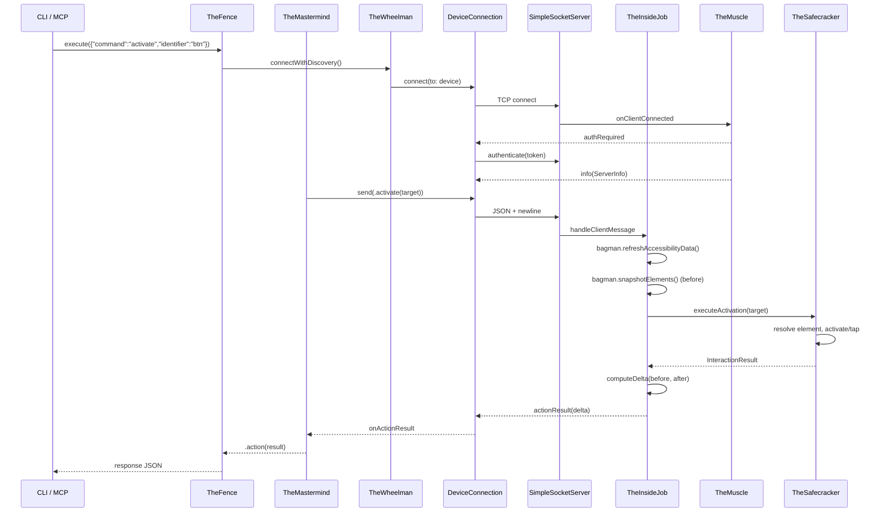

# ButtonHeist Crew Dossiers - Overview

## The Heist Metaphor

ButtonHeist is a remote iOS UI automation system structured as a heist crew. An iOS framework (TheInsideJob) embeds inside a target app as a TCP server, while macOS tooling discovers, connects, and sends commands to interact with the app's UI programmatically.

## Crew Roster

### Shared Foundation
| Crew Member | Alias | Primary Role |
|-------------|-------|-------------|
| [TheScore](01-THESCORE.md) | The Score | Shared wire protocol types (cross-platform) |
| [TheWheelman](02-THEWHEELMAN.md) | The Getaway Driver | TCP networking, Bonjour discovery, USB tunneling |

### Inside Team (iOS - runs in-process)
| Crew Member | Alias | Primary Role |
|-------------|-------|-------------|
| [TheFingerprints](03-THEFINGERPRINTS.md) | The Evidence | Visual touch indicators, overlay compositing |
| [TheSafecracker](04-THESAFECRACKER.md) | The Specialist | Touch injection, text input, gesture synthesis |
| [TheStakeout](05-THESTAKEOUT.md) | The Lookout | Screen recording, video encoding |
| [TheMuscle](06-THEMUSCLE.md) | The Bouncer | Authentication, session locking, on-device approval |
| [TheInsideJob](07-THEINSIDEJOB.md) | The Inside Operative | iOS server coordinator, message dispatch, UI polling |
| [ThePlant](08-THEPLANT.md) | The Advance Man | Zero-config auto-start via ObjC +load |
| [TheBagman](13-THEBAGMAN.md) | The Score Handler | Element cache, hierarchy parsing, delta computation, animation detection |

### Outside Team (macOS - CLI/MCP/Client)
| Crew Member | Alias | Primary Role |
|-------------|-------|-------------|
| [TheMastermind](09-THEMASTERMIND.md) | The Outside Coordinator | Observable macOS client API (wraps TheWheelman) |
| [TheFence](10-THEFENCE.md) | The Boss | Centralized command dispatch for CLI/MCP |
| [ButtonHeistCLI](11-CLI.md) | The CLI | Command-line interface |
| [ButtonHeistMCP](12-MCP.md) | The MCP Server | AI agent tool interface |

## Module Dependency Graph

## End-to-End Data Flow

## Cross-Cutting Review Concerns

These issues span multiple crew members and warrant holistic review:

1. ~~**Documentation drift**~~ - Fixed: configure() port param removed, isRunning visibility corrected, INSIDEJOB_BIND_ALL removed, token persistence clarified, InteractionEvent updated to use interfaceDelta
2. ~~**Duplicate error types**~~ - Fixed: `CLIError` removed, `FenceError` is the single error type
3. **Inconsistent timeouts** - 15s for actions, 30s for type_text/screenshots, 10s for interface requests
4. ~~**`vendorid` TXT key**~~ - Fixed: removed from DiscoveredDevice and DeviceDiscovery
5. **Token logged in plaintext** - TheInsideJob.swift logs full auth token at info level
6. **No TheInsideJob unit tests** - TheMuscleTests added; TheBagman and TheInsideJob server-side logic still untested
7. **USBDeviceDiscovery blocks main thread** - Subprocess calls in @MainActor context
8. ~~**Interaction log payload unbounded**~~ - Fixed: capped at 500 events, uses InterfaceDelta instead of full snapshots
