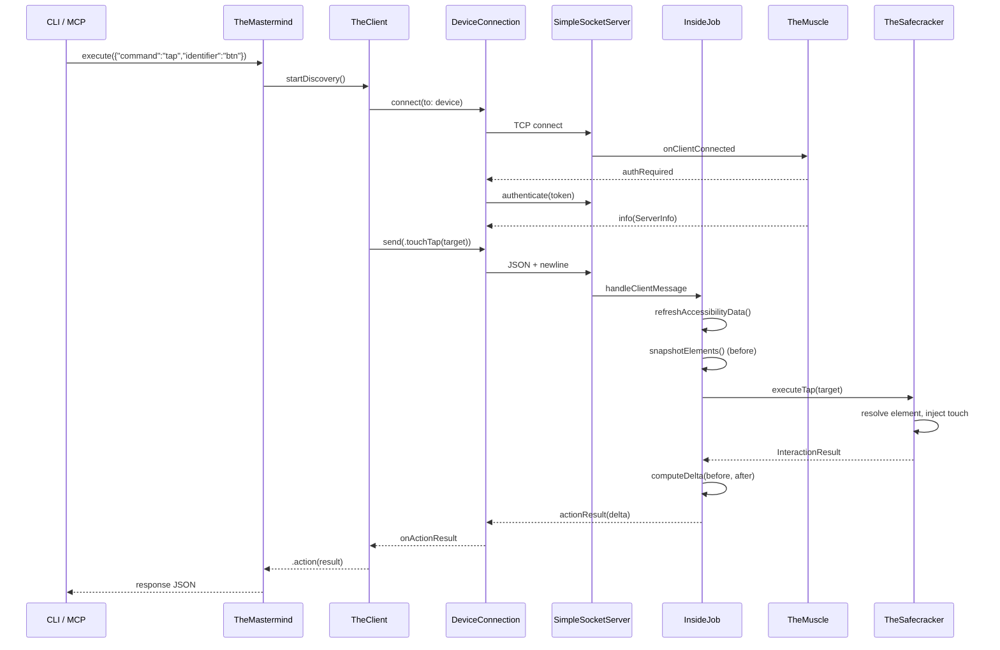

# ButtonHeist Crew Dossiers - Overview

## The Heist Metaphor

ButtonHeist is a remote iOS UI automation system structured as a heist crew. An iOS framework (InsideJob) embeds inside a target app as a TCP server, while macOS tooling discovers, connects, and sends commands to interact with the app's UI programmatically.

## Crew Roster

### Inside Team (iOS - runs in-process)
| Crew Member | Alias | Primary Role |
|-------------|-------|-------------|
| [InsideJob](01-INSIDEJOB.md) | The Inside Operative | iOS server coordinator, message dispatch, UI polling |
| [TheMuscle](02-THEMUSCLE.md) | The Bouncer | Authentication, session locking, on-device approval |
| [TheSafecracker](03-THESAFECRACKER.md) | The Specialist | Touch injection, text input, gesture synthesis |
| [Stakeout](04-STAKEOUT.md) | The Lookout | Screen recording, video encoding |
| [Fingerprints](05-FINGERPRINTS.md) | The Evidence | Visual touch indicators, overlay compositing |
| [ThePlant](06-THEPLANT.md) | The Advance Man | Zero-config auto-start via ObjC +load |

### Outside Team (macOS - CLI/MCP/Client)
| Crew Member | Alias | Primary Role |
|-------------|-------|-------------|
| [TheScore](07-THESCORE.md) | The Score | Shared wire protocol types (cross-platform) |
| [Wheelman](08-WHEELMAN.md) | The Getaway Driver | TCP networking, Bonjour discovery, USB tunneling |
| [TheClient](09-THECLIENT.md) | The Outside Coordinator | Observable macOS client API |
| [TheMastermind](10-THEMASTERMIND.md) | The Boss | Centralized command dispatch for CLI/MCP |
| [ButtonHeistCLI](11-CLI.md) | The CLI | Command-line interface |
| [ButtonHeistMCP](12-MCP.md) | The MCP Server | AI agent tool interface |

## Module Dependency Graph

```mermaid
graph TD
    TheScore["TheScore - (Shared Protocol)"]
    Wheelman["Wheelman - (Networking)"]
    InsideJob["InsideJob - (iOS Server)"]
    ThePlant["ThePlant - (Auto-Start)"]
    ButtonHeist["ButtonHeist - (macOS Client Framework)"]
    CLI["ButtonHeistCLI - (CLI)"]
    MCP["ButtonHeistMCP - (MCP Server)"]
    TestApp["AccessibilityTestApp"]

    TheScore --> Wheelman
    TheScore --> InsideJob
    Wheelman --> InsideJob
    Wheelman --> ButtonHeist
    TheScore --> ButtonHeist
    ButtonHeist --> CLI
    ButtonHeist --> MCP
    InsideJob --> ThePlant
    InsideJob --> TestApp
    ThePlant --> TestApp
end
```

## End-to-End Data Flow



## Recent Changes (from main)

**Interaction Recording** — New feature across multiple crew members:
- **TheScore**: New `InteractionEvent` type; `ClientMessage` now `Sendable`; `RecordingPayload` gains optional `interactionLog`
- **Stakeout**: Maintains in-memory `interactionLog` array; `recordInteraction(event:)` and `recordingElapsed` APIs
- **InsideJob**: `performInteraction` now takes `command:` parameter, captures before/after snapshots during recording
- **TheMastermind**: `MastermindResponse` recording cases include interaction count in human/JSON output
- **CLI**: `RecordCommand` displays interaction count
- **Tests**: `RecordingPayloadTests` covers round-trip, backward compat; `SessionResponseTests` covers interaction count
- **Docs**: API.md, ARCHITECTURE.md, WIRE-PROTOCOL.md all updated

**Logging fixes**: Several `self.` prefixes added to property references in os.log string interpolations across InsideJob, Stakeout, TheMuscle, TheSafecracker (Swift concurrency warning cleanup).

## Cross-Cutting Review Concerns

These issues span multiple crew members and warrant holistic review:

1. **Documentation drift** - Some API.md inaccuracies remain (configure() port param, isRunning visibility, INSIDEJOB_BIND_ALL, token persistence)
2. **Duplicate error types** - `MastermindError` vs `CLIError` with overlapping cases
3. **Inconsistent timeouts** - 15s for actions, 30s for type_text/screenshots, 10s for interface requests
4. **`vendorid` TXT key** - Published nowhere but read in DeviceDiscovery (always nil)
5. **Token logged in plaintext** - InsideJob.swift:114 logs full auth token at info level
6. **No InsideJob unit tests** - Server-side logic (delta computation, auth, session) untested
7. **USBDeviceDiscovery blocks main thread** - Subprocess calls in @MainActor context
8. **Interaction log payload unbounded** (NEW) - Full Interface snapshots per event could exceed 10MB buffer limit on long recordings
