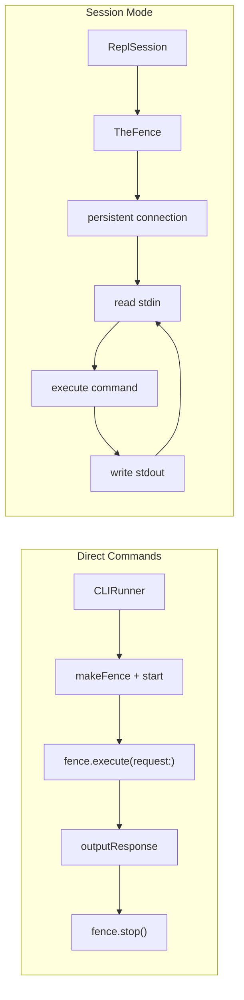

# ButtonHeistCLI - The CLI

> **Module:** `ButtonHeistCLI/Sources/`
> **Platform:** macOS 14.0+
> **Role:** User-facing command-line interface for direct commands and persistent sessions

## Responsibilities

This is the public face of the outfit. The CLI is what you hand to a human operator who wants to work the scene directly:

1. **Subcommand routing** via `swift-argument-parser`
2. **Direct commands** through `CLIRunner` — creates a `TheFence`, connects, executes, disconnects
3. **Persistent sessions** through `ReplSession` and `TheFence`
4. **Output auto-detection**: human for TTY, JSON for piped input/output. Also supports `compact` format for terse machine-readable output.
5. **Access to both high-level commands and raw JSON session requests**

## Architecture Diagram

```mermaid
graph TD
    subgraph CLI["ButtonHeistCLI"]
        Main["main.swift - AsyncParsableCommand"]
        Options["ConnectionOptions - --device, --token, --quiet"]
        Format["OutputFormat - human / json / compact (.auto is computed)"]

        subgraph Commands["Subcommands"]
            ListDevices["list_devices"]
            Activate["activate --action increment/decrement/custom"]
            EditAction["edit_action copy/paste/cut/select/selectAll"]
            DismissKeyboard["dismiss_keyboard"]
            Scroll["scroll / scroll_to_visible / scroll_to_edge"]
            Gestures["one_finger_tap / long_press / swipe / drag / pinch / rotate / two_finger_tap"]
            TypeCmd["type_text"]
            GetScreen["get_screen"]
            GetInterface["get_interface"]
            WaitForChange["wait_for_change"]
            WaitFor["wait_for"]
            Record["start_recording / stop_recording"]
            Pasteboard["set_pasteboard / get_pasteboard"]
            Session["session - ReplSession"]
        end

        subgraph Patterns["Connection Patterns"]
            Direct["CLIRunner - TheFence → connect → execute → disconnect"]
            REPL["ReplSession -> TheFence - persistent JSON/human command loop"]
        end
    end

    ListDevices --> Direct
    Activate --> Direct
    EditAction --> Direct
    DismissKeyboard --> Direct
    Scroll --> Direct
    Gestures --> Direct
    TypeCmd --> Direct
    GetScreen --> Direct
    GetInterface --> Direct
    WaitForChange --> Direct
    WaitFor --> Direct
    Record --> Direct
    Pasteboard --> Direct
    Session --> REPL

    Direct --> TheFence["TheFence"]
    REPL --> TheFence
```

## Connection Patterns

## MCP Parity

The CLI and MCP adapter both project from the Fence command descriptors. The
checked-in generated references are the only exhaustive mapping:

- [Command Reference](../reference/commands.md)
- [MCP Tool Reference](../reference/mcp-tools.md)

The CLI may present grouped MCP tools as separate human-friendly subcommands,
but command identity, parameter names, defaults, and batch/playback eligibility
belong to `TheFence.Command.descriptors`.

## Session Notes

- Human mode supports aliases such as `tap`, `ui`, `screen`, `idle`, `wait`, and `devices`
- JSON mode accepts canonical Fence commands such as `one_finger_tap`, `run_batch`, and `get_session_state`
- `session` is the bridge used under the hood by REPL-like workflows; the MCP server talks to `TheFence` directly rather than shelling out to the CLI

## Exit Code Contract

| Code | Meaning |
|------|---------|
| 0 | Success |
| 1 | Action failed (explicit `Darwin.exit(1)` in `CLIRunner.exitOnActionFailure`) or unhandled error (swift-argument-parser default) |

## Risks / Gaps

- Session mode exposes more raw power than the top-level flags, so documentation needs to keep both surfaces aligned
