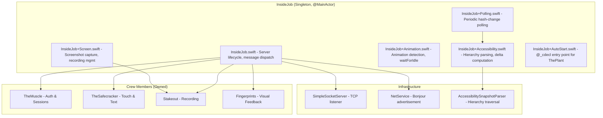
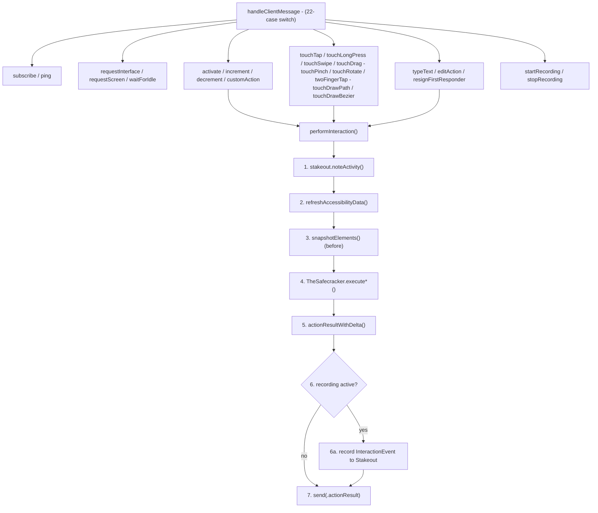
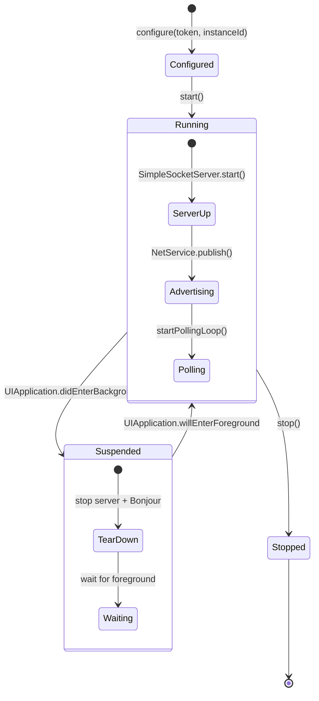

# InsideJob - The Inside Operative

> **Module:** `ButtonHeist/Sources/InsideJob/`
> **Platform:** iOS 17.0+ (UIKit, DEBUG builds only)
> **Role:** Master coordinator of the entire iOS-side operation

## Responsibilities

InsideJob is the central hub running inside the target iOS app. It:

1. **Runs a TCP server** (`SimpleSocketServer`) listening for remote commands
2. **Broadcasts presence** via Bonjour mDNS (`_buttonheist._tcp`)
3. **Polls for UI changes** at configurable intervals (default 1s, min 0.5s)
4. **Dispatches all commands** to crew members (TheSafecracker, Stakeout, TheMuscle)
5. **Manages client subscriptions** and broadcasts hierarchy/screen updates
6. **Caches accessibility elements** with weak references for fast resolution

## Architecture Diagram



## Key Files

| File | Lines | Purpose |
|------|-------|---------|
| `InsideJob.swift` | ~400 | Core lifecycle, server wiring, message dispatch |
| `InsideJob+Accessibility.swift` | ~300 | Hierarchy parsing, element conversion, delta computation |
| `InsideJob+Animation.swift` | ~180 | Animation detection, settle-waiting, post-action result |
| `InsideJob+Polling.swift` | ~80 | Periodic poll loop, debounced broadcast |
| `InsideJob+Screen.swift` | ~120 | Screen capture, recording start/stop |
| `InsideJob+AutoStart.swift` | ~50 | `@_cdecl` bridge for ObjC auto-start |

## Message Dispatch Flow



## Lifecycle State Machine



## Update Mechanisms

Two paths trigger hierarchy broadcasts:

1. **Notification-driven** (`scheduleHierarchyUpdate`): Triggered by `UIAccessibility.elementFocusedNotification` and `voiceOverStatusDidChangeNotification`. Debounced 300ms.
2. **Polling** (`startPollingLoop`): Periodic at configurable interval (default 1s). Compares `elements.hashValue` to `lastHierarchyHash`. Only broadcasts on change.

## Items Flagged for Review

### HIGH PRIORITY

**Auth token logged in plaintext** (`InsideJob.swift:114`)
```swift
insideJobLogger.info("Auth token: \(self.muscle.authToken)")
```
The full UUID token is emitted to the system log at `info` level. Any process with log access can read it.

**`handleClientMessage` cyclomatic complexity** (`InsideJob.swift:268`)
- 22-case switch statement with `swiftlint:disable:next cyclomatic_complexity` suppression
- Each case delegates to a helper, so the individual cases are thin, but the method is a dense routing table

### MEDIUM PRIORITY

**`shouldBindToLoopback` always returns `false`** (`InsideJob.swift:98`)
```swift
private var shouldBindToLoopback: Bool { false }
```
Dead computed property. The server always binds to all interfaces. The documented `INSIDEJOB_BIND_ALL` env var is never read. This is a documentation drift issue (WIRE-PROTOCOL.md says loopback is the default for simulators).

**Magic nanosecond literals**
- `300_000_000` debounce (line 66)
- `1_000_000_000` polling interval (line 70)
- These could be named constants for clarity.

**`performInteraction` now captures interaction events during recording** (NEW)
- When `stakeout.state == .recording`, each interaction captures a full `InteractionEvent`
- This includes `interfaceBefore` and `interfaceAfter` snapshots
- On failed interactions, an extra `refreshAccessibilityData()` call is made for the after-snapshot
- The `command: ClientMessage` parameter was added to `performInteraction` — all 16 call sites updated

**No unit tests for InsideJob itself**
- The delta computation logic in `InsideJob+Accessibility.swift:194-299` is pure data transformation
- It could be extracted and tested without UIKit dependency
- Currently untested

### LOW PRIORITY

**Background/foreground lifecycle**
- `suspend()` tears down the entire TCP server and Bonjour advertisement
- `resume()` recreates on a new port
- Any connected clients are silently disconnected with no notification
- This is expected iOS behavior but worth understanding

**Singleton pattern**
- `InsideJob.shared` is a replaceable singleton via `configure()`
- Multiple calls to `configure()` create a new instance, but `start()` on the old one isn't called
- Safe in practice (ThePlant only calls once), but the API allows misuse
