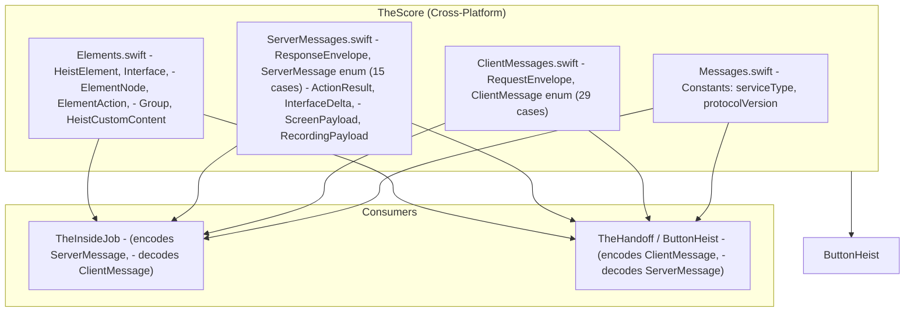
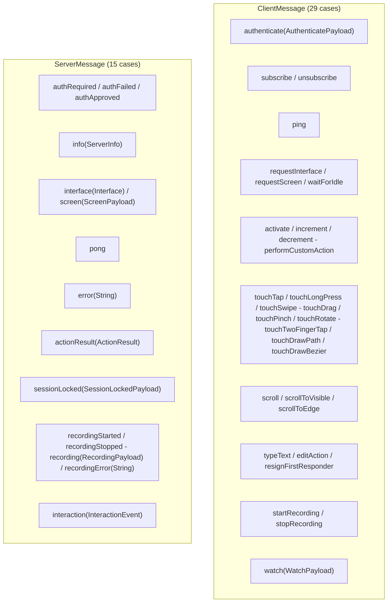
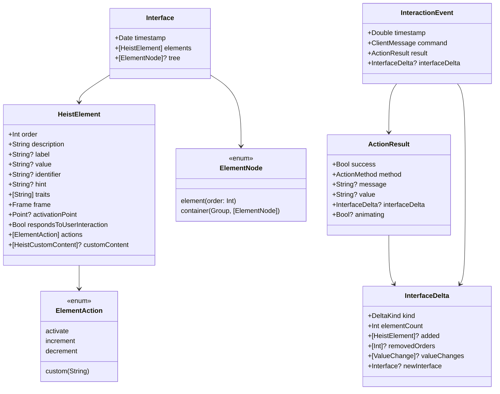

# TheScore - The Score

> **Module:** `ButtonHeist/Sources/TheScore/`
> **Platform:** iOS 17.0+ / macOS 14.0+ (cross-platform, no UIKit/AppKit)
> **Role:** Shared wire protocol definitions - the contract between iOS server and macOS clients

## Responsibilities

TheScore is the protocol bible. It defines:

1. **All client-to-server messages** (`ClientMessage` - 29 cases, including `watch`)
2. **All server-to-client messages** (`ServerMessage` - 15 cases, including `interaction`)
3. **Request/response envelopes** (`RequestEnvelope`, `ResponseEnvelope`) for correlation
4. **UI element types** (`HeistElement`, `Interface`, `ElementNode`, `ElementAction`)
5. **Action result types** (`ActionResult`, `InterfaceDelta`, `ActionMethod`)
6. **Media payloads** (`ScreenPayload`, `RecordingPayload`)
7. **Interaction events** (`InteractionEvent`) - wire-level command/result recording, also broadcast live to observers
8. **Watch payload** (`WatchPayload`) - observer connection parameters
9. **Server info** (`ServerInfo`)
10. **Protocol constants** (service type, version)
11. **`ButtonHeistActor`** - dedicated global actor for the host-side control plane (discovery, connection, session orchestration, command dispatch)

## Architecture Diagram

## Message Catalog

## Element Model

## Wire Protocol

- **Framing:** Newline-delimited JSON (each message is JSON + `0x0A`)
- **Protocol version:** `"4.0"` (envelope correlation + watch mode)
- **Service type:** `_buttonheist._tcp`
- **Encoding:** `Codable` with standard `JSONEncoder`/`JSONDecoder`
- **All types:** `Codable` + `Sendable` for Swift 6 concurrency (note: `ClientMessage` was made `Sendable` to support `InteractionEvent`)

## Items Flagged for Review

### MEDIUM PRIORITY

**`InteractionEvent` stores optional `InterfaceDelta`** (`ServerMessages.swift`)
- Each event includes an optional `interfaceDelta: InterfaceDelta?` instead of full before/after snapshots
- Deltas are compact but can include full `newInterface` for screen-changed cases
- Well-tested: `RecordingPayloadTests` covers round-trip, backward compat, and nil cases

**`ElementAction` custom Codable** (`Elements.swift:27-48`)
- Known actions encode as plain strings: `"activate"`, `"increment"`, `"decrement"`
- Custom actions encode as `{"custom":"name"}` objects
- Decoding: tries `{"custom":"name"}` keyed form first, falls back to plain string
- A plain string that isn't one of the known three is treated as `.custom(name)` for backward compatibility
- Edge case but worth noting

**`ActionMethod` has cases that may not round-trip cleanly through tests**
- `ActionCommandTests.swift:488-512` tests all `ActionMethod` cases but is missing 4:
  - `.typeText`, `.editAction`, `.resignFirstResponder`, `.waitForIdle`
- These cases exist in `ServerMessages.swift:214-233` but aren't in the test array

### LOW PRIORITY

**Protocol version is a string, not a numeric**
- `protocolVersion = "4.0"` - no formal version comparison logic exists
- Clients and servers don't negotiate or validate versions
- If a version mismatch occurs, messages may silently fail to decode

**No formal schema validation**
- Messages rely entirely on `Codable` for validation
- An invalid JSON field silently produces a decode error (caught by `try?` in receivers)
- No explicit schema version negotiation in the handshake
