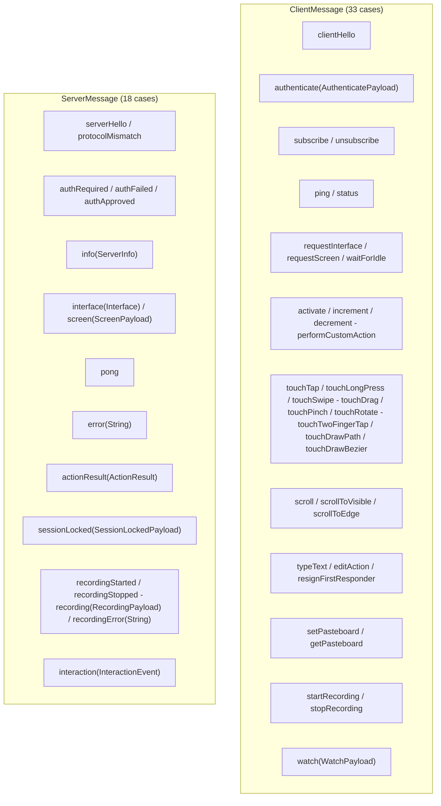
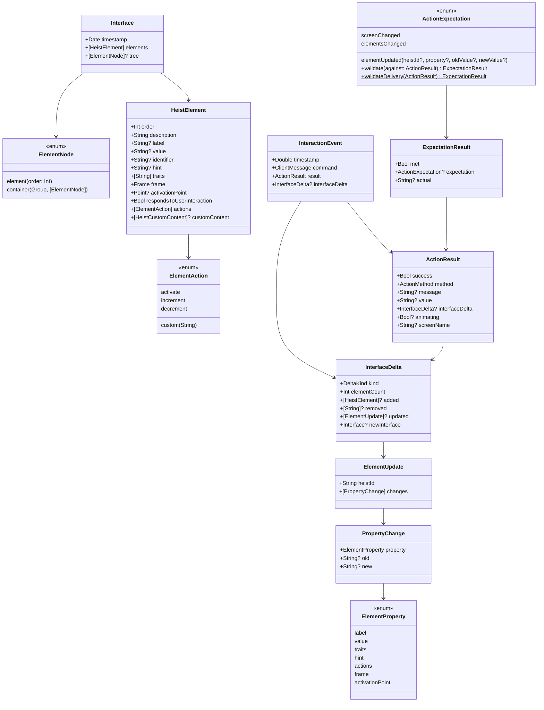

# TheScore - The Score

> **Module:** `ButtonHeist/Sources/TheScore/`
> **Platform:** iOS 17.0+ / macOS 14.0+ (cross-platform, no UIKit/AppKit)
> **Role:** Shared wire protocol definitions - the contract between iOS server and macOS clients

## Responsibilities

TheScore is the shared playbook. It defines:

1. **All client-to-server messages** (`ClientMessage` - 33 cases, including `clientHello`, `status`, `watch`, `setPasteboard`, and `getPasteboard`)
2. **All server-to-client messages** (`ServerMessage` - 18 cases, including `serverHello`, `protocolMismatch`, and `interaction`)
3. **Request/response envelopes** (`RequestEnvelope`, `ResponseEnvelope`) for correlation
4. **UI element types** (`HeistElement`, `Interface`, `ElementNode`, `ElementAction`)
5. **Action result types** (`ActionResult`, `InterfaceDelta`, `ActionMethod`)
6. **Action outcome signals** (`ActionExpectation`, `ExpectationResult`) - outcome classifiers for actions
7. **Media payloads** (`ScreenPayload`, `RecordingPayload`)
8. **Interaction events** (`InteractionEvent`) - wire-level command/result recording, also broadcast live to observers
9. **Watch payload** (`WatchPayload`) - observer connection parameters
10. **Server info** (`ServerInfo`)
11. **Protocol constants** (service type, version)
12. **`ButtonHeistActor`** - dedicated global actor for the host-side control plane (discovery, connection, session orchestration, command dispatch)
13. **Connection scope types** (`ConnectionScope`) - configurable connection source filtering (simulator, USB, network) with address classification and environment variable parsing

## Architecture Diagram

## Message Catalog

## Element Model

## Wire Protocol

- **Framing:** Newline-delimited JSON (each message is JSON + `0x0A`)
- **Protocol version:** `"6.4"` (explicit `type` / `payload` envelopes + exact hello/version matching, `ElementProperty.label` added)
- **Service type:** `_buttonheist._tcp`
- **Encoding:** `Codable` with custom top-level envelope coding at the wire boundary
- **All types:** `Codable` + `Sendable` for Swift 6 concurrency (note: `ClientMessage` was made `Sendable` to support `InteractionEvent`)

## Items Flagged for Review

### MEDIUM PRIORITY

**`InteractionEvent` stores optional `InterfaceDelta`** (`ServerMessages.swift`)
- Each event includes an optional `interfaceDelta: InterfaceDelta?` instead of full before/after snapshots
- Deltas are compact but can include full `newInterface` for screen-changed cases
- Well-tested: `RecordingPayloadTests` covers round-trip, backward compat, and nil cases

**`ElementAction` custom Codable** (`Elements.swift:27-48`)
- Known actions encode as plain strings: `"activate"`, `"increment"`, `"decrement"`
- Custom actions encode as `{"custom":"name"}` objects
- Decoding: tries `{"custom":"name"}` keyed form first, falls back to plain string
- A plain string that isn't one of the known three is treated as `.custom(name)` for backward compatibility
- Edge case but worth noting

**`ActionMethod` has cases that may not round-trip cleanly through tests**
- `ActionCommandTests.swift:488-512` tests all `ActionMethod` cases but is missing 4:
  - `.typeText`, `.editAction`, `.resignFirstResponder`, `.waitForIdle`
- These cases exist in `ServerMessages.swift:214-233` but aren't in the test array

### LOW PRIORITY

**Nested tree encoding still exposes Swift synthesized shape**
- Top-level request/response envelopes are now explicit `type` / `payload`
- `ElementNode.container` still encodes as `{"container":{"_0":Group,"children":[...]}}`
- Accurate, but awkward compared to the rest of the wire model

**No formal schema validation**
- Messages rely entirely on `Codable` for validation
- An invalid JSON field silently produces a decode error (caught by `try?` in receivers)
- Exact protocol matching now happens during `serverHello` / `clientHello`
