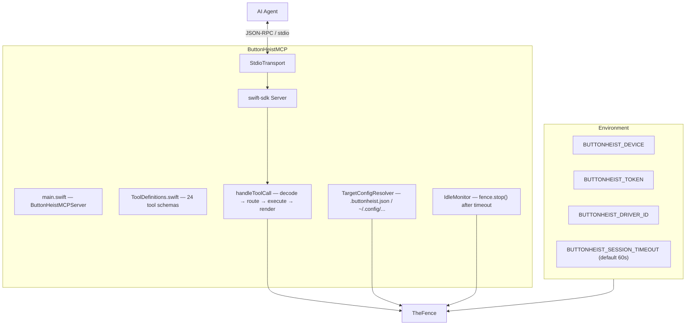
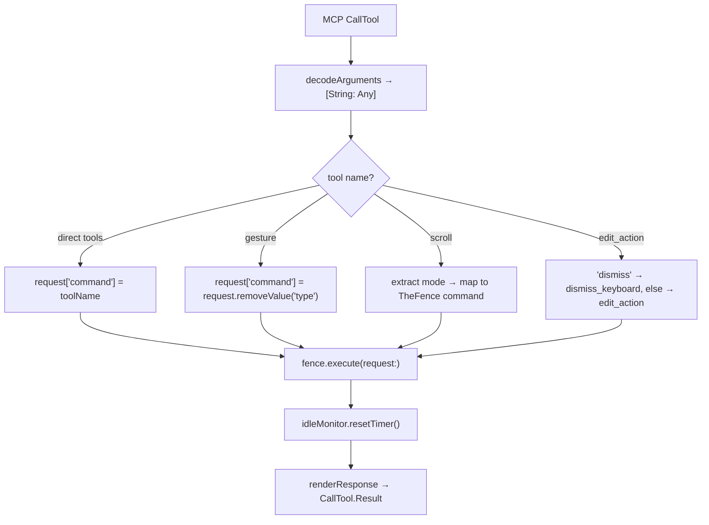

# ButtonHeistMCP — The MCP Server

> **Module:** `ButtonHeistMCP/Sources/`
> **Platform:** macOS 14.0+
> **Role:** Exposes Button Heist as 24 typed MCP tools for AI agents

## Responsibilities

This is the clean handshake between an AI agent and the rest of the crew:

1. **24 typed tools** backed by `TheFence`
2. **Tool-to-command routing** for direct, grouped, and hybrid tools
3. **Response adaptation** for MCP clients: screenshots inline as MCP image content, video summarized
4. **Idle disconnects** with automatic reconnect on the next tool call
5. **File-based target configuration** via `TargetConfigResolver` (`.buttonheist.json` or `~/.config/buttonheist/config.json`)
6. **Environment-based configuration** for device selection, auth, and timeout

## Source Files

| File | Contents |
|------|----------|
| `main.swift` | `ButtonHeistMCPServer` entry point, `setUp()`, `handleToolCall`, `renderResponse` |
| `ToolDefinitions.swift` | 24 tool schemas projected from `FenceParameterSpec`, with grouped-tool selector overrides |

`IdleMonitor` lives in the ButtonHeist framework (`ButtonHeist/Sources/TheButtonHeist/IdleMonitor.swift`), not in the MCP package.
`TargetConfigResolver` lives in the ButtonHeist framework (`TargetConfig.swift`), not in the MCP package.

## Architecture Diagram

## Full Tool List (24 tools)

| # | Tool Name | Type | Key Parameters |
|---|-----------|------|---------------|
| 1 | `get_interface` | direct | `scope` (omit or `"visible"`), `detail` (`"summary"`/`"full"`), `elements` (heistId filter array) |
| 2 | `activate` | direct | element target, optional `action` for increment/decrement/custom |
| 3 | `rotor` | direct | element target, `rotor`/`rotorIndex`, `direction`, `currentHeistId`, text-range cursor offsets |
| 4 | `type_text` | direct | `text`, `clearFirst`, `deleteCount` |
| 5 | `get_screen` | direct | `output` (file path, optional) |
| 6 | `wait_for_change` | direct | `expect`, `timeout` |
| 7 | `wait_for` | direct | element match fields, `absent`, `timeout` |
| 8 | `start_recording` | direct | `fps`, `scale`, `inactivity_timeout`, `max_duration` |
| 9 | `stop_recording` | direct | `output` (file path) |
| 10 | `list_devices` | direct | (no params) |
| 11 | `gesture` | grouped | `type` enum -> underlying command (swipe, one_finger_tap, drag, long_press, pinch, rotate, two_finger_tap, draw_path, draw_bezier) |
| 12 | `edit_action` | hybrid | `action`: copy/paste/cut/select/selectAll, or `"dismiss"` -> routes to dismiss_keyboard |
| 13 | `set_pasteboard` | direct | `text` |
| 14 | `get_pasteboard` | direct | (no params) |
| 15 | `scroll` | hybrid | `mode`: page (default), to_visible, search, to_edge; `direction`, `edge` |
| 16 | `run_batch` | direct | `steps` array, `policy` |
| 17 | `get_session_state` | direct | (no params) |
| 18 | `connect` | direct | `target`, `device`, `token` |
| 19 | `list_targets` | direct | (no params) |
| 20 | `get_session_log` | direct | (no params) |
| 21 | `archive_session` | direct | `delete_source` |
| 22 | `start_heist` | direct | `name` |
| 23 | `stop_heist` | direct | (no params) |
| 24 | `play_heist` | direct | `name` |

### Grouped and hybrid tools

`gesture` groups 9 gesture commands under a `type` discriminator:
`swipe`, `one_finger_tap`, `drag`, `long_press`, `pinch`, `rotate`, `two_finger_tap`, `draw_path`, `draw_bezier`

`scroll` uses a `mode` discriminator: `page` (default — scrolls one page), `to_visible` (jump to known element), `search` (scroll all containers looking for match), `to_edge` (scroll to edge).

`edit_action` routes `"dismiss"` to the `dismiss_keyboard` TheFence command; all other actions go to the `edit_action` command.

## Key Tool Schemas

### `get_interface`
- `scope`: omit for the app accessibility state; `"visible"` requests a diagnostic on-screen parse
- `detail`: `"summary"` (default — identity fields, traits, and actions only) or `"full"` (adds VoiceOver hint, customContent, frame, and activation point)
- `elements`: optional `[String]` — heistIds to filter; omit for the current interface tree
- `readOnlyHint: true`, `idempotentHint: true`

### Shared `expect` property
Used on all action tools. MCP and TheFence accept the object form only so every caller uses one schema shape.
- Object with a `type` discriminator that matches `ActionExpectation`'s Codable shape:
  - `{"type": "screen_changed"}` / `{"type": "elements_changed"}`
  - `{"type": "element_updated", "heistId": "...", "property": "...", "oldValue": "...", "newValue": "..."}` — all non-`type` fields are optional wildcards; `property` is one of `label`, `value`, `traits`, `hint`, `actions`, `frame`, `activationPoint`, `customContent`
  - `{"type": "element_appeared", "matcher": { ElementMatcher }}` / `{"type": "element_disappeared", "matcher": { ElementMatcher }}`
  - `{"type": "compound", "expectations": [ ... ]}`

## Routing Rules

1. Direct tools map 1:1 to `request["command"] = toolName`
2. `gesture` extracts `type` and uses that as the underlying Fence command
3. `scroll` extracts `mode` and maps to the corresponding Fence command (page → scroll, to_visible → scroll_to_visible, search → element_search, to_edge → scroll_to_edge)
4. `edit_action` intercepts `"dismiss"` and routes to `dismiss_keyboard`; other actions pass through
5. All requests end at `fence.execute(request:)`

## Response Behavior

- `get_screen` returns inline MCP image content (`image/png`) plus JSON metadata as text
- `stop_recording` omits raw base64 video data; agents must use the `output` parameter for a file path
- Errors set `isError: true` on the MCP result
- All responses append `response.compactFormatted()` as the text content item

## IdleMonitor

`@ButtonHeistActor public final class` (lives in `ButtonHeist/Sources/TheButtonHeist/IdleMonitor.swift`, not in the MCP package) with a simple timer pattern:
- `resetTimer()` cancels any existing timeout task, then spawns a `Task` that sleeps for `timeout` seconds and calls the `onTimeout` closure
- Called after every tool call (success or failure)
- `timeout <= 0` disables idle disconnect
- Default: 60 seconds (from `BUTTONHEIST_SESSION_TIMEOUT` env var)

## Target Configuration

`TargetConfigResolver.loadConfig()` searches in order:
1. `.buttonheist.json` (relative to working directory)
2. `~/.config/buttonheist/config.json`

`resolveEffective()` precedence:
1. `BUTTONHEIST_DEVICE` env var wins over everything
2. Named target from config file
3. `BUTTONHEIST_TOKEN` env var overrides the config file token even when a named target is used

## Risks / Gaps

- No streaming tool surface for live subscriptions
- Recording payloads are intentionally lossy in MCP mode to keep context size manageable
