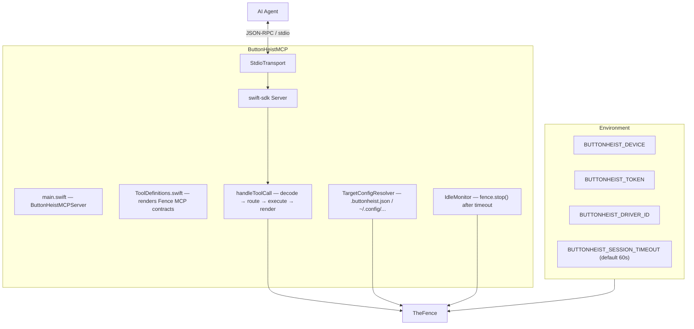
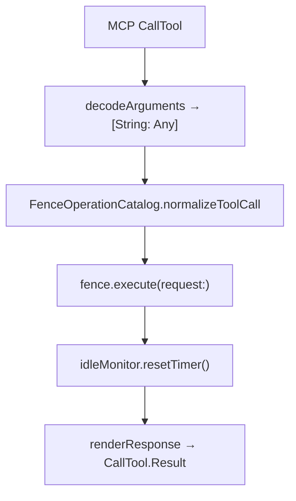

# ButtonHeistMCP — The MCP Server

> **Module:** `ButtonHeistMCP/Sources/`
> **Platform:** macOS 14.0+
> **Role:** Exposes Button Heist as typed MCP tools rendered from the Fence command contract

## Responsibilities

This is the clean handshake between an AI agent and the rest of the crew:

1. **Typed tools** backed by `TheFence`
2. **Tool-to-command routing** for direct, grouped, and hybrid tools
3. **Response adaptation** for MCP clients: screenshots and recordings as artifact-first metadata, with capped opt-in inline media/log content
4. **Idle disconnects** with automatic reconnect on the next tool call
5. **File-based target configuration** via `TargetConfigResolver` (`.buttonheist.json` or `~/.config/buttonheist/config.json`)
6. **Environment-based configuration** for device selection, auth, and timeout

## Source Files

| File | Contents |
|------|----------|
| `main.swift` | `ButtonHeistMCPServer` entry point, `setUp()`, `handleToolCall`, `renderResponse` |
| `ToolDefinitions.swift` | Renders MCP tools from `TheFence.Command.mcpToolContracts`; command identity, parameters, grouped selectors, and schema metadata are Fence-owned |

`IdleMonitor` lives in the ButtonHeist framework (`ButtonHeist/Sources/TheButtonHeist/IdleMonitor.swift`), not in the MCP package.
`TargetConfigResolver` lives in the ButtonHeist framework (`TargetConfig.swift`), not in the MCP package.

## Architecture Diagram

## Tool Surface

ButtonHeistMCP projects tools from `ToolDefinitions.swift`, which is rendered
from Fence-owned command contracts and `FenceParameterSpec`. Human docs describe
adapter invariants; generated references own tool names, selectors, parameters,
and grouped-command membership:

- [Command Reference](../reference/commands.md)
- [MCP Tool Reference](../reference/mcp-tools.md)

`run_batch` intentionally stays canonical: steps are normal batch-executable
`TheFence.Command` request objects, not nested MCP grouped-tool calls.

### Expectation Shape

Action tools share the same descriptor-owned `expect` object. MCP and TheFence
accept the object form only so every caller uses one schema shape. The concrete
property names and enum values are generated from `FenceParameterSpec`.

## Routing Rules

1. MCP decodes adapter-shaped input at the boundary.
2. `FenceOperationCatalog.normalizeToolCall` resolves direct/grouped tools from `MCPToolContract`.
3. The normalized request ends at `fence.execute(request:)`.

## Response Behavior

- `get_screen` returns JSON metadata plus an artifact path by default; `inlineData=true` opts into capped MCP image content (`image/png`) outside `run_batch`
- `stop_recording` returns JSON metadata plus an artifact path by default. `output` chooses the path; otherwise TheBookKeeper writes a default artifact. `inlineData=true` and `includeInteractionLog=true` opt into a capped expanded JSON response.
- Errors set `isError: true` on the MCP result
- All responses append `response.compactFormatted()` as the text content item

## IdleMonitor

`@ButtonHeistActor public final class` (lives in `ButtonHeist/Sources/TheButtonHeist/IdleMonitor.swift`, not in the MCP package) with a simple timer pattern:
- `resetTimer()` cancels any existing timeout task, then spawns a `Task` that sleeps for `timeout` seconds and calls the `onTimeout` closure
- Called after every tool call (success or failure)
- `timeout <= 0` disables idle disconnect
- Default: 60 seconds (from `BUTTONHEIST_SESSION_TIMEOUT` env var)

## Target Configuration

`TargetConfigResolver.loadConfig()` searches in order:
1. `.buttonheist.json` (relative to working directory)
2. `~/.config/buttonheist/config.json`

`resolveEffective()` precedence:
1. `BUTTONHEIST_DEVICE` env var wins over everything
2. Named target from config file
3. `BUTTONHEIST_TOKEN` env var overrides the config file token even when a named target is used

## Risks / Gaps

- No streaming tool surface for live subscriptions
- Recording payloads are artifact-first in MCP mode; inline video and interaction logs are opt-in and capped to keep context size manageable
