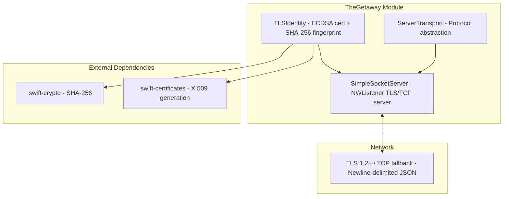

# TheGetaway - iOS Server Transport

> **Module:** `ButtonHeist/Sources/TheGetaway/`
> **Platform:** iOS 17.0+ (Network framework)
> **Role:** Server-side TLS/TCP transport — accepts client connections on the iOS side

## Responsibilities

TheGetaway provides the server-side transport layer used by TheInsideJob:

1. **TLS/TCP server** (`SimpleSocketServer`) - accepts client connections via NWListener with optional TLS encryption
2. **Server transport** (`ServerTransport`) - protocol abstraction for server-side networking, advertises `certfp` in Bonjour TXT records
3. **TLS identity** (`TLSIdentity`) - runtime-generated self-signed ECDSA certificates with SHA-256 fingerprint pinning and Keychain persistence

## Architecture Diagram



## SimpleSocketServer Internal Architecture

```mermaid
graph TD
    subgraph SimpleSocketServer["SimpleSocketServer (actor)"]
        Listener["NWListener - IPv6 dual-stack, port 0"]

        subgraph State["Actor-Isolated State"]
            Connections["connections: [Int: NWConnection]"]
            AuthSet["authenticatedClients: Set<Int>"]
            RateLimit["clientMessageTimestamps: [Int: [Date]]"]
        end

        subgraph Limits["Limits"]
            MaxConn["maxConnections: 5"]
            MaxRate["maxMessagesPerSecond: 30"]
            MaxBuf["maxBufferSize: 10MB"]
        end
    end

    Listener -->|new connection| Accept["Accept / Reject"]
    Accept -->|under limit| Track["Track in connections dict"]
    Accept -->|at limit| Reject["Reject"]

    Track --> UnauthPath["onUnauthenticatedData - (pre-auth messages)"]
    Track --> AuthPath["onDataReceived - (post-auth messages)"]

    UnauthPath -->|markAuthenticated()| AuthPath
```

## Relationship to TheHandoff

The former `TheWheelman` module was split into two parts:

- **TheGetaway** (this module) — server-side transport, depends only on TheScore. Embeds in iOS apps alongside TheInsideJob.
- **TheHandoff** — client-side networking (DeviceConnection, DeviceDiscovery, USBDeviceDiscovery, DiscoveredDevice), folded into the ButtonHeist macOS client framework as a namespace (`ButtonHeist/Sources/TheButtonHeist/TheHandoff/`).

## Items Flagged for Review

### HIGH PRIORITY

**`SimpleSocketServer` is a Swift actor** (`SimpleSocketServer.swift`)
- All mutable state is actor-isolated
- Client IDs are `Int` values (not `String`), incremented from a counter starting at 1

**Listener semaphore timeout not surfaced as error** (`SimpleSocketServer.swift:88`)
```swift
_ = readySemaphore.wait(timeout: .now() + 5)
```
- If the listener never reaches `.ready` state, the semaphore times out silently
- `_listeningPort` may remain `0`, which is returned to callers
- No error thrown or logged on timeout - callers get port `0` as if it succeeded

### LOW PRIORITY

**Rate limiting is per-second only** (`SimpleSocketServer.swift`)
- 30 messages/second limit, checked by counting messages in the last 1-second window
- No burst protection or sliding window
- A client could send 30 messages in 1ms, wait 999ms, then send 30 more
