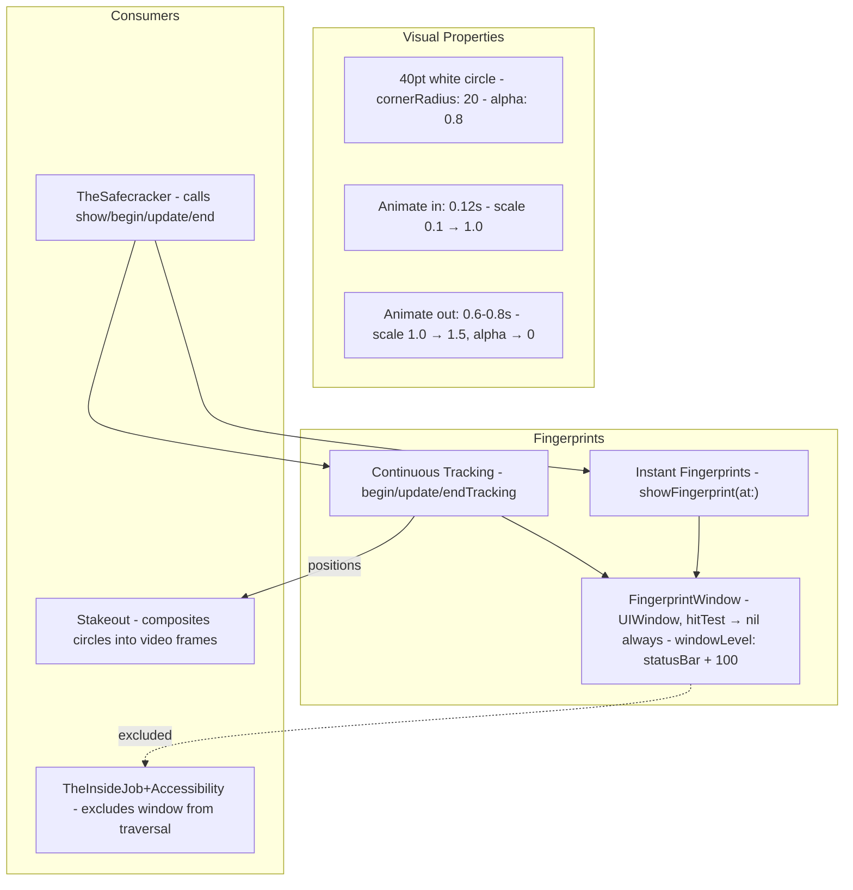
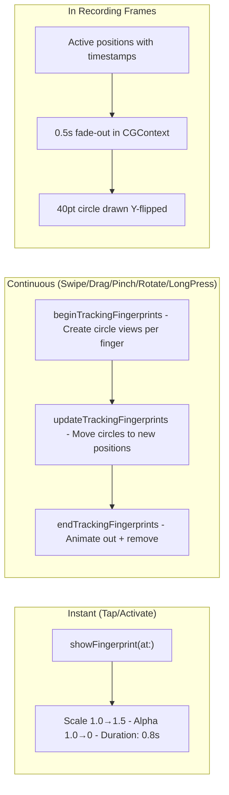

# Fingerprints - The Evidence

> **File:** `ButtonHeist/Sources/TheInsideJob/TheFingerprints.swift`
> **Platform:** iOS 17.0+ (UIKit)
> **Role:** Visual touch indicators - shows where interactions happen, composited into recordings

## Responsibilities

Fingerprints provides visual feedback for all touch interactions:

1. **Passthrough overlay window** at window level `statusBar + 100`
2. **Instant fingerprints** for taps - 40pt white circle, scales 1.5x and fades over 0.8s
3. **Continuous tracking** for swipes/drags/pinches - multi-finger circles that follow touch
4. **Recording integration** - positions reported to Stakeout for video frame compositing
5. **Accessibility exclusion** - window excluded from hierarchy traversal

## Architecture Diagram

## Interaction Types

## Items Flagged for Review

### LOW PRIORITY

**No configuration to disable fingerprints**
- Every interaction shows visual feedback
- For automated testing at high speed, the overlay animations may add slight overhead
- Not configurable via any env var or plist key

**Y-flip required for CGContext compositing in Stakeout**
- CGContext has origin at bottom-left, UIKit at top-left
- The Y-flip transform in Stakeout's fingerprint drawing is correct but non-obvious
- Worth verifying if device rotation is ever supported

**Passthrough window always in the hierarchy**
- `FingerprintWindow` is created and added to the scene
- Even when no fingerprints are showing, the window exists
- It's excluded from accessibility traversal via `getTraversableWindows()` filter
