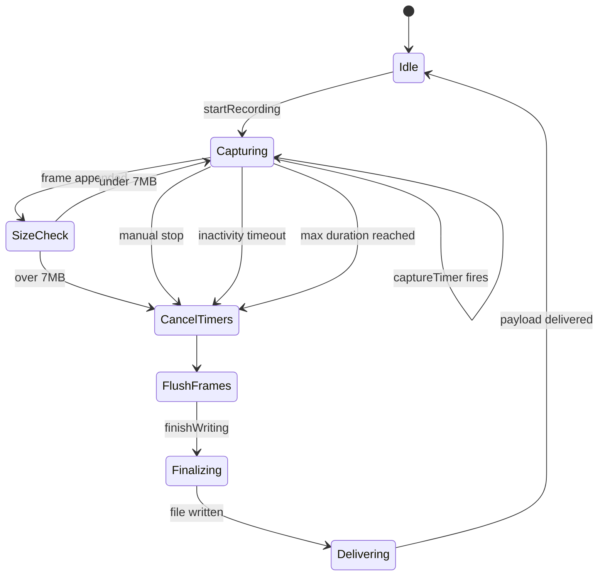
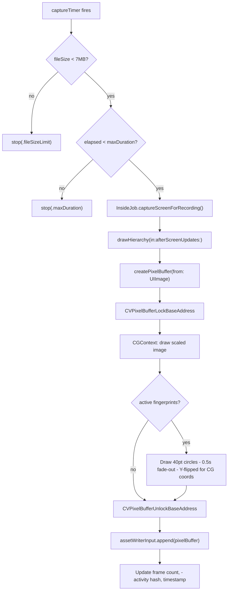
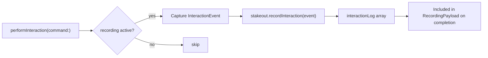

# Stakeout - The Lookout

> **File:** `ButtonHeist/Sources/InsideJob/Stakeout.swift`
> **Platform:** iOS 17.0+ (AVFoundation, UIKit)
> **Role:** Screen recording engine - captures, encodes, and delivers H.264/MP4 video

## Responsibilities

Stakeout handles all screen recording operations:

1. **Frame capture** at configurable FPS (1-15, default 8)
2. **H.264/MP4 encoding** via AVAssetWriter pipeline
3. **Resolution scaling** adjustable from 0.25x to 1.0x native
4. **Inactivity detection** auto-stops when no screen changes for timeout window
5. **Fingerprint compositing** draws touch indicators directly into video frames
6. **Size limiting** caps at 7MB to stay under 10MB wire protocol buffer limit
7. **Max duration** caps at configurable limit (default 60s)
8. **Interaction logging** records wire-level command/result pairs alongside video (NEW)

## Architecture Diagram

```mermaid
graph TD
    subgraph Stakeout["Stakeout (@MainActor)"]
        Config["RecordingConfig - fps, scale, inactivity, maxDuration"]
        State["State Machine - idle / recording / finalizing"]
        Capture["Frame Capture - Timer at 1/fps interval"]
        Encoder["AVAssetWriter - H.264 codec pipeline"]
        InactMon["Inactivity Monitor - 1-second polling"]
        FPComposite["Fingerprint Overlay - CGContext drawing"]
    end

        IntLog["Interaction Log - in-memory InteractionEvent array"]
    end

    InsideJob["InsideJob - captureScreenForRecording()"] -->|frame closure| Capture
    InsideJob -->|recordInteraction| IntLog
    TheSafecracker["TheSafecracker - onGestureMove"] -->|touch positions| FPComposite
    Capture --> FPComposite
    FPComposite --> Encoder
    Encoder -->|finalized MP4| Deliver["Base64 encode + interaction log → RecordingPayload"]
```

## Recording State Machine



## Frame Capture Pipeline



## Configuration

| Parameter | Default | Range | Notes |
|-----------|---------|-------|-------|
| `fps` | 8 | 1-15 | Frames per second |
| `scale` | 1.0 | 0.25-1.0 | Resolution multiplier |
| `inactivityTimeout` | 5.0s | >0 | Auto-stop after no changes |
| `maxDuration` | 60.0s | >0 | Hard cap on recording length |

## Interaction Recording (NEW)

During an active recording, `InsideJob.performInteraction()` now captures each command as an `InteractionEvent` and appends it to Stakeout's in-memory log via `recordInteraction(event:)`.

Each `InteractionEvent` contains:
- `timestamp` (seconds since recording start, from `recordingElapsed`)
- `command` (the original `ClientMessage`)
- `result` (the `ActionResult`)
- `interfaceBefore` / `interfaceAfter` (full `Interface` snapshots)

On recording completion, the log is included in `RecordingPayload.interactionLog` (nil if empty).



## Items Flagged for Review

### HIGH PRIORITY

**`swiftlint:disable file_length` suppression** (`Stakeout.swift:1`)
- File is 425 lines covering: config, state machine, capture timer, pixel buffer creation, fingerprint compositing, inactivity monitoring, and finalization
- All in one `final class` - could benefit from extraction of the AVAssetWriter pipeline or fingerprint compositing into separate types
- Not a bug, but the complexity warrants understanding the full state machine

**7MB file size limit is disconnected from 10MB buffer limit** (`Stakeout.swift:218`)
```swift
if fileSize > 7_000_000  // 7MB raw = ~9.3MB base64, under 10MB buffer limit
```
- The 7MB raw → ~9.3MB base64 math is correct (base64 expansion is ~1.33x)
- But this constant is not derived from `SimpleSocketServer.maxBufferSize` (10_000_000)
- If someone changes the buffer limit, this constant won't auto-adjust
- The relationship is only documented in a code comment

### MEDIUM PRIORITY

**Inactivity detection uses screen hash, not pixel comparison** (`Stakeout.swift`)
- Hashes the captured screen image to detect changes
- Subtle pixel changes (animations, blinking cursors) will keep recording active
- This is the intended behavior but means recordings can be longer than expected

**Output dimensions rounded to even** (H.264 requirement)
- `nativePixels * effectiveScale` rounded to nearest even number
- This is correct for H.264 but could produce unexpected recording dimensions
- Users specifying `scale: 0.75` on a non-standard resolution might get slightly different output

**Recording delivered to ALL connected clients** (`InsideJob+Screen.swift`)
- `broadcastToAll` sends the video payload to every client, not just the one that started recording
- This means multiple connected clients all receive the (potentially large) video data
- Could be bandwidth-intensive in multi-client scenarios

### LOW PRIORITY

**No cancellation of in-flight frame capture**
- If `stopRecording()` is called during `captureAndAppendFrame()`, the frame capture completes before stop is processed
- This is a benign race: the final frame is just included in the output

**`try?` on `Data(contentsOf:)` for finished MP4**
```swift
let videoData = try? Data(contentsOf: url)
```
- If reading the completed file fails, `deliverError(.finalizationFailed)` is called correctly
- The error detail from the failed read is lost though

**Interaction log payload size is unbounded**
- Each `InteractionEvent` includes full `interfaceBefore` and `interfaceAfter` snapshots
- A long recording with many interactions could produce a very large `interactionLog` array
- The 7MB file size cap only applies to video data, not the JSON-encoded interaction log
- If the interaction log is large, the total `RecordingPayload` could exceed the 10MB buffer limit
