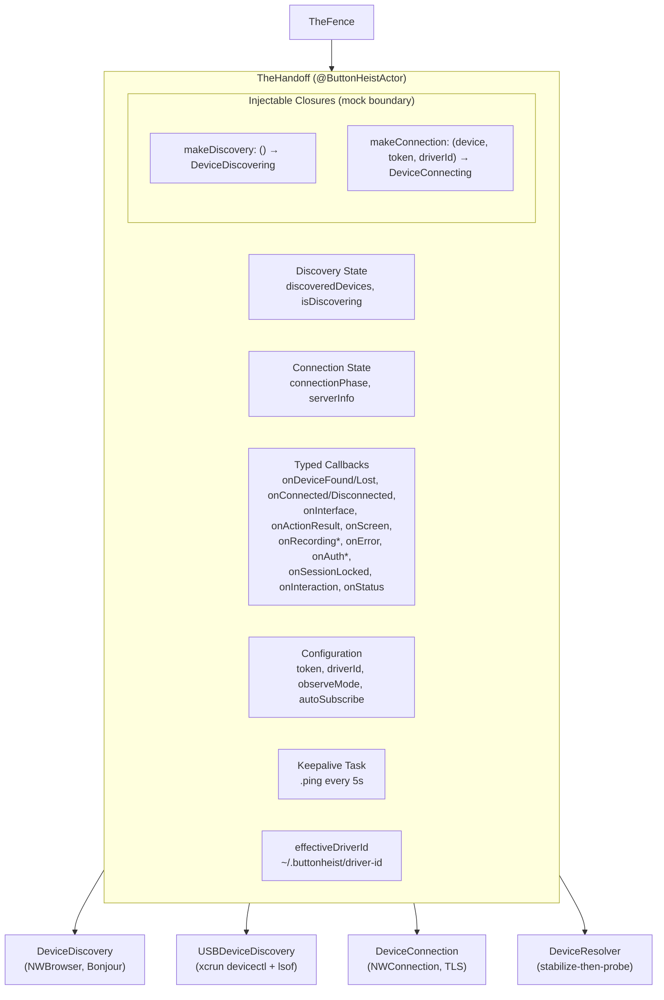
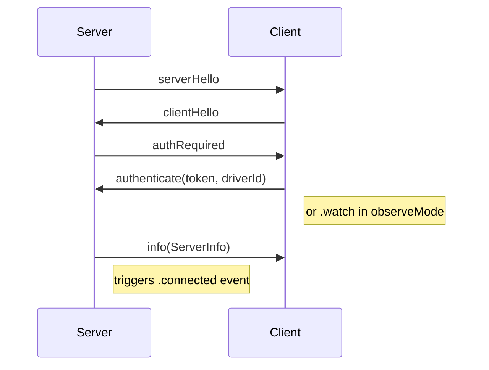
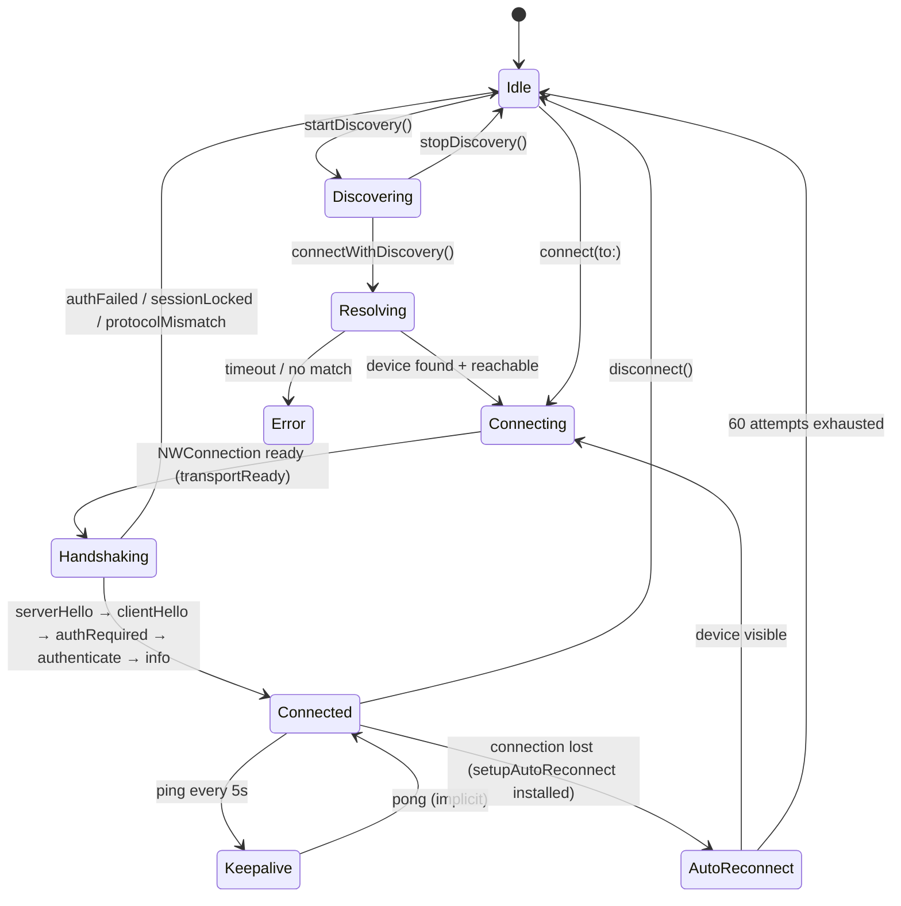

# TheHandoff - The Logistics

> **Files:** `ButtonHeist/Sources/TheButtonHeist/TheHandoff/`
> **Platform:** macOS 14.0+
> **Role:** Client-side device lifecycle manager — discovery, connection, keepalive, and auto-reconnect

## Responsibilities

TheHandoff owns the full lifecycle of communicating with a remote iOS device running TheInsideJob:

1. **Device discovery** — starts and stops Bonjour (`DeviceDiscovery`) and USB (`USBDeviceDiscovery`) discovery sessions; maintains `discoveredDevices`
2. **Connection management** — creates `DeviceConnection` instances, routes `ConnectionEvent`s from the transport layer to named callbacks, and manages `connectionPhase` (an explicit state machine carrying the device in `.connecting` and `.connected` phases)
3. **Session state tracking** — maintains `connectionPhase` (disconnected/connecting(device)/connected(device)/failed(ConnectionError)), `currentInterface`, `currentScreen`, `recordingPhase` (idle/recording)
4. **Keepalive** — sends `.ping` every 5 seconds over an active connection to keep the channel alive
5. **Session management** — `connectWithDiscovery(filter:timeout:)` orchestrates discovery → device resolution → connection with timeout tracking
6. **Reachability probing** — `discoverReachableDevices(timeout:)` discovers and validates each device advertisement via parallel TCP status probes
7. **Auto-reconnect** — `setupAutoReconnect(filter:)` sets `reconnectPolicy = .enabled(filter:)`; the disconnect event handler checks the policy directly instead of wrapping callbacks
8. **Driver ID persistence** — generates and stores a UUID in `~/.buttonheist/driver-id` used to identify the client across sessions

> **Note:** TheFence owns TheHandoff directly. There is no intermediate wrapper — TheFence talks to TheHandoff for all connection lifecycle and message sending, and owns the request-response correlation (pending continuations and async wait methods) itself.

## Architecture Diagram



## Component Map

| File | Type | Role |
|------|------|------|
| `TheHandoff.swift` | `@ButtonHeistActor public final class` | Lifecycle orchestrator |
| `DeviceDiscovery.swift` | `@ButtonHeistActor public final class` | Bonjour NWBrowser |
| `USBDeviceDiscovery.swift` | `@ButtonHeistActor public final class` (macOS only) | CoreDevice IPv6 tunnel polling |
| `DeviceConnection.swift` | `@ButtonHeistActor public final class` | TLS/TCP NWConnection client |
| `DeviceResolver.swift` | `@ButtonHeistActor public struct` | Stabilize-then-probe algorithm |
| `DeviceProtocols.swift` | Protocols + enums | `DeviceConnecting`, `DeviceDiscovering`, `ConnectionEvent`, `DiscoveryEvent` |
| `DiscoveredDevice.swift` | `public struct` | Bonjour service record + reachability probing |

## Discovery

### Bonjour Discovery (`DeviceDiscovery`)

`DeviceDiscovery` creates an `NWBrowser` browsing for `buttonHeistServiceType` in the `local.` domain with peer-to-peer enabled. The browser runs on a dedicated `DispatchQueue` (`browserQueue`) and dispatches change events to `@ButtonHeistActor` via `Task` wrappers.

**TXT record parsing**: For each `.added` result, `makeDevice(from:)` extracts these keys from the Bonjour TXT record:

| TXT Key | `DiscoveredDevice` property |
|---------|----------------------------|
| `simudid` | `simulatorUDID` |
| `installationid` | `installationId` |
| `devicename` | `displayDeviceName` |
| `instanceid` | `instanceId` |
| `sessionactive` | `sessionActive` (`"1"` → `true`) |
| `certfp` | `certFingerprint` |

**`DiscoveryRegistry`**: An internal value type that de-duplicates Bonjour advertisements by `discoveryIdentity`. When a device re-advertises under a new service name (common during simulator restarts), `recordFound` emits a synthetic `.lost` + `.found` pair so callers see a clean transition. Advertisements are ordered by insertion sequence (newest first).

**Reachability validation**: Every `reachabilityValidationInterval` seconds (default 3s), a background `Task` probes all visible devices in parallel with a 0.75s timeout. Devices that fail the probe are evicted from the registry via `recordLost`, emitting `.lost` events.

### USB Discovery (`USBDeviceDiscovery`)

`USBDeviceDiscovery` is macOS-only (`#if os(macOS)`). It polls every 3 seconds using two subprocess calls on a detached task to avoid blocking the actor:

1. **`xcrun devicectl list devices`** — parses lines containing `"connected"` to extract device names
2. **`lsof -i -P -n`** — applies the regex `\[(fd[0-9a-f:]+)::[12]\]` to find the CoreDevice IPv6 tunnel prefix, then appends `::1` to form the tunnel address

A `DiscoveredDevice` is constructed with the IPv6 tunnel address and the configured port, using `"usb-{deviceName}"` as the `id`. Devices absent from the current poll are removed and `.lost` events are fired.

## Connection

### `DeviceConnection`

`DeviceConnection` is the NWConnection-backed TCP/TLS client. It implements `DeviceConnecting`.

**TLS parameter selection**:

| Condition | Parameters used |
|-----------|----------------|
| `certFingerprint` present | `makeTLSParameters(expectedFingerprint:)` — custom verify block |
| No fingerprint, loopback endpoint | `makeLoopbackTLSParameters()` — accepts any certificate |
| No fingerprint, non-loopback | Refuses connection, fires `.disconnected(.certificateMismatch)` |

**Certificate fingerprint pinning**: `makeTLSParameters` sets a `sec_protocol_options_set_verify_block` that extracts the leaf DER certificate, computes `SHA256` over it, formats the result as `"sha256:<hex>"`, and compares to the expected fingerprint. Minimum TLS version is TLS 1.3.

**Framing**: Outbound messages are JSON-encoded as `RequestEnvelope` with an appended `0x0A` (newline) byte. The receive buffer accumulates bytes and `processBuffer` splits on `0x0A` delimiters. Maximum buffer is 10 MB; overflow fires `.disconnected(.bufferOverflow)`.

**Protocol handshake**:



`buttonHeistVersion` is checked on every inbound envelope. A mismatch disconnects immediately with `.protocolMismatch`.

### `DisconnectReason`

| Case | Trigger |
|------|---------|
| `.networkError(Error)` | NWConnection `.failed` or receive error |
| `.bufferOverflow` | Receive buffer exceeded 10 MB |
| `.serverClosed` | `isComplete` flag set in receive callback |
| `.authFailed(String)` | `authFailed` message received |
| `.sessionLocked(String)` | `sessionLocked` message received |
| `.protocolMismatch(String)` | Version mismatch in envelope |
| `.localDisconnect` | `forceDisconnect()` called |
| `.certificateMismatch` | Non-loopback connection attempted without fingerprint |

## Device Resolution (`DeviceResolver`)

`DeviceResolver` encapsulates the stabilize-then-probe algorithm shared by TheHandoff and the CLI's `DeviceConnector`.

**Direct connect shortcut**: If `filter` is a loopback host:port string (e.g. `127.0.0.1:8080`, `[::1]:8080`), `DiscoveredDevice.directConnectTarget` returns a `DiscoveredDevice` immediately without any discovery. Note: `isLoopbackHost` only accepts IP addresses (`127.*` and `::1`), not `localhost` (rejected as spoofable via `/etc/hosts`).

**Stabilize-then-probe loop**:

1. Every 100ms, compute `discoverySignature` (sorted device IDs joined by `"|"`)
2. If the signature changed, reset `stableAt` to now
3. Once the device list has been stable for 500ms and is non-empty, probe reachability
4. Probing fires at most once per second (`probeInterval = 1_000_000_000 ns`)
5. `reachable()` probes all candidates in parallel (1.5s timeout each) and returns responsive ones
6. If exactly one reachable device matches the filter (or there is only one device and no filter), return it
7. If multiple devices are reachable with no filter, throw `.noMatchingDevice`
8. On timeout expiry, `finalSelection()` does one final reachability check before throwing

## `DiscoveredDevice`

`DiscoveredDevice` is a `Sendable`, `Hashable`, `Identifiable` struct. Equality and hashing are based solely on `id`.

**Service name parsing**:

- v2 format: `"AppName-DeviceName#shortId"` → `parsedName` splits on the last `-`
- v3 format: `"AppName#instanceId"` → `parsedName` returns nil; `appName` is the portion before `#`
- `shortId` is the suffix after `#`

**`discoveryIdentity`**: Used by `DiscoveryRegistry` to deduplicate advertisements for the same logical device. If `installationId` is present, identity is `"install|{appName}|{installationId}"`. Otherwise it falls back to `"service|{id}"`.

**`connectionType`**: Returns `.simulator` if `simulatorUDID` is non-nil, `.usb` if `id` has prefix `"usb-"`, otherwise `.network`.

**Filter matching**: `matches(filter:)` does case-insensitive substring match on `name`, `appName`, `deviceName`, and prefix match on `shortId`, `installationId`, `instanceId`, `simulatorUDID`.

## Protocols (`DeviceProtocols.swift`)

Two protocols form the mock boundary for unit tests:

```swift
DeviceDiscovering (@ButtonHeistActor)
    var discoveredDevices: [DiscoveredDevice]
    var onEvent: (@ButtonHeistActor (DiscoveryEvent) -> Void)?
    func start()
    func stop()

DeviceConnecting (@ButtonHeistActor)
    var isConnected: Bool
    var observeMode: Bool
    var onEvent: (@ButtonHeistActor (ConnectionEvent) -> Void)?
    func connect()
    func disconnect()
    func send(_ message: ClientMessage, requestId: String?)
```

Both protocols are `@ButtonHeistActor`-isolated. `DeviceConnecting` has a default `send(_ message:)` convenience that calls `send(_:requestId:)` with `nil`.

## Injectable Factory Closures

TheHandoff exposes two `var` closures that are the test seam:

```swift
var makeDiscovery: () -> any DeviceDiscovering
var makeConnection: (DiscoveredDevice, String?, String) -> any DeviceConnecting
```

Default values create `DeviceDiscovery()` and `DeviceConnection(device:token:driverId:)` respectively. Tests replace these with mock implementations to avoid real Bonjour and NWConnection activity.

## Keepalive

On receiving a `ConnectionEvent.connected`, `startKeepalive()` launches a `Task` that loops with a 5-second sleep, sending `.ping` to the active connection. After 6 missed pongs (roughly 30 seconds of silence), it forces a disconnect. The task is stored in `keepaliveTask` and cancelled in `disconnect()` and `forceDisconnect()`.

## Driver ID Persistence

`effectiveDriverId` returns the explicit `driverId` override if set (non-empty), otherwise the `persistentDriverId` static property.

`persistentDriverId` is a `static let` computed once per process:

1. Attempts to read `~/.buttonheist/driver-id`
2. If the file is missing or empty, generates `UUID().uuidString.lowercased()`
3. Creates `~/.buttonheist/` if needed and writes the UUID atomically
4. Returns the UUID

The driver ID is passed to `DeviceConnection` and sent in every `.authenticate` or `.watch` message, allowing TheInsideJob/TheMuscle to identify and lock sessions to specific clients.

## Auto-Connect and Auto-Reconnect

### `connectWithDiscovery(filter:timeout:)`

Orchestrates discovery → resolution → connection as an `async throws` function:

1. Calls `startDiscovery()` (no-op if already running)
2. Wraps `DeviceResolver.resolve()` in `resolveReachableDevice`, translating `ResolutionError` into `ConnectionError`
3. Calls `connect(to:)` then polls `connectionPhase` every 100ms
4. Returns on `.connected`, throws on `.failed` (mapping `ConnectionError` to the right `FenceError`), `.disconnected`, or timeout

No callback swapping needed — the `ConnectionPhase` state machine carries the outcome directly.

### `setupAutoReconnect(filter:)`

Sets `reconnectPolicy = .enabled(filter:)`. The disconnect event handler in `connect(to:)` checks this policy directly:

- Guards against duplicate installation via `guard case .disabled = reconnectPolicy`
- On disconnect, if policy is `.enabled`, starts `runAutoReconnect(filter:)` as a `Task`
- `forceDisconnect()` also triggers reconnect when the policy is enabled
- `runAutoReconnect` makes up to 60 attempts: sleep 1s → look for matching device in `discoveredDevices` → call `connect(to:)` → poll `isConnected` for up to 10s
- Reports progress via `onStatus?` and stops on success or exhaustion

## Auto-Subscribe Behavior

When `autoSubscribe` is `true` (the default), TheHandoff sends two messages immediately upon receiving the `info` server message:

1. `.subscribe` — registers for push notifications
2. `.requestInterface` — fetches the current accessibility hierarchy

Screen snapshots are requested only through explicit `.requestScreen` calls.

## Connection Lifecycle



## How TheFence Uses TheHandoff

TheFence owns a `TheHandoff` instance directly. On init, it wires up `handoff.onInterface`, `handoff.onActionResult`, and `handoff.onScreen` callbacks to route correlated responses (those with a `requestId`) to pending continuation dictionaries, resuming the async caller that sent the original request.

TheFence calls TheHandoff methods directly for all lifecycle operations: `connectWithDiscovery`, `setupAutoReconnect`, `startDiscovery`, `connect`, `disconnect`, `send`, `forceDisconnect`, and `displayName(for:)`. There is no intermediate wrapper layer.
