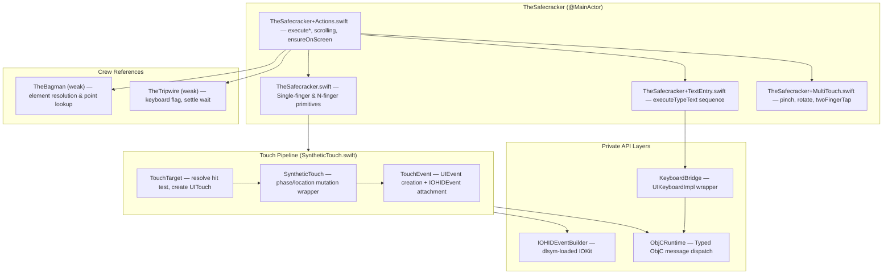
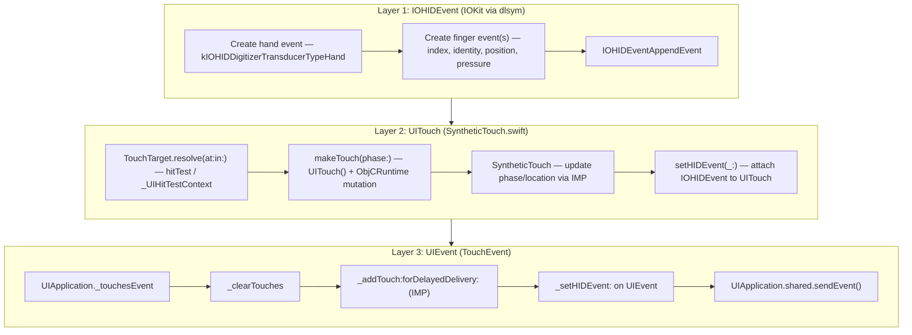
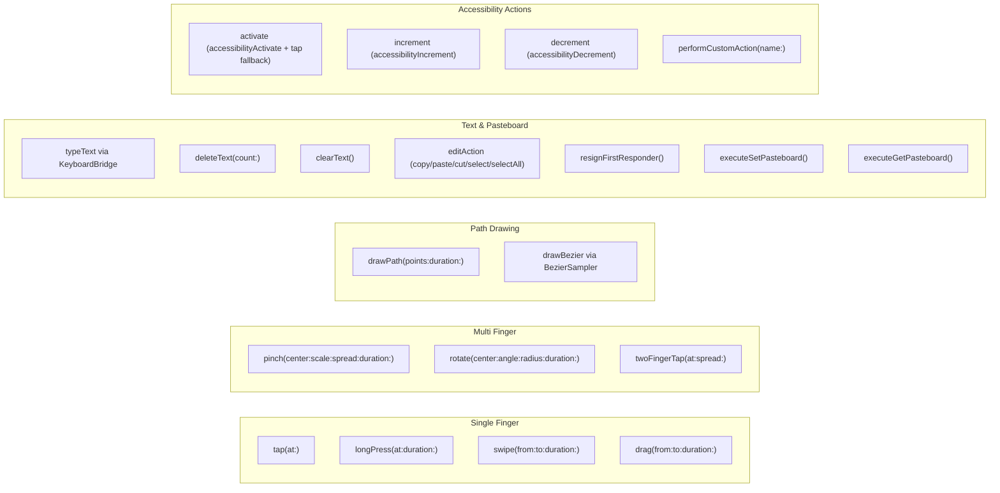
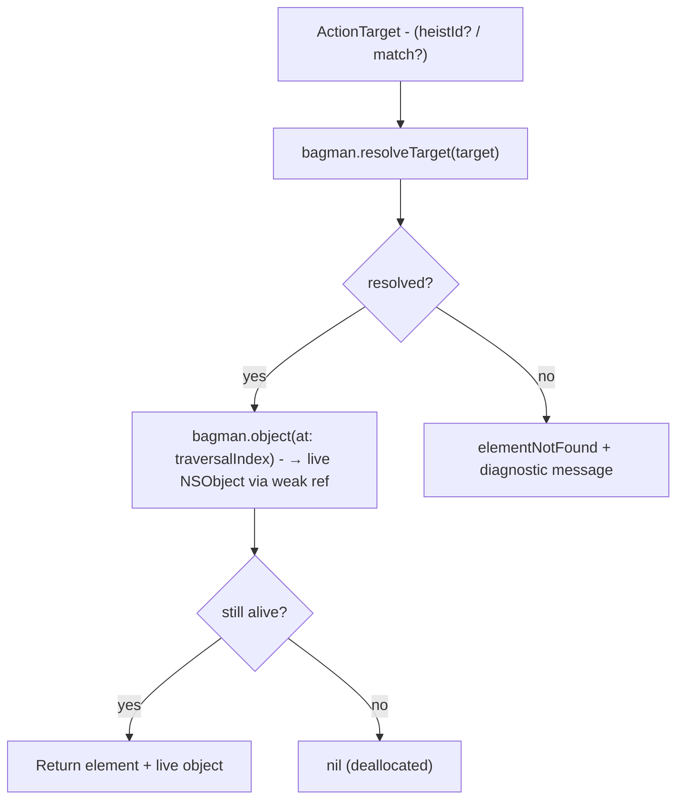

# TheSafecracker — The Specialist

> **Files:** `ButtonHeist/Sources/TheInsideJob/TheSafecracker/`
> **Platform:** iOS 17.0+ (UIKit, private APIs, DEBUG builds only)
> **Role:** Performs all physical interactions with the UI — touch injection, text input, gestures

## Responsibilities

TheSafecracker is the hands of the operation:

1. **Single-finger gestures** — tap, long press, swipe, drag
2. **Multi-finger gestures** — pinch, rotate, two-finger tap
3. **Path drawing** — polyline (drawPath) and Bezier curves (drawBezier)
4. **Text input** — typing via `KeyboardBridge` (UIKeyboardImpl wrapper), works in both software and hardware keyboard modes
5. **Text clearing** — select-all + delete via UITextInput
6. **Keyboard management** — detect visibility (via TheTripwire flag + UIKeyboardImpl fallback), dismiss keyboard
7. **Pasteboard operations** — read/write UIPasteboard.general
8. **Accessibility actions** — activate, increment, decrement, custom actions
9. **Point resolution** — resolve target coordinates from element heistId/match or explicit x/y
10. **Scrolling** — `scrollByPage` (UIScrollView.setContentOffset), `scrollToEdge`, `scrollToMakeVisible`, `scrollBySwipe` (synthetic swipe for non-UIScrollView containers)
11. **Auto-scroll to visible** — transparent pre-interaction scroll ensuring targets are within screen bounds
12. **First responder lookup** — walks the view hierarchy to find the current first responder

## Source Files

| File | Purpose |
|------|---------|
| `TheSafecracker.swift` | Core class, single-finger primitives, keyboard wrappers, `InteractionResult`, `PointResolution`, first responder utilities, N-finger primitives |
| `TheSafecracker+Actions.swift` | All `execute*` command methods, scroll infrastructure, duration helpers, `ensureOnScreen` |
| `TheSafecracker+MultiTouch.swift` | `pinch`, `rotate`, `twoFingerTap` |
| `TheSafecracker+TextEntry.swift` | `executeTypeText` — full tap-to-focus, poll-for-keyboard, clear/delete/type sequence |
| `TheSafecracker+Bezier.swift` | `BezierSampler` — cubic bezier sampling into polylines |
| `TheSafecracker+IOHIDEventBuilder.swift` | `IOHIDEventBuilder` + `FingerTouchData`; IOKit dlopen/dlsym loader |
| `KeyboardBridge.swift` | `UIKeyboardImpl` wrapper: `shared()`, `type(_:)`, `deleteBackward()`, `drainTaskQueue()`, `hasActiveInput` |
| `SyntheticTouch.swift` | Three nested structs: `TouchTarget`, `SyntheticTouch`, `TouchEvent` — the touch pipeline |
| `ObjCRuntime.swift` | `ObjCRuntime.Message` — typed ObjC dispatch for void and returning calls |

## Architecture Diagram

## Deep Dives

| Topic | File | Covers |
|-------|------|--------|
| [Scrolling](04a-SCROLLING.md) | `04a-SCROLLING.md` | Auto-scroll to visible, explicit scroll commands, ancestor walk, settle logic |
| [Touch Injection](04b-TOUCH-INJECTION.md) | `04b-TOUCH-INJECTION.md` | 3-layer IOKit/UITouch/UIEvent pipeline, hit testing, gesture geometry, timing |
| [Text Entry](04c-TEXT-ENTRY.md) | `04c-TEXT-ENTRY.md` | 5-step pipeline, UIKeyboardImpl injection, keyboard detection, edit actions |

## InteractionResult

`InteractionResult` is a plain struct — it does **not** conform to `Error`.

| Field | Type |
|-------|------|
| `success` | `Bool` |
| `method` | `ActionMethod` |
| `message` | `String?` |
| `value` | `String?` |
| `scrollSearchResult` | `ScrollSearchResult?` |

`PointResolution` is a custom enum (`.success(CGPoint)` / `.failure(InteractionResult)`) that exists specifically so `InteractionResult` doesn't need `Error` conformance.

## Touch Injection Stack

## KeyboardBridge

`@MainActor struct KeyboardBridge` wraps `UIKeyboardImpl` private API access through `ObjCRuntime`:

| Method | What it does |
|--------|-------------|
| `static shared() -> KeyboardBridge?` | `UIKeyboardImpl.sharedInstance` via ObjCRuntime; nil if class/selector absent |
| `var hasActiveInput: Bool` | `delegate is UIKeyInput` |
| `func type(_ character: Character)` | `addInputString:` + `drainTaskQueue()` |
| `func deleteBackward()` | `deleteFromInput` + `drainTaskQueue()` |
| `private func drainTaskQueue()` | `taskQueue.waitUntilAllTasksAreFinished` |

TheSafecracker's `isKeyboardVisible()` checks `tripwire.keyboardVisibleFlag` first (notification-driven, immediate), then falls back to `KeyboardBridge.shared()?.hasActiveInput` for hardware-keyboard scenarios.

## Gesture Catalog

## Timing Constants

| Constant | Value | Purpose |
|----------|-------|---------|
| `defaultInterKeyDelay` | 30 ms | Between keystrokes |
| `maxInterKeyDelay` | 500 ms | Upper clamp for inter-key delay |
| `gestureYieldDelay` | 50 ms | Between gesture phases (began/ended) |
| `selectionSettleDelay` | 50 ms | After setting selectedTextRange |
| `keyboardPollInterval` | 100 ms | Polling for keyboard appearance |
| `keyboardPollMaxAttempts` | 20 | = 2 second max wait for keyboard |

Gesture step interval is 10ms for all continuous gestures. `clampDuration` clamps to `[0.01, 60.0]` with default `0.5`.

## Scrolling & Auto-Scroll

> **Deep dive:** [04a-SCROLLING.md](04a-SCROLLING.md) — full design, requirements, limitations, and implementation notes

TheBagman owns all scroll orchestration (see [13-THEBAGMAN.md](13-THEBAGMAN.md)). TheSafecracker provides the scroll primitives: `scrollByPage`, `scrollToEdge`, `scrollToMakeVisible`, `scrollToOppositeEdge`, and `scrollBySwipe`.

| Primitive | Input | Mechanism |
|-----------|-------|-----------|
| `scrollByPage` | UIScrollView + direction | `setContentOffset` with 44pt overlap, clamped to content bounds |
| `scrollToEdge` | UIScrollView + edge | `setContentOffset` to absolute boundary |
| `scrollToMakeVisible` | CGRect + UIScrollView | Minimum offset adjustment to bring frame into visible rect |
| `scrollToOppositeEdge` | UIScrollView + direction | Jump to opposite content edge (no animation) |
| `scrollBySwipe` | CGRect + direction | Synthetic swipe gesture at 75% travel, 0.25s duration |

**Auto-scroll** is driven by TheBagman's `ensureOnScreen(for:)` before every element-targeted interaction. It checks `accessibilityFrame` against `UIScreen.main.bounds`, uses the accessibility hierarchy's scroll view reference (with UIKit ancestor fallback), calls TheSafecracker's `scrollToMakeVisible` for minimum offset adjustment, waits for settle via TheTripwire, and refreshes the element cache. Best-effort: never blocks or fails the command.

**Input size guards:** `touchDrawPath` limits to 10,000 points; `touchDrawBezier` limits to 1,000 segments.

## Swipe Resolution Paths

`executeSwipe` supports three coordinate resolution strategies:

1. **Unit-point pair**: `target.start` + `target.end` as `UnitPoint` relative to element frame — maps `(0,0)...(1,1)` to the element's `accessibilityFrame`
2. **Direction expansion**: `target.direction` expands to `direction.defaultStart`/`defaultEnd` unit points, then resolves as #1
3. **Absolute fallback**: `startX/Y` + `endX/Y` screen points, or direction-only with 200pt offset from element center

## Element Resolution Flow

> Full targeting system documentation: [15-UNIFIED-TARGETING.md](../dossiers/15-UNIFIED-TARGETING.md)

All action executors resolve elements via `TheBagman.resolveTarget(_:)` which checks heistId → match and returns `ResolvedTarget(element, traversalIndex)`.

## Items Flagged for Review

### HIGH PRIORITY

**Private API usage via `unsafeBitCast`** (`SyntheticTouch.swift`, `ObjCRuntime.swift`)
- All UITouch mutation uses IMP extraction via `unsafeBitCast` to call private selectors
- Guards: `responds(to:)` checks protect against missing selectors but NOT against signature changes
- This is the established KIF pattern and is DEBUG-only, but should be monitored with each iOS release

**IOHIDEventBuilder uses `dlsym`-loaded IOKit** (`TheSafecracker+IOHIDEventBuilder.swift`)
- All IOKit function pointers are loaded dynamically at first use
- If IOKit reorganizes or removes these symbols, touch injection silently fails
- The `guard` on dlsym returns nil-checks, but no runtime warning is logged on failure

### MEDIUM PRIORITY

**Text injection uses `UIKeyboardImpl.sharedInstance`**
- Encapsulated in `KeyboardBridge` — `shared()`, `type(_:)`, `deleteBackward()`
- `drainTaskQueue()` after each keystroke matches KIF's pattern
- `hasActiveInput` checks `delegate is UIKeyInput` (not just non-nil existence)

**Duplicate default durations** (`TheSafecracker+Actions.swift` vs `TheSafecracker.swift`)
- High-level executors and primitive methods both have independent duration defaults
- Both default to 0.15s for swipe — consistent but defined in two places

### LOW PRIORITY

**Fingerprint overlays shown for all gesture types**
- Every successful interaction calls `showFingerprint()` or `beginTrackingFingerprints()`
- Intentional for recording visibility; can be disabled via `INSIDEJOB_DISABLE_FINGERPRINTS=1`
