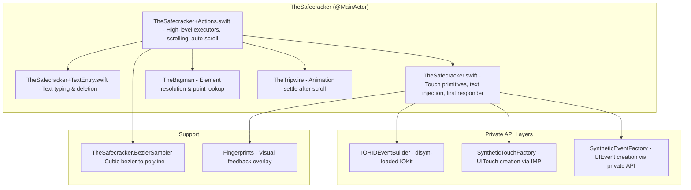
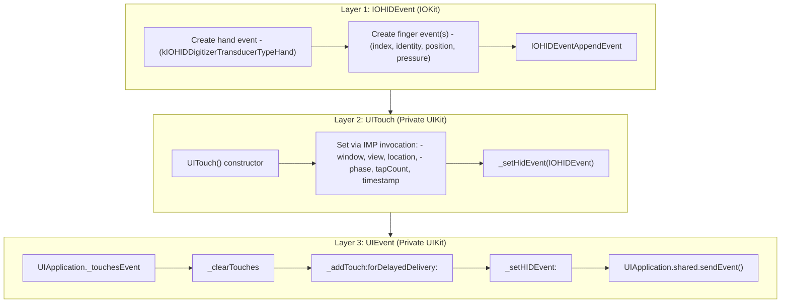
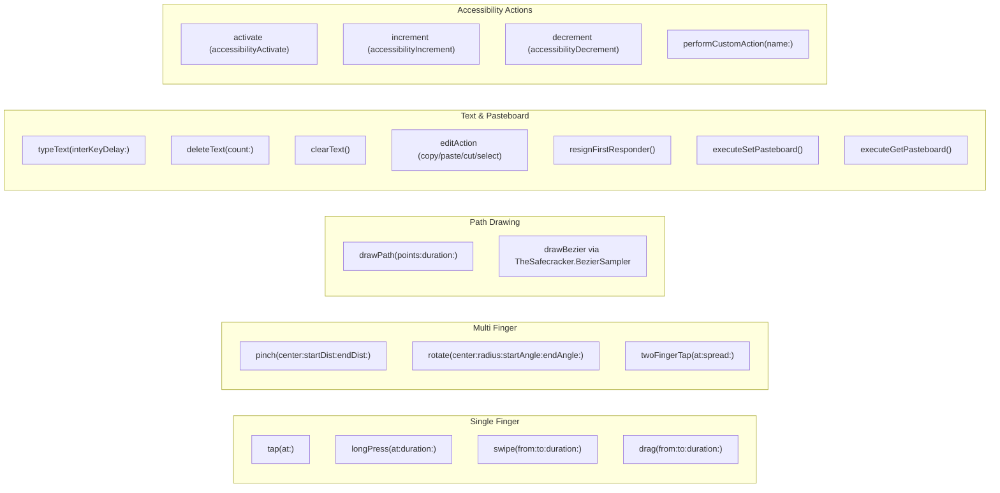
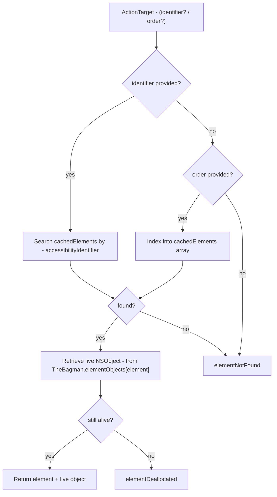
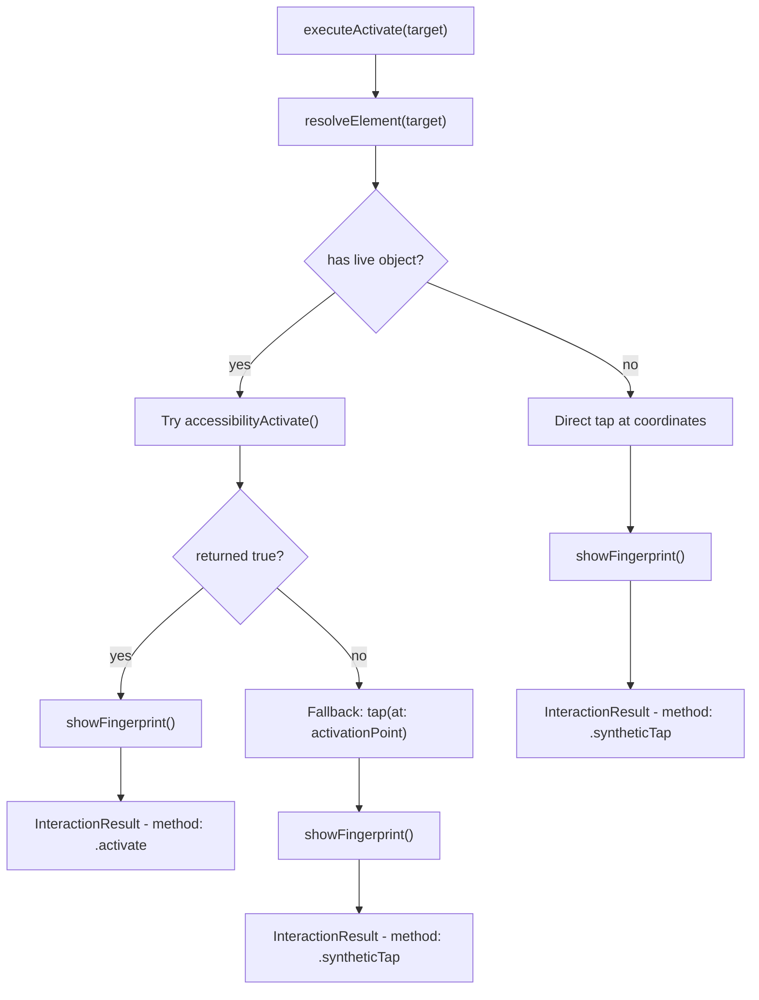

# TheSafecracker - The Specialist

> **Files:** `ButtonHeist/Sources/TheInsideJob/TheSafecracker*.swift`
> **Platform:** iOS 17.0+ (UIKit, private APIs)
> **Role:** Performs all physical interactions with the UI - touch injection, text input, gestures

## Responsibilities

TheSafecracker is the hands of the operation:

1. **Single-finger gestures** - tap, long press, swipe, drag
2. **Multi-finger gestures** - pinch, rotate, two-finger tap
3. **Path drawing** - polyline (drawPath) and Bezier curves (drawBezier)
4. **Text input** - typing via UIKeyboardImpl.sharedInstance injection (KIF pattern), works in both software and hardware keyboard modes
5. **Text clearing** - select-all + delete via UITextInput
6. **Keyboard management** - detect visibility, dismiss keyboard
7. **Pasteboard operations** - read/write UIPasteboard.general (avoids iOS "Allow Paste" dialog)
8. **Accessibility actions** - activate, increment, decrement, custom actions
9. **Point resolution** - resolve target coordinates from element identifier/order or explicit x/y
10. **Scrolling** - page scroll, scroll-to-visible, scroll-to-edge via UIScrollView.setContentOffset
11. **Auto-scroll to visible** - transparent pre-interaction scroll ensuring target elements and first responders are within screen bounds before any interaction
12. **First responder lookup** - walks the view hierarchy to find the current first responder

## Architecture Diagram



## Touch Injection Stack



## Gesture Catalog



## Scrolling & Auto-Scroll

> **Deep dive:** [04a-SCROLLING.md](04a-SCROLLING.md) — full design, requirements, limitations, and implementation notes

TheSafecracker owns all scrolling: three explicit commands (`scroll`, `scroll_to_visible`, `scroll_to_edge`) and an automatic pre-interaction scroll that ensures every action is visible on screen.

**Auto-scroll** runs transparently before every element-targeted interaction. It checks the element's `accessibilityFrame` against `UIScreen.main.bounds` — a bounds check, not a visibility check (keyboards and overlays don't matter, only whether the frame is within the screen rectangle). If off-screen, it walks the ancestor chain to find the nearest `UIScrollView`, scrolls with minimum offset adjustment, waits for the animation to settle via TheTripwire, and refreshes the element cache. Best-effort: never blocks or fails the command.

**Explicit scroll commands** give agents direct control: page-step with overlap, scroll-to-visible with minimum adjustment, and scroll-to-edge for jumping to extremes. All drive `UIScrollView.setContentOffset` directly — no synthetic touch.

## Element Resolution Flow



## Action Execution Pattern (Activate Example)



## Items Flagged for Review

### HIGH PRIORITY

**Private API usage via `unsafeBitCast`** (`TheSafecracker+SyntheticTouchFactory.swift:93,103,113,125`)
- All UITouch mutation uses `unsafeBitCast(imp, to: Fn.self)` to call private selectors
- The type cast is inherently unsafe if Apple changes a selector's signature
- Guards: `responds(to:)` checks protect against missing selectors but NOT against signature changes
- This is the established KIF pattern and is DEBUG-only, but should be monitored with each iOS release

**`SyntheticEventFactory` creates fresh UIEvent per phase** (`TheSafecracker+SyntheticEventFactory.swift`)
- iOS 26+ requires new UIEvent objects per touch phase (reusing causes validation errors)
- This was a targeted fix for a specific iOS version - needs verification on future versions

**IOHIDEventBuilder uses `dlsym`-loaded IOKit** (`TheSafecracker+IOHIDEventBuilder.swift`)
- All IOKit function pointers are loaded dynamically at first use
- If IOKit reorganizes or removes these symbols, touch injection silently fails
- The `guard` on dlsym returns nil-checks, but no runtime warning is logged on failure

### MEDIUM PRIORITY

**`InteractionResult: Error` conformance appears unused** (`TheSafecracker.swift:31`)
```swift
struct InteractionResult: Error { ... }
```
- `InteractionResult` is returned as a value, never thrown
- The `Error` conformance adds no functionality and may mislead readers

**Text injection uses `UIKeyboardImpl.sharedInstance`**
- Uses `sharedInstance` (not `activeInstance`) to stay alive in hardware keyboard mode
- `drainKeyboardTaskQueue()` after each keystroke matches KIF's pattern

**Duplicate default durations** (`TheSafecracker+Actions.swift` vs `TheSafecracker.swift`)
- `executeTap` at Actions:111 defaults duration via `target.duration ?? 0.15`
- `swipe(from:to:duration:)` at Core:79 has its own `duration: TimeInterval = 0.15`
- Defaults exist at both the high-level and primitive level independently

**`clampDuration` range** (`TheSafecracker+Actions.swift:255`)
```swift
private func clampDuration(_ value: TimeInterval) -> TimeInterval {
    min(max(value, 0.01), 60.0)
}
```
- 60-second max gesture duration seems generous
- No equivalent clamp on `interKeyDelay` for text typing

### LOW PRIORITY

**Fingerprint overlays shown for all gesture types**
- Every successful interaction calls `showFingerprint()` or `beginTrackingFingerprints()`
- This is intentional for recording visibility but adds visual noise during testing
- Fingerprints can be disabled via `INSIDEJOB_DISABLE_FINGERPRINTS=1` (env) or `InsideJobDisableFingerprints=true` (plist)
