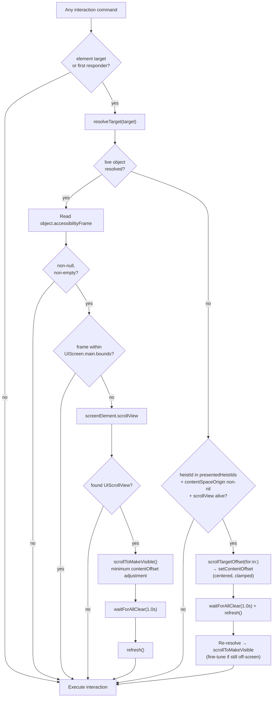
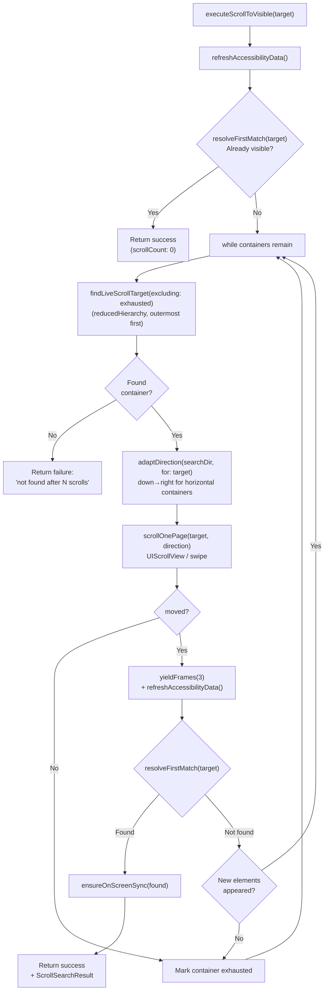

# Scrolling Deep Dive

> **Source:** `ButtonHeist/Sources/TheInsideJob/TheBagman+Scroll.swift` (orchestration), `TheSafecracker+Scroll.swift` (scroll primitives)
> **Parent dossiers:** [13-THEBAGMAN.md](13-THEBAGMAN.md), [04-THESAFECRACKER.md](04-THESAFECRACKER.md)

TheBagman owns all scroll orchestration — three explicit scroll commands for agents, and an automatic pre-interaction scroll that ensures every action is visible on screen. TheSafecracker provides the scroll primitives (`scrollByPage`, `scrollToEdge`, `scrollToMakeVisible`, `scrollBySwipe`) but never decides what to scroll or when.

Two-tier dispatch: UIScrollView for direct offset manipulation, synthetic swipe for everything else.

## Scrollable Container Discovery

Scrollable containers are discovered from the **accessibility hierarchy tree**, not from UIKit view hierarchy walking. The accessibility parser marks containers as `.scrollable(contentSize:)` when their backing view is a `UIScrollView` subclass (or reports scrollable traits). One lookup is stored:

| Lookup | Key | Value | Used for |
|--------|-----|-------|----------|
| `scrollableContainerViews` | `AccessibilityContainer` | `UIView` | Cast to `UIScrollView` for direct `setContentOffset`, else synthetic swipe |

Rebuilt on every `refreshAccessibilityData()` call via the `containerVisitor` callback.

### ScrollableTarget

A `ScrollableTarget` enum wraps a discovered scrollable container with two tiers:

```
.uiScrollView(UIScrollView)           — direct setContentOffset (fast, precise)
.swipeable(CGRect, CGSize)             — synthetic swipe gesture (universal)
```

`scrollOnePage(_:direction:animated:)` dispatches through these tiers. UIScrollView gets direct `setContentOffset` manipulation. Everything else (e.g. SwiftUI's `PlatformContainer`) gets a synthetic swipe at the container's screen-space frame.

### Axis-Aware Resolution

`ScrollAxis` is an `OptionSet` with `.horizontal` and `.vertical`. Three `requiredAxis(for:)` overloads map `ScrollDirection`, `ScrollEdge`, and `ScrollSearchDirection` to the axis they operate on.

For `scroll` and `scroll_to_edge`, `resolveScrollTarget` returns the element's stored `screenElement.scrollView` from the accessibility hierarchy. If the scroll view can't scroll in the requested direction, `scrollByPage` returns false ("Already at edge").

For `scroll_to_visible`, `adaptDirection` maps the caller's direction hint to each container's natural axis: "down" means "forward" — forward in a vertical = `.down`, forward in a horizontal = `.right`. This lets the search iterate every scroll view regardless of axis.

## Auto-Scroll to Visible

### Why it exists

Humans watching an agent interact with a simulator need to see every action happen on screen. Without auto-scroll, an agent can tap, type into, or swipe an element that's scrolled out of the viewport — the action succeeds but the observer sees nothing happen.

The check runs inside TheBagman before every interaction (via `ensureOnScreen(for:)`). The agent has no knowledge of it, sends no extra parameters, and receives no indication it happened. From the agent's perspective the command just works. From the human's perspective the screen scrolls to the element and then the action occurs.

### What it checks

The check compares the element's `accessibilityFrame` (screen coordinates, read from the live `NSObject`) against `UIScreen.main.bounds`. If the frame is fully contained within the screen bounds, no scroll is needed.

**This is a bounds check, not a visibility check.** It does not care about:
- Keyboard overlapping the element
- Modal sheets or overlays obscuring the element
- Other views drawn on top of the element
- The element being transparent or hidden

It only cares whether the element's frame is geometrically within the screen rectangle. An element behind a keyboard is "on screen" — an element scrolled 500 points below the viewport is not.

### What it does when an element is off-screen

Two paths, tried in order:

**Primary path — live object resolved.** The element's `NSObject` is in the current accessibility tree (it's on screen or nearby enough for UIKit to keep it alive):

1. Reads `object.accessibilityFrame` and checks `UIScreen.main.bounds.contains(frame)`
2. Uses `screenElement.scrollView` to find the nearest `UIScrollView`
3. Calls `scrollToMakeVisible(_:in:)` — adjusts `contentOffset` by the minimum amount needed to bring the element fully within the scroll view's visible rect
4. Waits for the scroll animation to settle via `tripwire.waitForAllClear(timeout: 1.0)` — presentation-layer diffing, not a fixed sleep
5. Refreshes the element cache via `refresh()` so subsequent reads reflect post-scroll positions

**Fallback path — full-scan-discovered element, live object not resolvable.** The element was discovered by `get_interface(full: true)` (exhaustive scroll) and is in `screenElements` with a valid `presentedHeistIds` entry, but has since scrolled off screen (cell reuse deallocated the `NSObject`). The stored `contentSpaceOrigin` and weak `scrollView` reference are still available:

1. Checks `target` is a `.heistId`, the heistId is in `presentedHeistIds`, `contentSpaceOrigin` is non-nil, and the weak `scrollView` is still alive
2. Calls `scrollTargetOffset(for:in:)` to compute a clamped content offset that centers the element in the viewport
3. Sets `scrollView.setContentOffset(targetOffset, animated: false)` directly
4. Waits for settle via `tripwire.waitForAllClear(timeout: 1.0)`, then `refresh()`
5. Re-resolves the target (the element should now be on screen) and fine-tunes with `scrollToMakeVisible` if the frame is still not fully within screen bounds



### Entry points

Two public methods resolve their target, then delegate to a shared private implementation:

| Method | Resolves object from | Used by |
|--------|---------------------|---------|
| `ensureOnScreen(for: ElementTarget)` | TheBagman screenElements registry | activate, increment, decrement, customAction, tap, longPress, swipe, drag, pinch, rotate, twoFingerTap, typeText |
| `ensureFirstResponderOnScreen()` | `tripwire.currentFirstResponder()` responder chain walk | editAction, setPasteboard, getPasteboard, resignFirstResponder |

### Best-effort guarantee

The auto-scroll never blocks or fails the command. If anything goes wrong — element can't be resolved, no scrollable ancestor, frame is null, tripwire is nil — the interaction proceeds at the current position.

## Explicit Scroll Commands

Three commands expose scrolling directly to agents. These are not auto-scroll — they are standalone commands the agent sends intentionally.

| Command | Method | Behavior |
|---------|--------|----------|
| `scroll` | `executeScroll` → `scrollByPage` | Axis-aware page scroll: finds the scroll view matching the direction's axis |
| `scroll_to_visible` | `executeScrollToVisible` | Hierarchy-driven search with swipe fallback for non-UIScrollView containers |
| `scroll_to_edge` | `executeScrollToEdge` → `scrollToEdge` | Axis-aware edge jump, iterates for lazy containers |

### scroll (page step)

Scrolls the axis-appropriate scroll view ancestor by one page in the given direction. "One page" is the scroll view's frame dimension minus a 44pt overlap, so the user retains context across pages.

`resolveScrollTarget` returns the element's stored scroll view from the accessibility hierarchy (`screenElement.scrollView`). If the scroll view can't scroll in the requested direction, `scrollByPage` returns false ("Already at edge").

Offsets are clamped to valid content bounds. Returns `false` if already at the edge.

### scroll_to_visible (hierarchy-driven search)

Searches for an element by scrolling through scrollable containers discovered from the accessibility hierarchy tree. Uses `reducedHierarchy` (pre-order traversal) to visit containers outermost first.

**Input:** `ScrollToVisibleTarget` containing an `ElementTarget` predicate and optional `direction` (default `.down`). Scrolls until found or all containers exhausted.

**Algorithm:**

1. **Pre-check.** Refresh and check if element is already visible via `resolveFirstMatch`.
2. **Scroll loop.** `findLiveScrollTarget(excluding: exhausted)` walks the hierarchy tree and returns the first non-exhausted scrollable container. `adaptDirection` maps the caller's direction to the container's natural axis. `scrollOnePage` scrolls it (UIScrollView → setContentOffset, else → swipe). After each scroll, yield 3 frames, refresh, check for match. If no new elements appeared, mark the container exhausted.



### scroll_to_edge (jump to extreme)

Jumps the content offset to the absolute edge of the content. Uses axis-aware resolution (same as `scroll`) to find the right scroll view.

| Edge | Offset |
|------|--------|
| `.top` | `y = -insets.top` |
| `.bottom` | `y = contentSize.height + insets.bottom - frame.height` |
| `.left` | `x = -insets.left` |
| `.right` | `x = contentSize.width + insets.right - frame.width` |

**Re-jump iteration:** Content may grow after the initial jump (lazy containers materialize on scroll). After a successful edge jump, `executeScrollToEdge` yields frames and re-jumps in a loop (up to 20 iterations), exiting when both `contentSize` stabilizes and `scrollToEdge` reports no movement.

## Ancestor Walk

The UIKit ancestor walk via `nextAncestor(of:)` handles three cases:

1. **UIView** → `view.superview` — standard UIKit view hierarchy
2. **UIAccessibilityElement** → `element.accessibilityContainer` cast to `NSObject` — VoiceOver container elements that aren't UIViews
3. **Other NSObject** → KVO `value(forKey: "accessibilityContainer")` — covers custom accessibility containers

The walk finds `UIScrollView` subclasses with `isScrollEnabled == true`. For containers where the UIKit walk fails (SwiftUI's `PlatformContainer` is not a `UIScrollView`), `resolveScrollTarget` falls back to `screenElement.scrollView` — the scroll view reference stored from the accessibility hierarchy's `containerVisitor` during parsing.

## Settle After Scroll

After any `setContentOffset(animated: true)` call, the scroll view runs a Core Animation animation (~300ms). The auto-scroll path waits for this using `tripwire.waitForAllClear(timeout: 1.0)` — presentation-layer diffing that returns when all animations complete.

The `scroll` command does **not** settle internally — it returns immediately after `setContentOffset`. The settle and delta computation happens in the outer `performInteraction` pipeline.

`scroll_to_visible` and `scroll_to_edge` handle their own frame yielding. `scroll_to_visible` uses `yieldFrames(3)` per step; `scroll_to_edge` uses `yieldFrames(2)` per re-jump. Both use `CATransaction.flush()` + `Task.yield()` per frame — lighter than `waitForSettle`.

## Implementation Notes

### Why setContentOffset + swipe fallback

`setContentOffset` gives exact positioning for `UIScrollView` instances. But SwiftUI's internal scroll containers (e.g. `HostingScrollView.PlatformContainer`) are not `UIScrollView` subclasses on iOS 26 — they don't respond to `setContentOffset`. For these, a synthetic swipe gesture at 75% travel covers a full page reliably. The two-tier `ScrollableTarget` dispatch uses `setContentOffset` when available and falls through to synthetic swipe as the universal fallback.

### Why the 44pt overlap in page scroll

The 44pt overlap when paging ensures continuity — the last few lines of the previous page remain visible at the top of the next page. This matches the standard iOS VoiceOver three-finger-swipe page scrolling behavior. 44pt is also the minimum recommended touch target size in the HIG.

### Why NSObject for ensureOnScreen

The auto-scroll has two callers: element-targeted commands (resolve through TheBagman) and first-responder commands (resolve through the UIView responder chain). Both produce a live `NSObject` that has `accessibilityFrame` and participates in the view hierarchy. Accepting `NSObject` lets both paths share one implementation.
